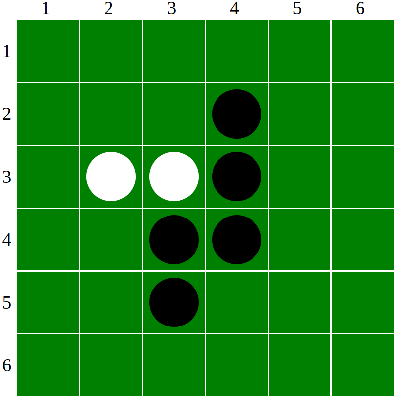

<html>

<head>
    <meta content="text/html; charset=UTF-8" http-equiv="content-type">
    <style type="text/css">
        @import url('https://themes.googleusercontent.com/fonts/css?kit=IQHow_FEYlDC4Gzy_m8fcltXRa8TVwTICgirnJhmVJw');

        .lst-kix_nrh864je400p-3>li:before {
            content: "\0025cf  "
        }

        .lst-kix_nrh864je400p-2>li:before {
            content: "\0025a0  "
        }

        .lst-kix_nrh864je400p-4>li:before {
            content: "\0025cb  "
        }

        .lst-kix_nrh864je400p-7>li:before {
            content: "\0025cb  "
        }

        .lst-kix_nrh864je400p-0>li:before {
            content: "\0025cf  "
        }

        .lst-kix_nrh864je400p-8>li:before {
            content: "\0025a0  "
        }

        ul.lst-kix_723z8x6uz4lz-8 {
            list-style-type: none
        }

        ol.lst-kix_61hph7qfzne-1.start {
            counter-reset: lst-ctn-kix_61hph7qfzne-1 0
        }

        .lst-kix_nrh864je400p-1>li:before {
            content: "\0025cb  "
        }

        ul.lst-kix_6mbac4y36vdw-5 {
            list-style-type: none
        }

        ul.lst-kix_723z8x6uz4lz-3 {
            list-style-type: none
        }

        ul.lst-kix_6mbac4y36vdw-6 {
            list-style-type: none
        }

        ul.lst-kix_723z8x6uz4lz-2 {
            list-style-type: none
        }

        ul.lst-kix_6mbac4y36vdw-7 {
            list-style-type: none
        }

        ul.lst-kix_723z8x6uz4lz-1 {
            list-style-type: none
        }

        .lst-kix_qh2dy2vgcs5l-6>li:before {
            content: "\0025cf  "
        }

        ul.lst-kix_6mbac4y36vdw-8 {
            list-style-type: none
        }

        ul.lst-kix_723z8x6uz4lz-0 {
            list-style-type: none
        }

        ul.lst-kix_723z8x6uz4lz-7 {
            list-style-type: none
        }

        .lst-kix_qh2dy2vgcs5l-7>li:before {
            content: "\0025cb  "
        }

        ul.lst-kix_723z8x6uz4lz-6 {
            list-style-type: none
        }

        ul.lst-kix_723z8x6uz4lz-5 {
            list-style-type: none
        }

        ul.lst-kix_723z8x6uz4lz-4 {
            list-style-type: none
        }

        .lst-kix_qh2dy2vgcs5l-8>li:before {
            content: "\0025a0  "
        }

        ul.lst-kix_6mbac4y36vdw-0 {
            list-style-type: none
        }

        ol.lst-kix_lb4vz53reiwa-5.start {
            counter-reset: lst-ctn-kix_lb4vz53reiwa-5 0
        }

        ul.lst-kix_6mbac4y36vdw-1 {
            list-style-type: none
        }

        ul.lst-kix_6mbac4y36vdw-2 {
            list-style-type: none
        }

        .lst-kix_yen1n5ddfg9r-0>li:before {
            content: "\0025cf  "
        }

        ul.lst-kix_6mbac4y36vdw-3 {
            list-style-type: none
        }

        .lst-kix_k660su5v77sz-4>li {
            counter-increment: lst-ctn-kix_k660su5v77sz-4
        }

        ul.lst-kix_6mbac4y36vdw-4 {
            list-style-type: none
        }

        .lst-kix_w8mz9fp1ppt0-2>li:before {
            content: "\0025a0  "
        }

        .lst-kix_w8mz9fp1ppt0-3>li:before {
            content: "\0025cf  "
        }

        .lst-kix_w8mz9fp1ppt0-0>li:before {
            content: "\0025cf  "
        }

        .lst-kix_w8mz9fp1ppt0-8>li:before {
            content: "\0025a0  "
        }

        .lst-kix_w8mz9fp1ppt0-1>li:before {
            content: "\0025cb  "
        }

        .lst-kix_pkbqts7mcwz7-3>li {
            counter-increment: lst-ctn-kix_pkbqts7mcwz7-3
        }

        .lst-kix_w8mz9fp1ppt0-7>li:before {
            content: "\0025cb  "
        }

        .lst-kix_w8mz9fp1ppt0-6>li:before {
            content: "\0025cf  "
        }

        .lst-kix_w8mz9fp1ppt0-4>li:before {
            content: "\0025cb  "
        }

        .lst-kix_w8mz9fp1ppt0-5>li:before {
            content: "\0025a0  "
        }

        .lst-kix_wcmwik5fb23i-8>li:before {
            content: "" counter(lst-ctn-kix_wcmwik5fb23i-8, lower-roman) ". "
        }

        .lst-kix_lb4vz53reiwa-8>li {
            counter-increment: lst-ctn-kix_lb4vz53reiwa-8
        }

        ul.lst-kix_i2xz172pc2wa-0 {
            list-style-type: none
        }

        .lst-kix_uftk3mgp51kk-8>li:before {
            content: "\0025a0  "
        }

        ol.lst-kix_61hph7qfzne-6.start {
            counter-reset: lst-ctn-kix_61hph7qfzne-6 0
        }

        ol.lst-kix_1r93xvd4ejxj-0 {
            list-style-type: none
        }

        ul.lst-kix_i2xz172pc2wa-2 {
            list-style-type: none
        }

        ul.lst-kix_i2xz172pc2wa-1 {
            list-style-type: none
        }

        ul.lst-kix_i2xz172pc2wa-4 {
            list-style-type: none
        }

        .lst-kix_uftk3mgp51kk-7>li:before {
            content: "\0025cb  "
        }

        ul.lst-kix_i2xz172pc2wa-3 {
            list-style-type: none
        }

        ul.lst-kix_i2xz172pc2wa-6 {
            list-style-type: none
        }

        ul.lst-kix_i2xz172pc2wa-5 {
            list-style-type: none
        }

        ul.lst-kix_i2xz172pc2wa-8 {
            list-style-type: none
        }

        .lst-kix_uftk3mgp51kk-6>li:before {
            content: "\0025cf  "
        }

        ul.lst-kix_i2xz172pc2wa-7 {
            list-style-type: none
        }

        .lst-kix_y6k81cvyc89c-0>li:before {
            content: "\0025cf  "
        }

        .lst-kix_yen1n5ddfg9r-1>li:before {
            content: "\0025cb  "
        }

        .lst-kix_yen1n5ddfg9r-2>li:before {
            content: "\0025a0  "
        }

        .lst-kix_uftk3mgp51kk-3>li:before {
            content: "\0025cf  "
        }

        .lst-kix_uftk3mgp51kk-5>li:before {
            content: "\0025a0  "
        }

        .lst-kix_y6k81cvyc89c-2>li:before {
            content: "\0025a0  "
        }

        .lst-kix_yen1n5ddfg9r-3>li:before {
            content: "\0025cf  "
        }

        .lst-kix_y6k81cvyc89c-3>li:before {
            content: "\0025cf  "
        }

        .lst-kix_uftk3mgp51kk-0>li:before {
            content: "\0025cf  "
        }

        .lst-kix_uftk3mgp51kk-4>li:before {
            content: "\0025cb  "
        }

        .lst-kix_y6k81cvyc89c-4>li:before {
            content: "\0025cb  "
        }

        ol.lst-kix_pkbqts7mcwz7-3.start {
            counter-reset: lst-ctn-kix_pkbqts7mcwz7-3 0
        }

        .lst-kix_yen1n5ddfg9r-5>li:before {
            content: "\0025a0  "
        }

        .lst-kix_yen1n5ddfg9r-6>li:before {
            content: "\0025cf  "
        }

        .lst-kix_uftk3mgp51kk-1>li:before {
            content: "\0025cb  "
        }

        .lst-kix_yen1n5ddfg9r-4>li:before {
            content: "\0025cb  "
        }

        .lst-kix_y6k81cvyc89c-5>li:before {
            content: "\0025a0  "
        }

        .lst-kix_uftk3mgp51kk-2>li:before {
            content: "\0025a0  "
        }

        .lst-kix_qh2dy2vgcs5l-5>li:before {
            content: "\0025a0  "
        }

        .lst-kix_qh2dy2vgcs5l-4>li:before {
            content: "\0025cb  "
        }

        .lst-kix_qh2dy2vgcs5l-3>li:before {
            content: "\0025cf  "
        }

        .lst-kix_yen1n5ddfg9r-7>li:before {
            content: "\0025cb  "
        }

        .lst-kix_qh2dy2vgcs5l-1>li:before {
            content: "\0025cb  "
        }

        .lst-kix_qh2dy2vgcs5l-0>li:before {
            content: "\0025cf  "
        }

        .lst-kix_qh2dy2vgcs5l-2>li:before {
            content: "\0025a0  "
        }

        .lst-kix_61hph7qfzne-4>li {
            counter-increment: lst-ctn-kix_61hph7qfzne-4
        }

        .lst-kix_yen1n5ddfg9r-8>li:before {
            content: "\0025a0  "
        }

        .lst-kix_y6k81cvyc89c-1>li:before {
            content: "\0025cb  "
        }

        .lst-kix_n7thv5m855ee-2>li:before {
            content: "" counter(lst-ctn-kix_n7thv5m855ee-2, decimal) ") "
        }

        .lst-kix_w808i5q8di03-5>li:before {
            content: "\0025a0  "
        }

        .lst-kix_n7thv5m855ee-0>li:before {
            content: "" counter(lst-ctn-kix_n7thv5m855ee-0, lower-latin) ") "
        }

        .lst-kix_n7thv5m855ee-4>li:before {
            content: "(" counter(lst-ctn-kix_n7thv5m855ee-4, lower-roman) ") "
        }

        .lst-kix_w808i5q8di03-7>li:before {
            content: "\0025cb  "
        }

        .lst-kix_w808i5q8di03-3>li:before {
            content: "\0025cf  "
        }

        .lst-kix_kff092u2o5yw-6>li {
            counter-increment: lst-ctn-kix_kff092u2o5yw-6
        }

        ol.lst-kix_kff092u2o5yw-4.start {
            counter-reset: lst-ctn-kix_kff092u2o5yw-4 0
        }

        .lst-kix_5acizy6shw0l-6>li:before {
            content: "\0025cf  "
        }

        .lst-kix_x1ocpkyq3f0e-6>li:before {
            content: "" counter(lst-ctn-kix_x1ocpkyq3f0e-6, decimal) ". "
        }

        ol.lst-kix_x1ocpkyq3f0e-6.start {
            counter-reset: lst-ctn-kix_x1ocpkyq3f0e-6 0
        }

        .lst-kix_x1ocpkyq3f0e-2>li:before {
            content: "" counter(lst-ctn-kix_x1ocpkyq3f0e-2, lower-roman) ". "
        }

        .lst-kix_x1ocpkyq3f0e-4>li:before {
            content: "" counter(lst-ctn-kix_x1ocpkyq3f0e-4, lower-latin) ". "
        }

        .lst-kix_y6k81cvyc89c-7>li:before {
            content: "\0025cb  "
        }

        .lst-kix_w808i5q8di03-1>li:before {
            content: "\0025cb  "
        }

        .lst-kix_x1ocpkyq3f0e-1>li {
            counter-increment: lst-ctn-kix_x1ocpkyq3f0e-1
        }

        .lst-kix_5acizy6shw0l-8>li:before {
            content: "\0025a0  "
        }

        .lst-kix_530pxzcjzn7j-5>li {
            counter-increment: lst-ctn-kix_530pxzcjzn7j-5
        }

        .lst-kix_x1ocpkyq3f0e-0>li:before {
            content: "" counter(lst-ctn-kix_x1ocpkyq3f0e-0, decimal) ". "
        }

        .lst-kix_mh8bkwyuibr4-0>li:before {
            content: "\0025cf  "
        }

        .lst-kix_ncole9hsqbxz-6>li {
            counter-increment: lst-ctn-kix_ncole9hsqbxz-6
        }

        ol.lst-kix_qpfqpo2fzpy5-7.start {
            counter-reset: lst-ctn-kix_qpfqpo2fzpy5-7 0
        }

        ol.lst-kix_pkbqts7mcwz7-8.start {
            counter-reset: lst-ctn-kix_pkbqts7mcwz7-8 0
        }

        .lst-kix_wvw55oafqz88-4>li {
            counter-increment: lst-ctn-kix_wvw55oafqz88-4
        }

        .lst-kix_mh8bkwyuibr4-2>li:before {
            content: "\0025a0  "
        }

        ol.lst-kix_io6i7i1iix0j-2.start {
            counter-reset: lst-ctn-kix_io6i7i1iix0j-2 0
        }

        ol.lst-kix_k660su5v77sz-3.start {
            counter-reset: lst-ctn-kix_k660su5v77sz-3 0
        }

        ul.lst-kix_nrh864je400p-6 {
            list-style-type: none
        }

        .lst-kix_wvw55oafqz88-1>li:before {
            content: "" counter(lst-ctn-kix_wvw55oafqz88-1, lower-latin) ". "
        }

        ul.lst-kix_nrh864je400p-7 {
            list-style-type: none
        }

        ul.lst-kix_nrh864je400p-4 {
            list-style-type: none
        }

        ul.lst-kix_nrh864je400p-5 {
            list-style-type: none
        }

        ul.lst-kix_nrh864je400p-2 {
            list-style-type: none
        }

        ul.lst-kix_nrh864je400p-3 {
            list-style-type: none
        }

        .lst-kix_wcmwik5fb23i-2>li:before {
            content: "" counter(lst-ctn-kix_wcmwik5fb23i-2, lower-roman) ". "
        }

        ul.lst-kix_nrh864je400p-0 {
            list-style-type: none
        }

        ul.lst-kix_nrh864je400p-1 {
            list-style-type: none
        }

        .lst-kix_wcmwik5fb23i-2>li {
            counter-increment: lst-ctn-kix_wcmwik5fb23i-2
        }

        .lst-kix_kff092u2o5yw-0>li:before {
            content: "" counter(lst-ctn-kix_kff092u2o5yw-0, lower-latin) ") "
        }

        .lst-kix_5acizy6shw0l-2>li:before {
            content: "\0025a0  "
        }

        .lst-kix_5acizy6shw0l-4>li:before {
            content: "\0025cb  "
        }

        .lst-kix_n7thv5m855ee-8>li:before {
            content: "" counter(lst-ctn-kix_n7thv5m855ee-8, decimal) ". "
        }

        .lst-kix_wcmwik5fb23i-4>li:before {
            content: "" counter(lst-ctn-kix_wcmwik5fb23i-4, lower-latin) ". "
        }

        ul.lst-kix_nrh864je400p-8 {
            list-style-type: none
        }

        .lst-kix_n7thv5m855ee-6>li:before {
            content: "" counter(lst-ctn-kix_n7thv5m855ee-6, lower-latin) ". "
        }

        ol.lst-kix_530pxzcjzn7j-4.start {
            counter-reset: lst-ctn-kix_530pxzcjzn7j-4 0
        }

        .lst-kix_5acizy6shw0l-0>li:before {
            content: "\0025cf  "
        }

        .lst-kix_x1ocpkyq3f0e-8>li:before {
            content: "" counter(lst-ctn-kix_x1ocpkyq3f0e-8, lower-roman) ". "
        }

        ol.lst-kix_ncole9hsqbxz-6.start {
            counter-reset: lst-ctn-kix_ncole9hsqbxz-6 0
        }

        .lst-kix_wcmwik5fb23i-6>li:before {
            content: "" counter(lst-ctn-kix_wcmwik5fb23i-6, decimal) ". "
        }

        ul.lst-kix_jrksq4kfu63r-1 {
            list-style-type: none
        }

        .lst-kix_hn8nutcbv4po-4>li:before {
            content: "\0025cb  "
        }

        ul.lst-kix_ow9yr0ir4rsa-2 {
            list-style-type: none
        }

        ul.lst-kix_jrksq4kfu63r-2 {
            list-style-type: none
        }

        ul.lst-kix_ow9yr0ir4rsa-3 {
            list-style-type: none
        }

        ul.lst-kix_ow9yr0ir4rsa-4 {
            list-style-type: none
        }

        ul.lst-kix_jrksq4kfu63r-0 {
            list-style-type: none
        }

        ul.lst-kix_ow9yr0ir4rsa-5 {
            list-style-type: none
        }

        ul.lst-kix_ow9yr0ir4rsa-0 {
            list-style-type: none
        }

        ul.lst-kix_ow9yr0ir4rsa-1 {
            list-style-type: none
        }

        .lst-kix_ncole9hsqbxz-0>li:before {
            content: "" counter(lst-ctn-kix_ncole9hsqbxz-0, decimal) ". "
        }

        ol.lst-kix_n7thv5m855ee-6.start {
            counter-reset: lst-ctn-kix_n7thv5m855ee-6 0
        }

        .lst-kix_wcmwik5fb23i-1>li {
            counter-increment: lst-ctn-kix_wcmwik5fb23i-1
        }

        .lst-kix_hn8nutcbv4po-2>li:before {
            content: "\0025a0  "
        }

        .lst-kix_wvw55oafqz88-3>li {
            counter-increment: lst-ctn-kix_wvw55oafqz88-3
        }

        .lst-kix_d6dv78ck1zgv-0>li:before {
            content: "\0025cf  "
        }

        .lst-kix_x1ocpkyq3f0e-2>li {
            counter-increment: lst-ctn-kix_x1ocpkyq3f0e-2
        }

        .lst-kix_qpfqpo2fzpy5-8>li {
            counter-increment: lst-ctn-kix_qpfqpo2fzpy5-8
        }

        .lst-kix_x1ocpkyq3f0e-8>li {
            counter-increment: lst-ctn-kix_x1ocpkyq3f0e-8
        }

        .lst-kix_wcmwik5fb23i-0>li:before {
            content: "" counter(lst-ctn-kix_wcmwik5fb23i-0, decimal) ". "
        }

        .lst-kix_hn8nutcbv4po-8>li:before {
            content: "\0025a0  "
        }

        ul.lst-kix_jrksq4kfu63r-7 {
            list-style-type: none
        }

        ul.lst-kix_jrksq4kfu63r-8 {
            list-style-type: none
        }

        ul.lst-kix_jrksq4kfu63r-5 {
            list-style-type: none
        }

        ul.lst-kix_jrksq4kfu63r-6 {
            list-style-type: none
        }

        ul.lst-kix_jrksq4kfu63r-3 {
            list-style-type: none
        }

        ul.lst-kix_jrksq4kfu63r-4 {
            list-style-type: none
        }

        .lst-kix_hn8nutcbv4po-6>li:before {
            content: "\0025cf  "
        }

        ol.lst-kix_wcmwik5fb23i-4.start {
            counter-reset: lst-ctn-kix_wcmwik5fb23i-4 0
        }

        .lst-kix_z3vxrdsiqm0u-8>li:before {
            content: "\0025a0  "
        }

        .lst-kix_kff092u2o5yw-5>li {
            counter-increment: lst-ctn-kix_kff092u2o5yw-5
        }

        .lst-kix_ncole9hsqbxz-8>li:before {
            content: "" counter(lst-ctn-kix_ncole9hsqbxz-8, lower-roman) ". "
        }

        .lst-kix_530pxzcjzn7j-4>li {
            counter-increment: lst-ctn-kix_530pxzcjzn7j-4
        }

        .lst-kix_z3vxrdsiqm0u-6>li:before {
            content: "\0025cf  "
        }

        .lst-kix_ncole9hsqbxz-4>li:before {
            content: "" counter(lst-ctn-kix_ncole9hsqbxz-4, lower-latin) ". "
        }

        ul.lst-kix_uftk3mgp51kk-1 {
            list-style-type: none
        }

        ul.lst-kix_uftk3mgp51kk-0 {
            list-style-type: none
        }

        .lst-kix_ncole9hsqbxz-2>li:before {
            content: "" counter(lst-ctn-kix_ncole9hsqbxz-2, lower-roman) ". "
        }

        .lst-kix_ncole9hsqbxz-6>li:before {
            content: "" counter(lst-ctn-kix_ncole9hsqbxz-6, decimal) ". "
        }

        .lst-kix_z3vxrdsiqm0u-0>li:before {
            content: "\0025cf  "
        }

        .lst-kix_z3vxrdsiqm0u-4>li:before {
            content: "\0025cb  "
        }

        ul.lst-kix_uftk3mgp51kk-7 {
            list-style-type: none
        }

        .lst-kix_hn8nutcbv4po-0>li:before {
            content: "\0025cf  "
        }

        ul.lst-kix_uftk3mgp51kk-6 {
            list-style-type: none
        }

        .lst-kix_nrh864je400p-6>li:before {
            content: "\0025cf  "
        }

        ul.lst-kix_uftk3mgp51kk-8 {
            list-style-type: none
        }

        ul.lst-kix_uftk3mgp51kk-3 {
            list-style-type: none
        }

        ul.lst-kix_ow9yr0ir4rsa-6 {
            list-style-type: none
        }

        ul.lst-kix_uftk3mgp51kk-2 {
            list-style-type: none
        }

        ul.lst-kix_ow9yr0ir4rsa-7 {
            list-style-type: none
        }

        ul.lst-kix_uftk3mgp51kk-5 {
            list-style-type: none
        }

        .lst-kix_z3vxrdsiqm0u-2>li:before {
            content: "\0025a0  "
        }

        ul.lst-kix_ow9yr0ir4rsa-8 {
            list-style-type: none
        }

        ul.lst-kix_uftk3mgp51kk-4 {
            list-style-type: none
        }

        ol.lst-kix_wvw55oafqz88-4.start {
            counter-reset: lst-ctn-kix_wvw55oafqz88-4 0
        }

        ol.lst-kix_wvw55oafqz88-0.start {
            counter-reset: lst-ctn-kix_wvw55oafqz88-0 0
        }

        .lst-kix_tjvc1vowf7h8-7>li:before {
            content: "\0025cb  "
        }

        ol.lst-kix_wcmwik5fb23i-3.start {
            counter-reset: lst-ctn-kix_wcmwik5fb23i-3 0
        }

        .lst-kix_tjvc1vowf7h8-4>li:before {
            content: "\0025cb  "
        }

        .lst-kix_tjvc1vowf7h8-8>li:before {
            content: "\0025a0  "
        }

        .lst-kix_k660su5v77sz-5>li {
            counter-increment: lst-ctn-kix_k660su5v77sz-5
        }

        .lst-kix_pkbqts7mcwz7-4>li {
            counter-increment: lst-ctn-kix_pkbqts7mcwz7-4
        }

        ul.lst-kix_nt32fxhuubg5-0 {
            list-style-type: none
        }

        ol.lst-kix_530pxzcjzn7j-3.start {
            counter-reset: lst-ctn-kix_530pxzcjzn7j-3 0
        }

        .lst-kix_2zxn8e7whh21-4>li:before {
            content: "\0025cb  "
        }

        ul.lst-kix_nt32fxhuubg5-1 {
            list-style-type: none
        }

        ul.lst-kix_nt32fxhuubg5-2 {
            list-style-type: none
        }

        .lst-kix_2zxn8e7whh21-3>li:before {
            content: "\0025cf  "
        }

        .lst-kix_lb4vz53reiwa-5>li:before {
            content: "" counter(lst-ctn-kix_lb4vz53reiwa-5, lower-roman) ". "
        }

        ul.lst-kix_ref32b37acq2-1 {
            list-style-type: none
        }

        ul.lst-kix_nt32fxhuubg5-3 {
            list-style-type: none
        }

        ul.lst-kix_ref32b37acq2-0 {
            list-style-type: none
        }

        ul.lst-kix_nt32fxhuubg5-4 {
            list-style-type: none
        }

        ul.lst-kix_nt32fxhuubg5-5 {
            list-style-type: none
        }

        ul.lst-kix_nt32fxhuubg5-6 {
            list-style-type: none
        }

        .lst-kix_k660su5v77sz-3>li {
            counter-increment: lst-ctn-kix_k660su5v77sz-3
        }

        ul.lst-kix_nt32fxhuubg5-7 {
            list-style-type: none
        }

        ul.lst-kix_nt32fxhuubg5-8 {
            list-style-type: none
        }

        ul.lst-kix_ref32b37acq2-8 {
            list-style-type: none
        }

        ul.lst-kix_ref32b37acq2-7 {
            list-style-type: none
        }

        ul.lst-kix_ref32b37acq2-6 {
            list-style-type: none
        }

        ul.lst-kix_ref32b37acq2-5 {
            list-style-type: none
        }

        ul.lst-kix_ref32b37acq2-4 {
            list-style-type: none
        }

        .lst-kix_d6dv78ck1zgv-8>li:before {
            content: "\0025a0  "
        }

        .lst-kix_2zxn8e7whh21-0>li:before {
            content: "\0025cf  "
        }

        .lst-kix_lb4vz53reiwa-6>li:before {
            content: "" counter(lst-ctn-kix_lb4vz53reiwa-6, decimal) ". "
        }

        ul.lst-kix_ref32b37acq2-3 {
            list-style-type: none
        }

        ul.lst-kix_ref32b37acq2-2 {
            list-style-type: none
        }

        .lst-kix_d6dv78ck1zgv-5>li:before {
            content: "\0025a0  "
        }

        .lst-kix_fed92vk4fuxw-0>li:before {
            content: "\0025cf  "
        }

        .lst-kix_wcmwik5fb23i-8>li {
            counter-increment: lst-ctn-kix_wcmwik5fb23i-8
        }

        .lst-kix_lb4vz53reiwa-1>li:before {
            content: "" counter(lst-ctn-kix_lb4vz53reiwa-1, lower-latin) ". "
        }

        .lst-kix_io6i7i1iix0j-0>li {
            counter-increment: lst-ctn-kix_io6i7i1iix0j-0
        }

        .lst-kix_d6dv78ck1zgv-4>li:before {
            content: "\0025cb  "
        }

        .lst-kix_lb4vz53reiwa-2>li:before {
            content: "" counter(lst-ctn-kix_lb4vz53reiwa-2, lower-roman) ". "
        }

        .lst-kix_kff092u2o5yw-8>li:before {
            content: "" counter(lst-ctn-kix_kff092u2o5yw-8, decimal) ". "
        }

        .lst-kix_jrksq4kfu63r-7>li:before {
            content: "\0025cb  "
        }

        .lst-kix_nt32fxhuubg5-0>li:before {
            content: "\0025cf  "
        }

        .lst-kix_nt32fxhuubg5-4>li:before {
            content: "\0025cb  "
        }

        .lst-kix_723z8x6uz4lz-6>li:before {
            content: "\0025cf  "
        }

        .lst-kix_jrksq4kfu63r-6>li:before {
            content: "\0025cf  "
        }

        ul.lst-kix_4jprb4wdbo72-7 {
            list-style-type: none
        }

        .lst-kix_723z8x6uz4lz-5>li:before {
            content: "\0025a0  "
        }

        ul.lst-kix_4jprb4wdbo72-6 {
            list-style-type: none
        }

        .lst-kix_wvw55oafqz88-8>li:before {
            content: "" counter(lst-ctn-kix_wvw55oafqz88-8, lower-roman) ". "
        }

        .lst-kix_ncole9hsqbxz-5>li {
            counter-increment: lst-ctn-kix_ncole9hsqbxz-5
        }

        ul.lst-kix_4jprb4wdbo72-8 {
            list-style-type: none
        }

        ul.lst-kix_4jprb4wdbo72-3 {
            list-style-type: none
        }

        ul.lst-kix_4jprb4wdbo72-2 {
            list-style-type: none
        }

        .lst-kix_jl3twyajlkch-0>li:before {
            content: "\0025cf  "
        }

        .lst-kix_wvw55oafqz88-7>li:before {
            content: "" counter(lst-ctn-kix_wvw55oafqz88-7, lower-latin) ". "
        }

        ul.lst-kix_4jprb4wdbo72-5 {
            list-style-type: none
        }

        .lst-kix_fed92vk4fuxw-1>li:before {
            content: "\0025cb  "
        }

        .lst-kix_nt32fxhuubg5-5>li:before {
            content: "\0025a0  "
        }

        ul.lst-kix_4jprb4wdbo72-4 {
            list-style-type: none
        }

        .lst-kix_jl3twyajlkch-1>li:before {
            content: "\0025cb  "
        }

        .lst-kix_kff092u2o5yw-1>li:before {
            content: "" counter(lst-ctn-kix_kff092u2o5yw-1, lower-roman) ") "
        }

        .lst-kix_wvw55oafqz88-4>li:before {
            content: "" counter(lst-ctn-kix_wvw55oafqz88-4, lower-latin) ". "
        }

        .lst-kix_723z8x6uz4lz-1>li:before {
            content: "\0025cb  "
        }

        .lst-kix_fed92vk4fuxw-4>li:before {
            content: "\0025cb  "
        }

        .lst-kix_723z8x6uz4lz-2>li:before {
            content: "\0025a0  "
        }

        .lst-kix_mh8bkwyuibr4-4>li:before {
            content: "\0025cb  "
        }

        .lst-kix_jl3twyajlkch-5>li:before {
            content: "\0025a0  "
        }

        .lst-kix_kff092u2o5yw-4>li:before {
            content: "(" counter(lst-ctn-kix_kff092u2o5yw-4, lower-roman) ") "
        }

        .lst-kix_kff092u2o5yw-5>li:before {
            content: "(" counter(lst-ctn-kix_kff092u2o5yw-5, decimal) ") "
        }

        .lst-kix_mh8bkwyuibr4-5>li:before {
            content: "\0025a0  "
        }

        .lst-kix_jl3twyajlkch-4>li:before {
            content: "\0025cb  "
        }

        .lst-kix_wvw55oafqz88-3>li:before {
            content: "" counter(lst-ctn-kix_wvw55oafqz88-3, decimal) ". "
        }

        .lst-kix_fed92vk4fuxw-5>li:before {
            content: "\0025a0  "
        }

        .lst-kix_nt32fxhuubg5-1>li:before {
            content: "\0025cb  "
        }

        .lst-kix_j8y3zsk6nh9z-6>li:before {
            content: "\0025cf  "
        }

        .lst-kix_hzud7h87avqs-7>li:before {
            content: "\0025cb  "
        }

        ol.lst-kix_ncole9hsqbxz-7 {
            list-style-type: none
        }

        .lst-kix_mjfpn2os6b93-3>li:before {
            content: "\0025cf  "
        }

        ol.lst-kix_ncole9hsqbxz-8 {
            list-style-type: none
        }

        .lst-kix_fed92vk4fuxw-8>li:before {
            content: "\0025a0  "
        }

        ol.lst-kix_ncole9hsqbxz-5 {
            list-style-type: none
        }

        .lst-kix_mjfpn2os6b93-0>li:before {
            content: "\0025cf  "
        }

        .lst-kix_mjfpn2os6b93-4>li:before {
            content: "\0025cb  "
        }

        ol.lst-kix_ncole9hsqbxz-6 {
            list-style-type: none
        }

        .lst-kix_j8y3zsk6nh9z-5>li:before {
            content: "\0025a0  "
        }

        ol.lst-kix_ncole9hsqbxz-3 {
            list-style-type: none
        }

        ol.lst-kix_ncole9hsqbxz-4 {
            list-style-type: none
        }

        .lst-kix_j8y3zsk6nh9z-2>li:before {
            content: "\0025a0  "
        }

        .lst-kix_2zxn8e7whh21-7>li:before {
            content: "\0025cb  "
        }

        .lst-kix_hzud7h87avqs-3>li:before {
            content: "\0025cf  "
        }

        .lst-kix_hzud7h87avqs-4>li:before {
            content: "\0025cb  "
        }

        ol.lst-kix_pkbqts7mcwz7-0 {
            list-style-type: none
        }

        ol.lst-kix_pkbqts7mcwz7-1 {
            list-style-type: none
        }

        ol.lst-kix_pkbqts7mcwz7-2 {
            list-style-type: none
        }

        .lst-kix_wcmwik5fb23i-3>li {
            counter-increment: lst-ctn-kix_wcmwik5fb23i-3
        }

        ol.lst-kix_pkbqts7mcwz7-3 {
            list-style-type: none
        }

        .lst-kix_jl3twyajlkch-8>li:before {
            content: "\0025a0  "
        }

        ol.lst-kix_pkbqts7mcwz7-4 {
            list-style-type: none
        }

        ol.lst-kix_pkbqts7mcwz7-5 {
            list-style-type: none
        }

        .lst-kix_2zxn8e7whh21-8>li:before {
            content: "\0025a0  "
        }

        ol.lst-kix_pkbqts7mcwz7-6 {
            list-style-type: none
        }

        ol.lst-kix_pkbqts7mcwz7-7 {
            list-style-type: none
        }

        .lst-kix_mh8bkwyuibr4-8>li:before {
            content: "\0025a0  "
        }

        .lst-kix_hzud7h87avqs-0>li:before {
            content: "\0025cf  "
        }

        ol.lst-kix_pkbqts7mcwz7-8 {
            list-style-type: none
        }

        ul.lst-kix_4jprb4wdbo72-1 {
            list-style-type: none
        }

        ul.lst-kix_ytckfz9pd0kx-1 {
            list-style-type: none
        }

        ul.lst-kix_4jprb4wdbo72-0 {
            list-style-type: none
        }

        ul.lst-kix_ytckfz9pd0kx-0 {
            list-style-type: none
        }

        .lst-kix_mjfpn2os6b93-8>li:before {
            content: "\0025a0  "
        }

        .lst-kix_j8y3zsk6nh9z-1>li:before {
            content: "\0025cb  "
        }

        .lst-kix_jrksq4kfu63r-2>li:before {
            content: "\0025a0  "
        }

        ol.lst-kix_qpfqpo2fzpy5-3.start {
            counter-reset: lst-ctn-kix_qpfqpo2fzpy5-3 0
        }

        .lst-kix_qpfqpo2fzpy5-7>li {
            counter-increment: lst-ctn-kix_qpfqpo2fzpy5-7
        }

        ul.lst-kix_ytckfz9pd0kx-7 {
            list-style-type: none
        }

        ul.lst-kix_ytckfz9pd0kx-6 {
            list-style-type: none
        }

        .lst-kix_mjfpn2os6b93-7>li:before {
            content: "\0025cb  "
        }

        .lst-kix_jrksq4kfu63r-3>li:before {
            content: "\0025cf  "
        }

        ul.lst-kix_ytckfz9pd0kx-8 {
            list-style-type: none
        }

        ul.lst-kix_ytckfz9pd0kx-3 {
            list-style-type: none
        }

        ul.lst-kix_ytckfz9pd0kx-2 {
            list-style-type: none
        }

        .lst-kix_w808i5q8di03-8>li:before {
            content: "\0025a0  "
        }

        ul.lst-kix_ytckfz9pd0kx-5 {
            list-style-type: none
        }

        ul.lst-kix_ytckfz9pd0kx-4 {
            list-style-type: none
        }

        ul.lst-kix_yen1n5ddfg9r-6 {
            list-style-type: none
        }

        ul.lst-kix_yen1n5ddfg9r-5 {
            list-style-type: none
        }

        ul.lst-kix_yen1n5ddfg9r-8 {
            list-style-type: none
        }

        .lst-kix_qpfqpo2fzpy5-0>li {
            counter-increment: lst-ctn-kix_qpfqpo2fzpy5-0
        }

        ul.lst-kix_yen1n5ddfg9r-7 {
            list-style-type: none
        }

        ul.lst-kix_yen1n5ddfg9r-2 {
            list-style-type: none
        }

        .lst-kix_ubw863oe6ymo-8>li:before {
            content: "\0025a0  "
        }

        ul.lst-kix_yen1n5ddfg9r-1 {
            list-style-type: none
        }

        .lst-kix_n7thv5m855ee-3>li:before {
            content: "(" counter(lst-ctn-kix_n7thv5m855ee-3, lower-latin) ") "
        }

        ul.lst-kix_yen1n5ddfg9r-4 {
            list-style-type: none
        }

        ul.lst-kix_yen1n5ddfg9r-3 {
            list-style-type: none
        }

        .lst-kix_x1ocpkyq3f0e-7>li:before {
            content: "" counter(lst-ctn-kix_x1ocpkyq3f0e-7, lower-latin) ". "
        }

        .lst-kix_6k1xvs9c2d5p-2>li:before {
            content: "\0025a0  "
        }

        .lst-kix_w808i5q8di03-4>li:before {
            content: "\0025cb  "
        }

        .lst-kix_n7thv5m855ee-7>li {
            counter-increment: lst-ctn-kix_n7thv5m855ee-7
        }

        .lst-kix_6mbac4y36vdw-3>li:before {
            content: "\0025cf  "
        }

        .lst-kix_6k1xvs9c2d5p-6>li:before {
            content: "\0025cf  "
        }

        .lst-kix_do4gnukzmk8w-0>li:before {
            content: "\0025cf  "
        }

        .lst-kix_y6k81cvyc89c-6>li:before {
            content: "\0025cf  "
        }

        .lst-kix_ubw863oe6ymo-4>li:before {
            content: "\0025cb  "
        }

        .lst-kix_x1ocpkyq3f0e-3>li:before {
            content: "" counter(lst-ctn-kix_x1ocpkyq3f0e-3, decimal) ". "
        }

        .lst-kix_ubw863oe6ymo-0>li:before {
            content: "\0025cf  "
        }

        .lst-kix_5acizy6shw0l-7>li:before {
            content: "\0025cb  "
        }

        ul.lst-kix_yen1n5ddfg9r-0 {
            list-style-type: none
        }

        .lst-kix_do4gnukzmk8w-4>li:before {
            content: "\0025cb  "
        }

        ol.lst-kix_qpfqpo2fzpy5-2.start {
            counter-reset: lst-ctn-kix_qpfqpo2fzpy5-2 0
        }

        .lst-kix_w808i5q8di03-0>li:before {
            content: "\0025cf  "
        }

        ol.lst-kix_k660su5v77sz-8.start {
            counter-reset: lst-ctn-kix_k660su5v77sz-8 0
        }

        ol.lst-kix_io6i7i1iix0j-7.start {
            counter-reset: lst-ctn-kix_io6i7i1iix0j-7 0
        }

        ul.lst-kix_pq6wkhvlrwav-6 {
            list-style-type: none
        }

        ul.lst-kix_pq6wkhvlrwav-7 {
            list-style-type: none
        }

        .lst-kix_mh8bkwyuibr4-1>li:before {
            content: "\0025cb  "
        }

        ul.lst-kix_pq6wkhvlrwav-8 {
            list-style-type: none
        }

        .lst-kix_do4gnukzmk8w-8>li:before {
            content: "\0025a0  "
        }

        ul.lst-kix_pq6wkhvlrwav-2 {
            list-style-type: none
        }

        ul.lst-kix_pq6wkhvlrwav-3 {
            list-style-type: none
        }

        ul.lst-kix_pq6wkhvlrwav-4 {
            list-style-type: none
        }

        ul.lst-kix_pq6wkhvlrwav-5 {
            list-style-type: none
        }

        .lst-kix_6mbac4y36vdw-7>li:before {
            content: "\0025cb  "
        }

        .lst-kix_wvw55oafqz88-0>li:before {
            content: "" counter(lst-ctn-kix_wvw55oafqz88-0, decimal) ". "
        }

        .lst-kix_wcmwik5fb23i-1>li:before {
            content: "" counter(lst-ctn-kix_wcmwik5fb23i-1, lower-latin) ". "
        }

        ul.lst-kix_gycizvnah24u-4 {
            list-style-type: none
        }

        .lst-kix_5acizy6shw0l-3>li:before {
            content: "\0025cf  "
        }

        ul.lst-kix_gycizvnah24u-3 {
            list-style-type: none
        }

        ul.lst-kix_gycizvnah24u-6 {
            list-style-type: none
        }

        .lst-kix_lb4vz53reiwa-1>li {
            counter-increment: lst-ctn-kix_lb4vz53reiwa-1
        }

        ul.lst-kix_gycizvnah24u-5 {
            list-style-type: none
        }

        .lst-kix_nt32fxhuubg5-8>li:before {
            content: "\0025a0  "
        }

        ul.lst-kix_gycizvnah24u-0 {
            list-style-type: none
        }

        .lst-kix_n7thv5m855ee-7>li:before {
            content: "" counter(lst-ctn-kix_n7thv5m855ee-7, lower-roman) ". "
        }

        ul.lst-kix_gycizvnah24u-2 {
            list-style-type: none
        }

        .lst-kix_n7thv5m855ee-5>li {
            counter-increment: lst-ctn-kix_n7thv5m855ee-5
        }

        .lst-kix_530pxzcjzn7j-6>li {
            counter-increment: lst-ctn-kix_530pxzcjzn7j-6
        }

        ul.lst-kix_gycizvnah24u-1 {
            list-style-type: none
        }

        ul.lst-kix_pq6wkhvlrwav-0 {
            list-style-type: none
        }

        ul.lst-kix_pq6wkhvlrwav-1 {
            list-style-type: none
        }

        .lst-kix_wcmwik5fb23i-5>li:before {
            content: "" counter(lst-ctn-kix_wcmwik5fb23i-5, lower-roman) ". "
        }

        ul.lst-kix_gycizvnah24u-8 {
            list-style-type: none
        }

        ul.lst-kix_gycizvnah24u-7 {
            list-style-type: none
        }

        .lst-kix_hn8nutcbv4po-5>li:before {
            content: "\0025a0  "
        }

        ol.lst-kix_io6i7i1iix0j-8.start {
            counter-reset: lst-ctn-kix_io6i7i1iix0j-8 0
        }

        .lst-kix_d6dv78ck1zgv-1>li:before {
            content: "\0025cb  "
        }

        .lst-kix_hn8nutcbv4po-1>li:before {
            content: "\0025cb  "
        }

        ul.lst-kix_jl3twyajlkch-0 {
            list-style-type: none
        }

        ul.lst-kix_xn87byvarnls-0 {
            list-style-type: none
        }

        ul.lst-kix_jl3twyajlkch-2 {
            list-style-type: none
        }

        ul.lst-kix_xn87byvarnls-1 {
            list-style-type: none
        }

        ul.lst-kix_jl3twyajlkch-1 {
            list-style-type: none
        }

        ul.lst-kix_xn87byvarnls-2 {
            list-style-type: none
        }

        ul.lst-kix_jl3twyajlkch-4 {
            list-style-type: none
        }

        ul.lst-kix_xn87byvarnls-3 {
            list-style-type: none
        }

        ul.lst-kix_jl3twyajlkch-3 {
            list-style-type: none
        }

        ul.lst-kix_xn87byvarnls-4 {
            list-style-type: none
        }

        ul.lst-kix_jl3twyajlkch-6 {
            list-style-type: none
        }

        .lst-kix_m7c6tqlky7wl-2>li:before {
            content: "\0025a0  "
        }

        ul.lst-kix_xn87byvarnls-5 {
            list-style-type: none
        }

        ul.lst-kix_jl3twyajlkch-5 {
            list-style-type: none
        }

        ul.lst-kix_xn87byvarnls-6 {
            list-style-type: none
        }

        ul.lst-kix_jl3twyajlkch-8 {
            list-style-type: none
        }

        ul.lst-kix_jl3twyajlkch-7 {
            list-style-type: none
        }

        .lst-kix_smsr48v3gvc9-6>li:before {
            content: "\0025cf  "
        }

        .lst-kix_lb4vz53reiwa-6>li {
            counter-increment: lst-ctn-kix_lb4vz53reiwa-6
        }

        ol.lst-kix_k660su5v77sz-1 {
            list-style-type: none
        }

        ol.lst-kix_k660su5v77sz-0 {
            list-style-type: none
        }

        ol.lst-kix_k660su5v77sz-3 {
            list-style-type: none
        }

        ol.lst-kix_k660su5v77sz-2 {
            list-style-type: none
        }

        ol.lst-kix_k660su5v77sz-5 {
            list-style-type: none
        }

        ol.lst-kix_k660su5v77sz-4 {
            list-style-type: none
        }

        .lst-kix_7hxz94ez52af-8>li:before {
            content: "\0025a0  "
        }

        ol.lst-kix_k660su5v77sz-7 {
            list-style-type: none
        }

        ol.lst-kix_k660su5v77sz-6 {
            list-style-type: none
        }

        ul.lst-kix_xn87byvarnls-7 {
            list-style-type: none
        }

        ul.lst-kix_xn87byvarnls-8 {
            list-style-type: none
        }

        .lst-kix_z3vxrdsiqm0u-7>li:before {
            content: "\0025cb  "
        }

        .lst-kix_io6i7i1iix0j-7>li {
            counter-increment: lst-ctn-kix_io6i7i1iix0j-7
        }

        ol.lst-kix_k660su5v77sz-7.start {
            counter-reset: lst-ctn-kix_k660su5v77sz-7 0
        }

        .lst-kix_ncole9hsqbxz-1>li:before {
            content: "" counter(lst-ctn-kix_ncole9hsqbxz-1, lower-latin) ". "
        }

        .lst-kix_ncole9hsqbxz-5>li:before {
            content: "" counter(lst-ctn-kix_ncole9hsqbxz-5, lower-roman) ". "
        }

        .lst-kix_7hxz94ez52af-0>li:before {
            content: "\0025cf  "
        }

        .lst-kix_7hxz94ez52af-4>li:before {
            content: "\0025cb  "
        }

        .lst-kix_tjvc1vowf7h8-0>li:before {
            content: "\0025cf  "
        }

        .lst-kix_smsr48v3gvc9-2>li:before {
            content: "\0025a0  "
        }

        ol.lst-kix_k660su5v77sz-8 {
            list-style-type: none
        }

        .lst-kix_z3vxrdsiqm0u-3>li:before {
            content: "\0025cf  "
        }

        .lst-kix_nrh864je400p-5>li:before {
            content: "\0025a0  "
        }

        .lst-kix_qb73tru7a1sd-8>li:before {
            content: "\0025a0  "
        }

        .lst-kix_4m2yfy5gcus3-5>li:before {
            content: "\0025a0  "
        }

        .lst-kix_qb73tru7a1sd-6>li:before {
            content: "\0025cf  "
        }

        .lst-kix_4m2yfy5gcus3-2>li:before {
            content: "\0025a0  "
        }

        ol.lst-kix_wcmwik5fb23i-8 {
            list-style-type: none
        }

        .lst-kix_qb73tru7a1sd-1>li:before {
            content: "\0025cb  "
        }

        .lst-kix_qb73tru7a1sd-0>li:before {
            content: "\0025cf  "
        }

        ol.lst-kix_wcmwik5fb23i-5 {
            list-style-type: none
        }

        ol.lst-kix_wcmwik5fb23i-4 {
            list-style-type: none
        }

        ul.lst-kix_5acizy6shw0l-8 {
            list-style-type: none
        }

        ol.lst-kix_wcmwik5fb23i-7 {
            list-style-type: none
        }

        ol.lst-kix_wcmwik5fb23i-6 {
            list-style-type: none
        }

        ol.lst-kix_wcmwik5fb23i-1 {
            list-style-type: none
        }

        ol.lst-kix_wcmwik5fb23i-0 {
            list-style-type: none
        }

        ol.lst-kix_wvw55oafqz88-3.start {
            counter-reset: lst-ctn-kix_wvw55oafqz88-3 0
        }

        ol.lst-kix_wcmwik5fb23i-3 {
            list-style-type: none
        }

        ol.lst-kix_wcmwik5fb23i-2 {
            list-style-type: none
        }

        .lst-kix_4m2yfy5gcus3-8>li:before {
            content: "\0025a0  "
        }

        .lst-kix_4m2yfy5gcus3-7>li:before {
            content: "\0025cb  "
        }

        .lst-kix_i2xz172pc2wa-6>li:before {
            content: "\0025cf  "
        }

        .lst-kix_oyc3k2xxr2l4-7>li:before {
            content: "\0025cb  "
        }

        .lst-kix_n7thv5m855ee-0>li {
            counter-increment: lst-ctn-kix_n7thv5m855ee-0
        }

        ul.lst-kix_hn8nutcbv4po-8 {
            list-style-type: none
        }

        ul.lst-kix_hn8nutcbv4po-7 {
            list-style-type: none
        }

        ul.lst-kix_hn8nutcbv4po-6 {
            list-style-type: none
        }

        ul.lst-kix_hn8nutcbv4po-5 {
            list-style-type: none
        }

        ul.lst-kix_hn8nutcbv4po-4 {
            list-style-type: none
        }

        ul.lst-kix_hn8nutcbv4po-3 {
            list-style-type: none
        }

        .lst-kix_k660su5v77sz-6>li {
            counter-increment: lst-ctn-kix_k660su5v77sz-6
        }

        ul.lst-kix_hn8nutcbv4po-2 {
            list-style-type: none
        }

        .lst-kix_i2xz172pc2wa-3>li:before {
            content: "\0025cf  "
        }

        ul.lst-kix_hn8nutcbv4po-1 {
            list-style-type: none
        }

        ul.lst-kix_5acizy6shw0l-1 {
            list-style-type: none
        }

        ul.lst-kix_hn8nutcbv4po-0 {
            list-style-type: none
        }

        ul.lst-kix_5acizy6shw0l-0 {
            list-style-type: none
        }

        ul.lst-kix_5acizy6shw0l-3 {
            list-style-type: none
        }

        .lst-kix_i2xz172pc2wa-0>li:before {
            content: "\0025cf  "
        }

        ol.lst-kix_x1ocpkyq3f0e-5.start {
            counter-reset: lst-ctn-kix_x1ocpkyq3f0e-5 0
        }

        ul.lst-kix_5acizy6shw0l-2 {
            list-style-type: none
        }

        .lst-kix_x1ocpkyq3f0e-7>li {
            counter-increment: lst-ctn-kix_x1ocpkyq3f0e-7
        }

        ul.lst-kix_5acizy6shw0l-5 {
            list-style-type: none
        }

        ul.lst-kix_5acizy6shw0l-4 {
            list-style-type: none
        }

        .lst-kix_m7c6tqlky7wl-4>li:before {
            content: "\0025cb  "
        }

        ul.lst-kix_5acizy6shw0l-7 {
            list-style-type: none
        }

        .lst-kix_i2xz172pc2wa-1>li:before {
            content: "\0025cb  "
        }

        ul.lst-kix_5acizy6shw0l-6 {
            list-style-type: none
        }

        .lst-kix_4m2yfy5gcus3-0>li:before {
            content: "\0025cf  "
        }

        .lst-kix_m7c6tqlky7wl-7>li:before {
            content: "\0025cb  "
        }

        .lst-kix_9ew8pa1jkr1q-5>li:before {
            content: "\0025a0  "
        }

        .lst-kix_9ew8pa1jkr1q-6>li:before {
            content: "\0025cf  "
        }

        .lst-kix_1rx0g9okk7jw-7>li:before {
            content: "\0025cb  "
        }

        .lst-kix_qpfqpo2fzpy5-4>li:before {
            content: "" counter(lst-ctn-kix_qpfqpo2fzpy5-4, lower-latin) ". "
        }

        .lst-kix_lmvhg88cxeek-1>li:before {
            content: "\0025cb  "
        }

        .lst-kix_k660su5v77sz-2>li {
            counter-increment: lst-ctn-kix_k660su5v77sz-2
        }

        .lst-kix_qpfqpo2fzpy5-7>li:before {
            content: "" counter(lst-ctn-kix_qpfqpo2fzpy5-7, lower-latin) ". "
        }

        .lst-kix_lmvhg88cxeek-4>li:before {
            content: "\0025cb  "
        }

        .lst-kix_6e1mwjjx4ykc-2>li:before {
            content: "\0025a0  "
        }

        .lst-kix_6e1mwjjx4ykc-4>li:before {
            content: "\0025cb  "
        }

        .lst-kix_n7thv5m855ee-4>li {
            counter-increment: lst-ctn-kix_n7thv5m855ee-4
        }

        .lst-kix_qpfqpo2fzpy5-5>li:before {
            content: "" counter(lst-ctn-kix_qpfqpo2fzpy5-5, lower-roman) ". "
        }

        .lst-kix_9ew8pa1jkr1q-0>li:before {
            content: "\0025cf  "
        }

        .lst-kix_9ew8pa1jkr1q-8>li:before {
            content: "\0025a0  "
        }

        .lst-kix_530pxzcjzn7j-3>li:before {
            content: "" counter(lst-ctn-kix_530pxzcjzn7j-3, decimal) ". "
        }

        .lst-kix_lmvhg88cxeek-3>li:before {
            content: "\0025cf  "
        }

        ol.lst-kix_pkbqts7mcwz7-4.start {
            counter-reset: lst-ctn-kix_pkbqts7mcwz7-4 0
        }

        .lst-kix_1rx0g9okk7jw-2>li:before {
            content: "\0025a0  "
        }

        .lst-kix_530pxzcjzn7j-6>li:before {
            content: "" counter(lst-ctn-kix_530pxzcjzn7j-6, decimal) ". "
        }

        .lst-kix_6e1mwjjx4ykc-1>li:before {
            content: "\0025cb  "
        }

        ol.lst-kix_ncole9hsqbxz-5.start {
            counter-reset: lst-ctn-kix_ncole9hsqbxz-5 0
        }

        ol.lst-kix_wvw55oafqz88-8.start {
            counter-reset: lst-ctn-kix_wvw55oafqz88-8 0
        }

        .lst-kix_1rx0g9okk7jw-4>li:before {
            content: "\0025cb  "
        }

        .lst-kix_9ew8pa1jkr1q-3>li:before {
            content: "\0025cf  "
        }

        .lst-kix_530pxzcjzn7j-8>li:before {
            content: "" counter(lst-ctn-kix_530pxzcjzn7j-8, lower-roman) ". "
        }

        ul.lst-kix_fhzdbpik5k4j-2 {
            list-style-type: none
        }

        ul.lst-kix_fhzdbpik5k4j-1 {
            list-style-type: none
        }

        ul.lst-kix_fhzdbpik5k4j-4 {
            list-style-type: none
        }

        ul.lst-kix_fhzdbpik5k4j-3 {
            list-style-type: none
        }

        ul.lst-kix_fhzdbpik5k4j-6 {
            list-style-type: none
        }

        .lst-kix_wcmwik5fb23i-0>li {
            counter-increment: lst-ctn-kix_wcmwik5fb23i-0
        }

        ul.lst-kix_fhzdbpik5k4j-5 {
            list-style-type: none
        }

        .lst-kix_pq6wkhvlrwav-2>li:before {
            content: "-  "
        }

        ul.lst-kix_fhzdbpik5k4j-8 {
            list-style-type: none
        }

        ul.lst-kix_fhzdbpik5k4j-7 {
            list-style-type: none
        }

        .lst-kix_pq6wkhvlrwav-5>li:before {
            content: "-  "
        }

        ol.lst-kix_61hph7qfzne-0.start {
            counter-reset: lst-ctn-kix_61hph7qfzne-0 0
        }

        .lst-kix_pkbqts7mcwz7-1>li:before {
            content: "" counter(lst-ctn-kix_pkbqts7mcwz7-1, lower-latin) ". "
        }

        .lst-kix_pujfjsp62b1z-6>li:before {
            content: "\0025cf  "
        }

        ul.lst-kix_fhzdbpik5k4j-0 {
            list-style-type: none
        }

        .lst-kix_pq6wkhvlrwav-8>li:before {
            content: "-  "
        }

        .lst-kix_pkbqts7mcwz7-3>li:before {
            content: "" counter(lst-ctn-kix_pkbqts7mcwz7-3, decimal) ". "
        }

        .lst-kix_pujfjsp62b1z-4>li:before {
            content: "\0025cb  "
        }

        .lst-kix_pq6wkhvlrwav-7>li:before {
            content: "-  "
        }

        .lst-kix_qb73tru7a1sd-3>li:before {
            content: "\0025cf  "
        }

        .lst-kix_pkbqts7mcwz7-4>li:before {
            content: "" counter(lst-ctn-kix_pkbqts7mcwz7-4, lower-latin) ". "
        }

        .lst-kix_pujfjsp62b1z-3>li:before {
            content: "\0025cf  "
        }

        .lst-kix_wvw55oafqz88-2>li {
            counter-increment: lst-ctn-kix_wvw55oafqz88-2
        }

        .lst-kix_lmvhg88cxeek-6>li:before {
            content: "\0025cf  "
        }

        .lst-kix_qpfqpo2fzpy5-2>li:before {
            content: "" counter(lst-ctn-kix_qpfqpo2fzpy5-2, lower-roman) ". "
        }

        .lst-kix_pkbqts7mcwz7-6>li:before {
            content: "" counter(lst-ctn-kix_pkbqts7mcwz7-6, decimal) ". "
        }

        .lst-kix_pujfjsp62b1z-1>li:before {
            content: "\0025cb  "
        }

        ol.lst-kix_61hph7qfzne-7.start {
            counter-reset: lst-ctn-kix_61hph7qfzne-7 0
        }

        .lst-kix_6k1xvs9c2d5p-1>li:before {
            content: "\0025cb  "
        }

        .lst-kix_x1ocpkyq3f0e-0>li {
            counter-increment: lst-ctn-kix_x1ocpkyq3f0e-0
        }

        .lst-kix_h3tt7acksgzy-7>li:before {
            content: "\0025cb  "
        }

        .lst-kix_ubw863oe6ymo-5>li:before {
            content: "\0025a0  "
        }

        .lst-kix_ubw863oe6ymo-7>li:before {
            content: "\0025cb  "
        }

        .lst-kix_9tkjbswnk5tq-5>li:before {
            content: "\0025a0  "
        }

        .lst-kix_9tkjbswnk5tq-3>li:before {
            content: "\0025cf  "
        }

        .lst-kix_6k1xvs9c2d5p-7>li:before {
            content: "\0025cb  "
        }

        ul.lst-kix_mjfpn2os6b93-2 {
            list-style-type: none
        }

        .lst-kix_6mbac4y36vdw-4>li:before {
            content: "\0025cb  "
        }

        ul.lst-kix_mjfpn2os6b93-3 {
            list-style-type: none
        }

        ul.lst-kix_mjfpn2os6b93-0 {
            list-style-type: none
        }

        ul.lst-kix_mjfpn2os6b93-1 {
            list-style-type: none
        }

        .lst-kix_6mbac4y36vdw-6>li:before {
            content: "\0025cf  "
        }

        .lst-kix_do4gnukzmk8w-1>li:before {
            content: "\0025cb  "
        }

        ul.lst-kix_mjfpn2os6b93-8 {
            list-style-type: none
        }

        .lst-kix_io6i7i1iix0j-3>li:before {
            content: "" counter(lst-ctn-kix_io6i7i1iix0j-3, decimal) ". "
        }

        ul.lst-kix_mjfpn2os6b93-6 {
            list-style-type: none
        }

        ul.lst-kix_mjfpn2os6b93-7 {
            list-style-type: none
        }

        ul.lst-kix_mjfpn2os6b93-4 {
            list-style-type: none
        }

        .lst-kix_do4gnukzmk8w-3>li:before {
            content: "\0025cf  "
        }

        ul.lst-kix_mjfpn2os6b93-5 {
            list-style-type: none
        }

        .lst-kix_hzud7h87avqs-8>li:before {
            content: "\0025a0  "
        }

        .lst-kix_io6i7i1iix0j-5>li:before {
            content: "" counter(lst-ctn-kix_io6i7i1iix0j-5, lower-roman) ". "
        }

        ul.lst-kix_ti2vc21zu1yy-2 {
            list-style-type: none
        }

        ul.lst-kix_ti2vc21zu1yy-3 {
            list-style-type: none
        }

        .lst-kix_1rx0g9okk7jw-1>li:before {
            content: "\0025cb  "
        }

        ol.lst-kix_qpfqpo2fzpy5-4.start {
            counter-reset: lst-ctn-kix_qpfqpo2fzpy5-4 0
        }

        ul.lst-kix_ti2vc21zu1yy-0 {
            list-style-type: none
        }

        ul.lst-kix_ti2vc21zu1yy-1 {
            list-style-type: none
        }

        ul.lst-kix_ti2vc21zu1yy-6 {
            list-style-type: none
        }

        ul.lst-kix_lmvhg88cxeek-8 {
            list-style-type: none
        }

        ul.lst-kix_ti2vc21zu1yy-7 {
            list-style-type: none
        }

        ul.lst-kix_lmvhg88cxeek-7 {
            list-style-type: none
        }

        ul.lst-kix_ti2vc21zu1yy-4 {
            list-style-type: none
        }

        .lst-kix_n7thv5m855ee-8>li {
            counter-increment: lst-ctn-kix_n7thv5m855ee-8
        }

        ul.lst-kix_ti2vc21zu1yy-5 {
            list-style-type: none
        }

        .lst-kix_nt32fxhuubg5-7>li:before {
            content: "\0025cb  "
        }

        ul.lst-kix_ti2vc21zu1yy-8 {
            list-style-type: none
        }

        ul.lst-kix_lmvhg88cxeek-0 {
            list-style-type: none
        }

        ul.lst-kix_lmvhg88cxeek-2 {
            list-style-type: none
        }

        ul.lst-kix_lmvhg88cxeek-1 {
            list-style-type: none
        }

        ul.lst-kix_lmvhg88cxeek-4 {
            list-style-type: none
        }

        .lst-kix_530pxzcjzn7j-0>li:before {
            content: "" counter(lst-ctn-kix_530pxzcjzn7j-0, decimal) ". "
        }

        ul.lst-kix_lmvhg88cxeek-3 {
            list-style-type: none
        }

        ul.lst-kix_lmvhg88cxeek-6 {
            list-style-type: none
        }

        ul.lst-kix_lmvhg88cxeek-5 {
            list-style-type: none
        }

        .lst-kix_wcmwik5fb23i-7>li {
            counter-increment: lst-ctn-kix_wcmwik5fb23i-7
        }

        ol.lst-kix_pkbqts7mcwz7-7.start {
            counter-reset: lst-ctn-kix_pkbqts7mcwz7-7 0
        }

        ol.lst-kix_wvw55oafqz88-5.start {
            counter-reset: lst-ctn-kix_wvw55oafqz88-5 0
        }

        .lst-kix_ref32b37acq2-0>li:before {
            content: "\0025cf  "
        }

        .lst-kix_4jprb4wdbo72-7>li:before {
            content: "\0025cb  "
        }

        .lst-kix_ref32b37acq2-6>li:before {
            content: "\0025cf  "
        }

        .lst-kix_4jprb4wdbo72-1>li:before {
            content: "\0025cb  "
        }

        .lst-kix_m7c6tqlky7wl-1>li:before {
            content: "\0025cb  "
        }

        ol.lst-kix_530pxzcjzn7j-4 {
            list-style-type: none
        }

        .lst-kix_1isceivp76ak-7>li:before {
            content: "\0025cb  "
        }

        ol.lst-kix_530pxzcjzn7j-3 {
            list-style-type: none
        }

        ol.lst-kix_x1ocpkyq3f0e-7.start {
            counter-reset: lst-ctn-kix_x1ocpkyq3f0e-7 0
        }

        ol.lst-kix_530pxzcjzn7j-2 {
            list-style-type: none
        }

        ol.lst-kix_530pxzcjzn7j-1 {
            list-style-type: none
        }

        .lst-kix_lb4vz53reiwa-3>li {
            counter-increment: lst-ctn-kix_lb4vz53reiwa-3
        }

        ul.lst-kix_tjvc1vowf7h8-8 {
            list-style-type: none
        }

        .lst-kix_7hxz94ez52af-7>li:before {
            content: "\0025cb  "
        }

        ol.lst-kix_530pxzcjzn7j-8 {
            list-style-type: none
        }

        .lst-kix_1isceivp76ak-5>li:before {
            content: "\0025a0  "
        }

        ol.lst-kix_530pxzcjzn7j-7 {
            list-style-type: none
        }

        .lst-kix_smsr48v3gvc9-5>li:before {
            content: "\0025a0  "
        }

        ol.lst-kix_530pxzcjzn7j-6 {
            list-style-type: none
        }

        ol.lst-kix_530pxzcjzn7j-5 {
            list-style-type: none
        }

        .lst-kix_7hxz94ez52af-5>li:before {
            content: "\0025a0  "
        }

        ul.lst-kix_tjvc1vowf7h8-3 {
            list-style-type: none
        }

        ul.lst-kix_tjvc1vowf7h8-2 {
            list-style-type: none
        }

        .lst-kix_ref32b37acq2-8>li:before {
            content: "\0025a0  "
        }

        ul.lst-kix_tjvc1vowf7h8-1 {
            list-style-type: none
        }

        ul.lst-kix_tjvc1vowf7h8-0 {
            list-style-type: none
        }

        ol.lst-kix_530pxzcjzn7j-0 {
            list-style-type: none
        }

        ol.lst-kix_ncole9hsqbxz-8.start {
            counter-reset: lst-ctn-kix_ncole9hsqbxz-8 0
        }

        ul.lst-kix_tjvc1vowf7h8-7 {
            list-style-type: none
        }

        ul.lst-kix_tjvc1vowf7h8-6 {
            list-style-type: none
        }

        ul.lst-kix_tjvc1vowf7h8-5 {
            list-style-type: none
        }

        ul.lst-kix_tjvc1vowf7h8-4 {
            list-style-type: none
        }

        ul.lst-kix_hzud7h87avqs-1 {
            list-style-type: none
        }

        ul.lst-kix_1yrga9xxgdih-0 {
            list-style-type: none
        }

        .lst-kix_oyc3k2xxr2l4-1>li:before {
            content: "\0025cb  "
        }

        ul.lst-kix_hzud7h87avqs-2 {
            list-style-type: none
        }

        ul.lst-kix_1yrga9xxgdih-1 {
            list-style-type: none
        }

        ul.lst-kix_hzud7h87avqs-3 {
            list-style-type: none
        }

        ul.lst-kix_1yrga9xxgdih-2 {
            list-style-type: none
        }

        .lst-kix_xn87byvarnls-4>li:before {
            content: "\0025cb  "
        }

        ol.lst-kix_61hph7qfzne-0 {
            list-style-type: none
        }

        ul.lst-kix_hzud7h87avqs-4 {
            list-style-type: none
        }

        ul.lst-kix_1yrga9xxgdih-3 {
            list-style-type: none
        }

        ul.lst-kix_hzud7h87avqs-5 {
            list-style-type: none
        }

        ul.lst-kix_1yrga9xxgdih-4 {
            list-style-type: none
        }

        ul.lst-kix_hzud7h87avqs-6 {
            list-style-type: none
        }

        ul.lst-kix_1yrga9xxgdih-5 {
            list-style-type: none
        }

        ul.lst-kix_hzud7h87avqs-7 {
            list-style-type: none
        }

        ul.lst-kix_1yrga9xxgdih-6 {
            list-style-type: none
        }

        ul.lst-kix_hzud7h87avqs-8 {
            list-style-type: none
        }

        ul.lst-kix_1yrga9xxgdih-7 {
            list-style-type: none
        }

        ul.lst-kix_1yrga9xxgdih-8 {
            list-style-type: none
        }

        ol.lst-kix_61hph7qfzne-6 {
            list-style-type: none
        }

        ol.lst-kix_qpfqpo2fzpy5-6.start {
            counter-reset: lst-ctn-kix_qpfqpo2fzpy5-6 0
        }

        ol.lst-kix_61hph7qfzne-5 {
            list-style-type: none
        }

        .lst-kix_xn87byvarnls-2>li:before {
            content: "\0025a0  "
        }

        ol.lst-kix_61hph7qfzne-8 {
            list-style-type: none
        }

        .lst-kix_tjvc1vowf7h8-1>li:before {
            content: "\0025cb  "
        }

        .lst-kix_tjvc1vowf7h8-3>li:before {
            content: "\0025cf  "
        }

        ol.lst-kix_61hph7qfzne-7 {
            list-style-type: none
        }

        ol.lst-kix_61hph7qfzne-2 {
            list-style-type: none
        }

        ol.lst-kix_61hph7qfzne-1 {
            list-style-type: none
        }

        .lst-kix_smsr48v3gvc9-3>li:before {
            content: "\0025cf  "
        }

        ol.lst-kix_61hph7qfzne-4 {
            list-style-type: none
        }

        ul.lst-kix_hzud7h87avqs-0 {
            list-style-type: none
        }

        ol.lst-kix_61hph7qfzne-3 {
            list-style-type: none
        }

        .lst-kix_k660su5v77sz-4>li:before {
            content: "" counter(lst-ctn-kix_k660su5v77sz-4, lower-latin) ". "
        }

        .lst-kix_n9zdw33jydyi-5>li:before {
            content: "\0025a0  "
        }

        .lst-kix_ow9yr0ir4rsa-3>li:before {
            content: "\0025cf  "
        }

        .lst-kix_61hph7qfzne-8>li:before {
            content: "" counter(lst-ctn-kix_61hph7qfzne-8, lower-roman) ". "
        }

        .lst-kix_n9zdw33jydyi-2>li:before {
            content: "\0025a0  "
        }

        .lst-kix_ow9yr0ir4rsa-8>li:before {
            content: "\0025a0  "
        }

        .lst-kix_ow9yr0ir4rsa-0>li:before {
            content: "\0025cf  "
        }

        .lst-kix_5ne8q33wawwx-4>li:before {
            content: "\0025cb  "
        }

        .lst-kix_61hph7qfzne-5>li:before {
            content: "" counter(lst-ctn-kix_61hph7qfzne-5, lower-roman) ". "
        }

        .lst-kix_tjvc1vowf7h8-6>li:before {
            content: "\0025cf  "
        }

        .lst-kix_1r93xvd4ejxj-6>li:before {
            content: "\0025cf  "
        }

        .lst-kix_61hph7qfzne-0>li:before {
            content: "" counter(lst-ctn-kix_61hph7qfzne-0, decimal) ". "
        }

        ol.lst-kix_ncole9hsqbxz-7.start {
            counter-reset: lst-ctn-kix_ncole9hsqbxz-7 0
        }

        ol.lst-kix_wvw55oafqz88-6 {
            list-style-type: none
        }

        ol.lst-kix_pkbqts7mcwz7-6.start {
            counter-reset: lst-ctn-kix_pkbqts7mcwz7-6 0
        }

        ol.lst-kix_wvw55oafqz88-7 {
            list-style-type: none
        }

        ol.lst-kix_wvw55oafqz88-8 {
            list-style-type: none
        }

        .lst-kix_j8y3zsk6nh9z-8>li:before {
            content: "\0025a0  "
        }

        ol.lst-kix_wvw55oafqz88-2 {
            list-style-type: none
        }

        ol.lst-kix_wvw55oafqz88-3 {
            list-style-type: none
        }

        ol.lst-kix_wvw55oafqz88-4 {
            list-style-type: none
        }

        ol.lst-kix_wvw55oafqz88-5 {
            list-style-type: none
        }

        .lst-kix_x1ocpkyq3f0e-4>li {
            counter-increment: lst-ctn-kix_x1ocpkyq3f0e-4
        }

        .lst-kix_lb4vz53reiwa-8>li:before {
            content: "" counter(lst-ctn-kix_lb4vz53reiwa-8, lower-roman) ". "
        }

        ol.lst-kix_x1ocpkyq3f0e-2.start {
            counter-reset: lst-ctn-kix_x1ocpkyq3f0e-2 0
        }

        .lst-kix_61hph7qfzne-3>li {
            counter-increment: lst-ctn-kix_61hph7qfzne-3
        }

        .lst-kix_2zxn8e7whh21-1>li:before {
            content: "\0025cb  "
        }

        ol.lst-kix_wvw55oafqz88-6.start {
            counter-reset: lst-ctn-kix_wvw55oafqz88-6 0
        }

        .lst-kix_d6dv78ck1zgv-6>li:before {
            content: "\0025cf  "
        }

        .lst-kix_lb4vz53reiwa-0>li:before {
            content: "" counter(lst-ctn-kix_lb4vz53reiwa-0, decimal) ". "
        }

        .lst-kix_lb4vz53reiwa-7>li {
            counter-increment: lst-ctn-kix_lb4vz53reiwa-7
        }

        .lst-kix_k660su5v77sz-1>li:before {
            content: "" counter(lst-ctn-kix_k660su5v77sz-1, lower-latin) ". "
        }

        .lst-kix_d6dv78ck1zgv-3>li:before {
            content: "\0025cf  "
        }

        .lst-kix_lb4vz53reiwa-3>li:before {
            content: "" counter(lst-ctn-kix_lb4vz53reiwa-3, decimal) ". "
        }

        .lst-kix_723z8x6uz4lz-7>li:before {
            content: "\0025cb  "
        }

        .lst-kix_5ne8q33wawwx-7>li:before {
            content: "\0025cb  "
        }

        ul.lst-kix_do4gnukzmk8w-7 {
            list-style-type: none
        }

        ol.lst-kix_n7thv5m855ee-6 {
            list-style-type: none
        }

        .lst-kix_nt32fxhuubg5-2>li:before {
            content: "\0025a0  "
        }

        ul.lst-kix_do4gnukzmk8w-6 {
            list-style-type: none
        }

        ol.lst-kix_n7thv5m855ee-7 {
            list-style-type: none
        }

        ul.lst-kix_do4gnukzmk8w-5 {
            list-style-type: none
        }

        ol.lst-kix_n7thv5m855ee-4 {
            list-style-type: none
        }

        .lst-kix_61hph7qfzne-7>li {
            counter-increment: lst-ctn-kix_61hph7qfzne-7
        }

        ul.lst-kix_do4gnukzmk8w-4 {
            list-style-type: none
        }

        ol.lst-kix_n7thv5m855ee-5 {
            list-style-type: none
        }

        ol.lst-kix_qpfqpo2fzpy5-8.start {
            counter-reset: lst-ctn-kix_qpfqpo2fzpy5-8 0
        }

        ul.lst-kix_4w79krz3a57c-8 {
            list-style-type: none
        }

        ul.lst-kix_do4gnukzmk8w-3 {
            list-style-type: none
        }

        ol.lst-kix_n7thv5m855ee-2 {
            list-style-type: none
        }

        ul.lst-kix_4w79krz3a57c-7 {
            list-style-type: none
        }

        ul.lst-kix_do4gnukzmk8w-2 {
            list-style-type: none
        }

        ol.lst-kix_n7thv5m855ee-3 {
            list-style-type: none
        }

        .lst-kix_kff092u2o5yw-6>li:before {
            content: "" counter(lst-ctn-kix_kff092u2o5yw-6, lower-latin) ". "
        }

        ul.lst-kix_4w79krz3a57c-6 {
            list-style-type: none
        }

        ul.lst-kix_do4gnukzmk8w-1 {
            list-style-type: none
        }

        ol.lst-kix_n7thv5m855ee-0 {
            list-style-type: none
        }

        ul.lst-kix_4w79krz3a57c-5 {
            list-style-type: none
        }

        ul.lst-kix_do4gnukzmk8w-0 {
            list-style-type: none
        }

        ol.lst-kix_n7thv5m855ee-1 {
            list-style-type: none
        }

        ul.lst-kix_4w79krz3a57c-4 {
            list-style-type: none
        }

        ul.lst-kix_4w79krz3a57c-3 {
            list-style-type: none
        }

        ul.lst-kix_4w79krz3a57c-2 {
            list-style-type: none
        }

        ul.lst-kix_4w79krz3a57c-1 {
            list-style-type: none
        }

        .lst-kix_jrksq4kfu63r-1>li:before {
            content: "\0025cb  "
        }

        ul.lst-kix_4w79krz3a57c-0 {
            list-style-type: none
        }

        ol.lst-kix_n7thv5m855ee-8 {
            list-style-type: none
        }

        ul.lst-kix_do4gnukzmk8w-8 {
            list-style-type: none
        }

        .lst-kix_723z8x6uz4lz-4>li:before {
            content: "\0025cb  "
        }

        .lst-kix_mh8bkwyuibr4-7>li:before {
            content: "\0025cb  "
        }

        .lst-kix_kff092u2o5yw-3>li:before {
            content: "(" counter(lst-ctn-kix_kff092u2o5yw-3, lower-latin) ") "
        }

        .lst-kix_wvw55oafqz88-6>li:before {
            content: "" counter(lst-ctn-kix_wvw55oafqz88-6, decimal) ". "
        }

        .lst-kix_fed92vk4fuxw-3>li:before {
            content: "\0025cf  "
        }

        .lst-kix_530pxzcjzn7j-2>li {
            counter-increment: lst-ctn-kix_530pxzcjzn7j-2
        }

        .lst-kix_fed92vk4fuxw-6>li:before {
            content: "\0025cf  "
        }

        .lst-kix_jl3twyajlkch-3>li:before {
            content: "\0025cf  "
        }

        ul.lst-kix_qlv1nzx3vnpe-1 {
            list-style-type: none
        }

        ul.lst-kix_qlv1nzx3vnpe-2 {
            list-style-type: none
        }

        ol.lst-kix_wvw55oafqz88-0 {
            list-style-type: none
        }

        .lst-kix_mjfpn2os6b93-1>li:before {
            content: "\0025cb  "
        }

        ul.lst-kix_qlv1nzx3vnpe-0 {
            list-style-type: none
        }

        ol.lst-kix_wvw55oafqz88-1 {
            list-style-type: none
        }

        ul.lst-kix_qlv1nzx3vnpe-5 {
            list-style-type: none
        }

        .lst-kix_hzud7h87avqs-5>li:before {
            content: "\0025a0  "
        }

        ul.lst-kix_qlv1nzx3vnpe-6 {
            list-style-type: none
        }

        .lst-kix_2zxn8e7whh21-6>li:before {
            content: "\0025cf  "
        }

        ul.lst-kix_qlv1nzx3vnpe-3 {
            list-style-type: none
        }

        ul.lst-kix_qlv1nzx3vnpe-4 {
            list-style-type: none
        }

        .lst-kix_io6i7i1iix0j-0>li:before {
            content: "" counter(lst-ctn-kix_io6i7i1iix0j-0, decimal) ". "
        }

        .lst-kix_jl3twyajlkch-6>li:before {
            content: "\0025cf  "
        }

        .lst-kix_1r93xvd4ejxj-3>li:before {
            content: "\0025cf  "
        }

        .lst-kix_j8y3zsk6nh9z-3>li:before {
            content: "\0025cf  "
        }

        .lst-kix_h3tt7acksgzy-1>li:before {
            content: "\0025cb  "
        }

        .lst-kix_h3tt7acksgzy-4>li:before {
            content: "\0025cb  "
        }

        .lst-kix_hzud7h87avqs-2>li:before {
            content: "\0025a0  "
        }

        .lst-kix_n7thv5m855ee-1>li {
            counter-increment: lst-ctn-kix_n7thv5m855ee-1
        }

        .lst-kix_qpfqpo2fzpy5-1>li {
            counter-increment: lst-ctn-kix_qpfqpo2fzpy5-1
        }

        .lst-kix_mjfpn2os6b93-6>li:before {
            content: "\0025cf  "
        }

        ul.lst-kix_qlv1nzx3vnpe-7 {
            list-style-type: none
        }

        ul.lst-kix_qlv1nzx3vnpe-8 {
            list-style-type: none
        }

        .lst-kix_j8y3zsk6nh9z-0>li:before {
            content: "\0025cf  "
        }

        ol.lst-kix_x1ocpkyq3f0e-3.start {
            counter-reset: lst-ctn-kix_x1ocpkyq3f0e-3 0
        }

        .lst-kix_jrksq4kfu63r-4>li:before {
            content: "\0025cb  "
        }

        .lst-kix_w808i5q8di03-6>li:before {
            content: "\0025cf  "
        }

        .lst-kix_wcmwik5fb23i-4>li {
            counter-increment: lst-ctn-kix_wcmwik5fb23i-4
        }

        .lst-kix_6k1xvs9c2d5p-4>li:before {
            content: "\0025cb  "
        }

        .lst-kix_5acizy6shw0l-5>li:before {
            content: "\0025a0  "
        }

        .lst-kix_y6k81cvyc89c-8>li:before {
            content: "\0025a0  "
        }

        ul.lst-kix_z3vxrdsiqm0u-0 {
            list-style-type: none
        }

        .lst-kix_ubw863oe6ymo-2>li:before {
            content: "\0025a0  "
        }

        ol.lst-kix_ncole9hsqbxz-0.start {
            counter-reset: lst-ctn-kix_ncole9hsqbxz-0 0
        }

        ul.lst-kix_z3vxrdsiqm0u-4 {
            list-style-type: none
        }

        .lst-kix_6mbac4y36vdw-1>li:before {
            content: "\0025cb  "
        }

        ul.lst-kix_z3vxrdsiqm0u-3 {
            list-style-type: none
        }

        .lst-kix_ti2vc21zu1yy-3>li:before {
            content: "\0025cf  "
        }

        ul.lst-kix_z3vxrdsiqm0u-2 {
            list-style-type: none
        }

        ul.lst-kix_z3vxrdsiqm0u-1 {
            list-style-type: none
        }

        ul.lst-kix_z3vxrdsiqm0u-8 {
            list-style-type: none
        }

        ul.lst-kix_z3vxrdsiqm0u-7 {
            list-style-type: none
        }

        .lst-kix_9tkjbswnk5tq-0>li:before {
            content: "\0025cf  "
        }

        ul.lst-kix_z3vxrdsiqm0u-6 {
            list-style-type: none
        }

        ul.lst-kix_z3vxrdsiqm0u-5 {
            list-style-type: none
        }

        .lst-kix_x1ocpkyq3f0e-1>li:before {
            content: "" counter(lst-ctn-kix_x1ocpkyq3f0e-1, lower-latin) ". "
        }

        ol.lst-kix_61hph7qfzne-2.start {
            counter-reset: lst-ctn-kix_61hph7qfzne-2 0
        }

        ol.lst-kix_ncole9hsqbxz-3.start {
            counter-reset: lst-ctn-kix_ncole9hsqbxz-3 0
        }

        .lst-kix_do4gnukzmk8w-6>li:before {
            content: "\0025cf  "
        }

        .lst-kix_pkbqts7mcwz7-0>li {
            counter-increment: lst-ctn-kix_pkbqts7mcwz7-0
        }

        .lst-kix_gjjhwh7nm1bz-3>li:before {
            content: "\0025cf  "
        }

        ul.lst-kix_oyc3k2xxr2l4-8 {
            list-style-type: none
        }

        .lst-kix_61hph7qfzne-0>li {
            counter-increment: lst-ctn-kix_61hph7qfzne-0
        }

        ul.lst-kix_oyc3k2xxr2l4-7 {
            list-style-type: none
        }

        ol.lst-kix_61hph7qfzne-5.start {
            counter-reset: lst-ctn-kix_61hph7qfzne-5 0
        }

        ul.lst-kix_oyc3k2xxr2l4-6 {
            list-style-type: none
        }

        ul.lst-kix_oyc3k2xxr2l4-5 {
            list-style-type: none
        }

        .lst-kix_wvw55oafqz88-6>li {
            counter-increment: lst-ctn-kix_wvw55oafqz88-6
        }

        ul.lst-kix_oyc3k2xxr2l4-4 {
            list-style-type: none
        }

        .lst-kix_io6i7i1iix0j-6>li {
            counter-increment: lst-ctn-kix_io6i7i1iix0j-6
        }

        ul.lst-kix_oyc3k2xxr2l4-3 {
            list-style-type: none
        }

        ul.lst-kix_oyc3k2xxr2l4-2 {
            list-style-type: none
        }

        ul.lst-kix_oyc3k2xxr2l4-1 {
            list-style-type: none
        }

        ul.lst-kix_oyc3k2xxr2l4-0 {
            list-style-type: none
        }

        .lst-kix_io6i7i1iix0j-8>li:before {
            content: "" counter(lst-ctn-kix_io6i7i1iix0j-8, lower-roman) ". "
        }

        .lst-kix_wcmwik5fb23i-7>li:before {
            content: "" counter(lst-ctn-kix_wcmwik5fb23i-7, lower-latin) ". "
        }

        .lst-kix_n7thv5m855ee-5>li:before {
            content: "(" counter(lst-ctn-kix_n7thv5m855ee-5, decimal) ") "
        }

        ol.lst-kix_pkbqts7mcwz7-2.start {
            counter-reset: lst-ctn-kix_pkbqts7mcwz7-2 0
        }

        .lst-kix_6e1mwjjx4ykc-7>li:before {
            content: "\0025cb  "
        }

        .lst-kix_hn8nutcbv4po-3>li:before {
            content: "\0025cf  "
        }

        .lst-kix_4jprb4wdbo72-4>li:before {
            content: "\0025cb  "
        }

        ol.lst-kix_ncole9hsqbxz-2.start {
            counter-reset: lst-ctn-kix_ncole9hsqbxz-2 0
        }

        .lst-kix_4w79krz3a57c-2>li:before {
            content: "\0025a0  "
        }

        ul.lst-kix_mh8bkwyuibr4-0 {
            list-style-type: none
        }

        ol.lst-kix_pkbqts7mcwz7-0.start {
            counter-reset: lst-ctn-kix_pkbqts7mcwz7-0 0
        }

        ul.lst-kix_mh8bkwyuibr4-3 {
            list-style-type: none
        }

        ul.lst-kix_mh8bkwyuibr4-4 {
            list-style-type: none
        }

        ul.lst-kix_mh8bkwyuibr4-1 {
            list-style-type: none
        }

        ul.lst-kix_mh8bkwyuibr4-2 {
            list-style-type: none
        }

        ul.lst-kix_mh8bkwyuibr4-7 {
            list-style-type: none
        }

        ul.lst-kix_mh8bkwyuibr4-8 {
            list-style-type: none
        }

        ul.lst-kix_mh8bkwyuibr4-5 {
            list-style-type: none
        }

        ol.lst-kix_x1ocpkyq3f0e-1.start {
            counter-reset: lst-ctn-kix_x1ocpkyq3f0e-1 0
        }

        ul.lst-kix_mh8bkwyuibr4-6 {
            list-style-type: none
        }

        .lst-kix_xn87byvarnls-7>li:before {
            content: "\0025cb  "
        }

        .lst-kix_fhzdbpik5k4j-7>li:before {
            content: "\0025cb  "
        }

        .lst-kix_1yrga9xxgdih-7>li:before {
            content: "-  "
        }

        .lst-kix_1isceivp76ak-2>li:before {
            content: "\0025a0  "
        }

        .lst-kix_63dqtq9abjai-6>li:before {
            content: "\0025cf  "
        }

        ol.lst-kix_61hph7qfzne-3.start {
            counter-reset: lst-ctn-kix_61hph7qfzne-3 0
        }

        .lst-kix_ref32b37acq2-3>li:before {
            content: "\0025cf  "
        }

        ol.lst-kix_x1ocpkyq3f0e-0.start {
            counter-reset: lst-ctn-kix_x1ocpkyq3f0e-0 0
        }

        ol.lst-kix_pkbqts7mcwz7-1.start {
            counter-reset: lst-ctn-kix_pkbqts7mcwz7-1 0
        }

        .lst-kix_kff092u2o5yw-2>li {
            counter-increment: lst-ctn-kix_kff092u2o5yw-2
        }

        ul.lst-kix_fed92vk4fuxw-7 {
            list-style-type: none
        }

        .lst-kix_z3vxrdsiqm0u-5>li:before {
            content: "\0025a0  "
        }

        ul.lst-kix_fed92vk4fuxw-6 {
            list-style-type: none
        }

        ul.lst-kix_fed92vk4fuxw-8 {
            list-style-type: none
        }

        .lst-kix_smsr48v3gvc9-8>li:before {
            content: "\0025a0  "
        }

        ul.lst-kix_fed92vk4fuxw-3 {
            list-style-type: none
        }

        .lst-kix_smsr48v3gvc9-0>li:before {
            content: "\0025cf  "
        }

        ul.lst-kix_fed92vk4fuxw-2 {
            list-style-type: none
        }

        li.li-bullet-0:before {
            margin-left: -18pt;
            white-space: nowrap;
            display: inline-block;
            min-width: 18pt
        }

        ul.lst-kix_fed92vk4fuxw-5 {
            list-style-type: none
        }

        .lst-kix_oyc3k2xxr2l4-4>li:before {
            content: "\0025cb  "
        }

        ul.lst-kix_fed92vk4fuxw-4 {
            list-style-type: none
        }

        .lst-kix_lb4vz53reiwa-0>li {
            counter-increment: lst-ctn-kix_lb4vz53reiwa-0
        }

        .lst-kix_qlv1nzx3vnpe-1>li:before {
            content: "\0025cb  "
        }

        .lst-kix_ncole9hsqbxz-3>li:before {
            content: "" counter(lst-ctn-kix_ncole9hsqbxz-3, decimal) ". "
        }

        ul.lst-kix_fed92vk4fuxw-1 {
            list-style-type: none
        }

        ul.lst-kix_fed92vk4fuxw-0 {
            list-style-type: none
        }

        .lst-kix_ytckfz9pd0kx-6>li:before {
            content: "\0025cf  "
        }

        ol.lst-kix_61hph7qfzne-4.start {
            counter-reset: lst-ctn-kix_61hph7qfzne-4 0
        }

        ol.lst-kix_ncole9hsqbxz-1.start {
            counter-reset: lst-ctn-kix_ncole9hsqbxz-1 0
        }

        .lst-kix_9tkjbswnk5tq-8>li:before {
            content: "\0025a0  "
        }

        .lst-kix_7hxz94ez52af-2>li:before {
            content: "\0025a0  "
        }

        ul.lst-kix_h3tt7acksgzy-3 {
            list-style-type: none
        }

        ul.lst-kix_h3tt7acksgzy-4 {
            list-style-type: none
        }

        ol.lst-kix_ncole9hsqbxz-4.start {
            counter-reset: lst-ctn-kix_ncole9hsqbxz-4 0
        }

        ul.lst-kix_h3tt7acksgzy-1 {
            list-style-type: none
        }

        ul.lst-kix_h3tt7acksgzy-2 {
            list-style-type: none
        }

        .lst-kix_wvw55oafqz88-0>li {
            counter-increment: lst-ctn-kix_wvw55oafqz88-0
        }

        .lst-kix_n7thv5m855ee-2>li {
            counter-increment: lst-ctn-kix_n7thv5m855ee-2
        }

        ul.lst-kix_h3tt7acksgzy-7 {
            list-style-type: none
        }

        ul.lst-kix_h3tt7acksgzy-8 {
            list-style-type: none
        }

        ul.lst-kix_h3tt7acksgzy-5 {
            list-style-type: none
        }

        ul.lst-kix_h3tt7acksgzy-6 {
            list-style-type: none
        }

        .lst-kix_ncole9hsqbxz-2>li {
            counter-increment: lst-ctn-kix_ncole9hsqbxz-2
        }

        .lst-kix_x1ocpkyq3f0e-5>li {
            counter-increment: lst-ctn-kix_x1ocpkyq3f0e-5
        }

        ul.lst-kix_h3tt7acksgzy-0 {
            list-style-type: none
        }

        .lst-kix_fhzdbpik5k4j-1>li:before {
            content: "\0025cb  "
        }

        .lst-kix_fhzdbpik5k4j-2>li:before {
            content: "\0025a0  "
        }

        .lst-kix_fhzdbpik5k4j-3>li:before {
            content: "\0025cf  "
        }

        .lst-kix_fhzdbpik5k4j-0>li:before {
            content: "\0025cf  "
        }

        ol.lst-kix_wcmwik5fb23i-6.start {
            counter-reset: lst-ctn-kix_wcmwik5fb23i-6 0
        }

        ul.lst-kix_j8y3zsk6nh9z-6 {
            list-style-type: none
        }

        ul.lst-kix_j8y3zsk6nh9z-7 {
            list-style-type: none
        }

        ul.lst-kix_j8y3zsk6nh9z-8 {
            list-style-type: none
        }

        ul.lst-kix_j8y3zsk6nh9z-2 {
            list-style-type: none
        }

        ul.lst-kix_j8y3zsk6nh9z-3 {
            list-style-type: none
        }

        ul.lst-kix_j8y3zsk6nh9z-4 {
            list-style-type: none
        }

        ul.lst-kix_j8y3zsk6nh9z-5 {
            list-style-type: none
        }

        ul.lst-kix_j8y3zsk6nh9z-0 {
            list-style-type: none
        }

        ul.lst-kix_j8y3zsk6nh9z-1 {
            list-style-type: none
        }

        .lst-kix_lb4vz53reiwa-4>li {
            counter-increment: lst-ctn-kix_lb4vz53reiwa-4
        }

        .lst-kix_io6i7i1iix0j-3>li {
            counter-increment: lst-ctn-kix_io6i7i1iix0j-3
        }

        ul.lst-kix_5ne8q33wawwx-6 {
            list-style-type: none
        }

        ul.lst-kix_5ne8q33wawwx-7 {
            list-style-type: none
        }

        ul.lst-kix_5ne8q33wawwx-4 {
            list-style-type: none
        }

        ul.lst-kix_5ne8q33wawwx-5 {
            list-style-type: none
        }

        ul.lst-kix_5ne8q33wawwx-2 {
            list-style-type: none
        }

        ul.lst-kix_5ne8q33wawwx-3 {
            list-style-type: none
        }

        ol.lst-kix_kff092u2o5yw-2.start {
            counter-reset: lst-ctn-kix_kff092u2o5yw-2 0
        }

        ul.lst-kix_5ne8q33wawwx-0 {
            list-style-type: none
        }

        ul.lst-kix_5ne8q33wawwx-1 {
            list-style-type: none
        }

        ol.lst-kix_wvw55oafqz88-2.start {
            counter-reset: lst-ctn-kix_wvw55oafqz88-2 0
        }

        .lst-kix_k660su5v77sz-8>li {
            counter-increment: lst-ctn-kix_k660su5v77sz-8
        }

        ol.lst-kix_wcmwik5fb23i-1.start {
            counter-reset: lst-ctn-kix_wcmwik5fb23i-1 0
        }

        ol.lst-kix_x1ocpkyq3f0e-4.start {
            counter-reset: lst-ctn-kix_x1ocpkyq3f0e-4 0
        }

        ul.lst-kix_5ne8q33wawwx-8 {
            list-style-type: none
        }

        .lst-kix_pkbqts7mcwz7-7>li {
            counter-increment: lst-ctn-kix_pkbqts7mcwz7-7
        }

        .lst-kix_530pxzcjzn7j-8>li {
            counter-increment: lst-ctn-kix_530pxzcjzn7j-8
        }

        .lst-kix_gycizvnah24u-0>li:before {
            content: "\0025cf  "
        }

        ul.lst-kix_6e1mwjjx4ykc-8 {
            list-style-type: none
        }

        .lst-kix_gycizvnah24u-1>li:before {
            content: "\0025cb  "
        }

        .lst-kix_gycizvnah24u-3>li:before {
            content: "\0025cf  "
        }

        .lst-kix_gycizvnah24u-4>li:before {
            content: "\0025cb  "
        }

        ol.lst-kix_io6i7i1iix0j-0.start {
            counter-reset: lst-ctn-kix_io6i7i1iix0j-0 0
        }

        .lst-kix_gycizvnah24u-2>li:before {
            content: "\0025a0  "
        }

        .lst-kix_gycizvnah24u-7>li:before {
            content: "\0025cb  "
        }

        .lst-kix_gycizvnah24u-8>li:before {
            content: "\0025a0  "
        }

        .lst-kix_gycizvnah24u-5>li:before {
            content: "\0025a0  "
        }

        ul.lst-kix_6e1mwjjx4ykc-4 {
            list-style-type: none
        }

        ul.lst-kix_6e1mwjjx4ykc-5 {
            list-style-type: none
        }

        ul.lst-kix_6e1mwjjx4ykc-6 {
            list-style-type: none
        }

        .lst-kix_qpfqpo2fzpy5-4>li {
            counter-increment: lst-ctn-kix_qpfqpo2fzpy5-4
        }

        ul.lst-kix_6e1mwjjx4ykc-7 {
            list-style-type: none
        }

        ul.lst-kix_6e1mwjjx4ykc-0 {
            list-style-type: none
        }

        ul.lst-kix_6e1mwjjx4ykc-1 {
            list-style-type: none
        }

        .lst-kix_gycizvnah24u-6>li:before {
            content: "\0025cf  "
        }

        ul.lst-kix_6e1mwjjx4ykc-2 {
            list-style-type: none
        }

        ul.lst-kix_6e1mwjjx4ykc-3 {
            list-style-type: none
        }

        ul.lst-kix_d6dv78ck1zgv-5 {
            list-style-type: none
        }

        ol.lst-kix_61hph7qfzne-8.start {
            counter-reset: lst-ctn-kix_61hph7qfzne-8 0
        }

        ul.lst-kix_d6dv78ck1zgv-4 {
            list-style-type: none
        }

        ul.lst-kix_d6dv78ck1zgv-7 {
            list-style-type: none
        }

        ul.lst-kix_d6dv78ck1zgv-6 {
            list-style-type: none
        }

        ul.lst-kix_m7c6tqlky7wl-6 {
            list-style-type: none
        }

        ul.lst-kix_d6dv78ck1zgv-8 {
            list-style-type: none
        }

        ul.lst-kix_m7c6tqlky7wl-5 {
            list-style-type: none
        }

        ol.lst-kix_wvw55oafqz88-7.start {
            counter-reset: lst-ctn-kix_wvw55oafqz88-7 0
        }

        ul.lst-kix_m7c6tqlky7wl-8 {
            list-style-type: none
        }

        ul.lst-kix_m7c6tqlky7wl-7 {
            list-style-type: none
        }

        ul.lst-kix_d6dv78ck1zgv-1 {
            list-style-type: none
        }

        ul.lst-kix_d6dv78ck1zgv-0 {
            list-style-type: none
        }

        ul.lst-kix_d6dv78ck1zgv-3 {
            list-style-type: none
        }

        ul.lst-kix_d6dv78ck1zgv-2 {
            list-style-type: none
        }

        ol.lst-kix_k660su5v77sz-0.start {
            counter-reset: lst-ctn-kix_k660su5v77sz-0 0
        }

        ul.lst-kix_m7c6tqlky7wl-2 {
            list-style-type: none
        }

        ul.lst-kix_m7c6tqlky7wl-1 {
            list-style-type: none
        }

        ol.lst-kix_kff092u2o5yw-7.start {
            counter-reset: lst-ctn-kix_kff092u2o5yw-7 0
        }

        .lst-kix_ti2vc21zu1yy-4>li:before {
            content: "\0025cb  "
        }

        ul.lst-kix_m7c6tqlky7wl-4 {
            list-style-type: none
        }

        ol.lst-kix_n7thv5m855ee-4.start {
            counter-reset: lst-ctn-kix_n7thv5m855ee-4 0
        }

        ul.lst-kix_m7c6tqlky7wl-3 {
            list-style-type: none
        }

        .lst-kix_ti2vc21zu1yy-6>li:before {
            content: "\0025cf  "
        }

        ul.lst-kix_m7c6tqlky7wl-0 {
            list-style-type: none
        }

        .lst-kix_gjjhwh7nm1bz-8>li:before {
            content: "\0025a0  "
        }

        ol.lst-kix_io6i7i1iix0j-7 {
            list-style-type: none
        }

        .lst-kix_ti2vc21zu1yy-8>li:before {
            content: "\0025a0  "
        }

        ol.lst-kix_io6i7i1iix0j-8 {
            list-style-type: none
        }

        ol.lst-kix_io6i7i1iix0j-3 {
            list-style-type: none
        }

        ol.lst-kix_io6i7i1iix0j-4 {
            list-style-type: none
        }

        ol.lst-kix_io6i7i1iix0j-5 {
            list-style-type: none
        }

        .lst-kix_gjjhwh7nm1bz-2>li:before {
            content: "\0025a0  "
        }

        .lst-kix_gjjhwh7nm1bz-6>li:before {
            content: "\0025cf  "
        }

        ol.lst-kix_io6i7i1iix0j-6 {
            list-style-type: none
        }

        ol.lst-kix_kff092u2o5yw-6 {
            list-style-type: none
        }

        ol.lst-kix_kff092u2o5yw-7 {
            list-style-type: none
        }

        ol.lst-kix_io6i7i1iix0j-0 {
            list-style-type: none
        }

        ol.lst-kix_kff092u2o5yw-4 {
            list-style-type: none
        }

        ol.lst-kix_io6i7i1iix0j-1 {
            list-style-type: none
        }

        ol.lst-kix_kff092u2o5yw-5 {
            list-style-type: none
        }

        ol.lst-kix_io6i7i1iix0j-2 {
            list-style-type: none
        }

        ol.lst-kix_kff092u2o5yw-2 {
            list-style-type: none
        }

        ol.lst-kix_io6i7i1iix0j-5.start {
            counter-reset: lst-ctn-kix_io6i7i1iix0j-5 0
        }

        ol.lst-kix_kff092u2o5yw-3 {
            list-style-type: none
        }

        .lst-kix_61hph7qfzne-8>li {
            counter-increment: lst-ctn-kix_61hph7qfzne-8
        }

        ol.lst-kix_kff092u2o5yw-0 {
            list-style-type: none
        }

        .lst-kix_gjjhwh7nm1bz-4>li:before {
            content: "\0025cb  "
        }

        ol.lst-kix_kff092u2o5yw-1 {
            list-style-type: none
        }

        .lst-kix_k660su5v77sz-0>li {
            counter-increment: lst-ctn-kix_k660su5v77sz-0
        }

        ul.lst-kix_smsr48v3gvc9-0 {
            list-style-type: none
        }

        ul.lst-kix_smsr48v3gvc9-1 {
            list-style-type: none
        }

        ol.lst-kix_pkbqts7mcwz7-5.start {
            counter-reset: lst-ctn-kix_pkbqts7mcwz7-5 0
        }

        .lst-kix_gjjhwh7nm1bz-0>li:before {
            content: "\0025cf  "
        }

        ol.lst-kix_lb4vz53reiwa-7.start {
            counter-reset: lst-ctn-kix_lb4vz53reiwa-7 0
        }

        .lst-kix_ytckfz9pd0kx-1>li:before {
            content: "\0025cb  "
        }

        .lst-kix_ytckfz9pd0kx-3>li:before {
            content: "\0025cf  "
        }

        .lst-kix_4w79krz3a57c-1>li:before {
            content: "\0025cb  "
        }

        .lst-kix_4w79krz3a57c-5>li:before {
            content: "\0025a0  "
        }

        .lst-kix_63dqtq9abjai-7>li:before {
            content: "\0025cb  "
        }

        .lst-kix_1yrga9xxgdih-0>li:before {
            content: "-  "
        }

        ul.lst-kix_smsr48v3gvc9-6 {
            list-style-type: none
        }

        ul.lst-kix_smsr48v3gvc9-7 {
            list-style-type: none
        }

        ul.lst-kix_smsr48v3gvc9-8 {
            list-style-type: none
        }

        .lst-kix_1yrga9xxgdih-2>li:before {
            content: "-  "
        }

        ul.lst-kix_smsr48v3gvc9-2 {
            list-style-type: none
        }

        ul.lst-kix_smsr48v3gvc9-3 {
            list-style-type: none
        }

        ul.lst-kix_smsr48v3gvc9-4 {
            list-style-type: none
        }

        .lst-kix_4w79krz3a57c-3>li:before {
            content: "\0025cf  "
        }

        ul.lst-kix_smsr48v3gvc9-5 {
            list-style-type: none
        }

        .lst-kix_1yrga9xxgdih-4>li:before {
            content: "-  "
        }

        .lst-kix_k660su5v77sz-1>li {
            counter-increment: lst-ctn-kix_k660su5v77sz-1
        }

        ol.lst-kix_530pxzcjzn7j-6.start {
            counter-reset: lst-ctn-kix_530pxzcjzn7j-6 0
        }

        ol.lst-kix_qpfqpo2fzpy5-5.start {
            counter-reset: lst-ctn-kix_qpfqpo2fzpy5-5 0
        }

        .lst-kix_k660su5v77sz-7>li {
            counter-increment: lst-ctn-kix_k660su5v77sz-7
        }

        ol.lst-kix_kff092u2o5yw-8 {
            list-style-type: none
        }

        .lst-kix_63dqtq9abjai-3>li:before {
            content: "\0025cf  "
        }

        .lst-kix_fhzdbpik5k4j-6>li:before {
            content: "\0025cf  "
        }

        .lst-kix_1yrga9xxgdih-6>li:before {
            content: "-  "
        }

        .lst-kix_fhzdbpik5k4j-4>li:before {
            content: "\0025cb  "
        }

        .lst-kix_63dqtq9abjai-5>li:before {
            content: "\0025a0  "
        }

        .lst-kix_1yrga9xxgdih-8>li:before {
            content: "-  "
        }

        ul.lst-kix_pujfjsp62b1z-2 {
            list-style-type: none
        }

        ul.lst-kix_pujfjsp62b1z-3 {
            list-style-type: none
        }

        ul.lst-kix_pujfjsp62b1z-0 {
            list-style-type: none
        }

        .lst-kix_qlv1nzx3vnpe-4>li:before {
            content: "\0025cb  "
        }

        ul.lst-kix_pujfjsp62b1z-1 {
            list-style-type: none
        }

        ul.lst-kix_pujfjsp62b1z-6 {
            list-style-type: none
        }

        .lst-kix_fhzdbpik5k4j-8>li:before {
            content: "\0025a0  "
        }

        ul.lst-kix_pujfjsp62b1z-7 {
            list-style-type: none
        }

        .lst-kix_ti2vc21zu1yy-2>li:before {
            content: "\0025a0  "
        }

        ol.lst-kix_lb4vz53reiwa-8.start {
            counter-reset: lst-ctn-kix_lb4vz53reiwa-8 0
        }

        ul.lst-kix_pujfjsp62b1z-4 {
            list-style-type: none
        }

        .lst-kix_63dqtq9abjai-1>li:before {
            content: "\0025cb  "
        }

        ul.lst-kix_pujfjsp62b1z-5 {
            list-style-type: none
        }

        ul.lst-kix_gjjhwh7nm1bz-0 {
            list-style-type: none
        }

        ul.lst-kix_gjjhwh7nm1bz-1 {
            list-style-type: none
        }

        .lst-kix_ti2vc21zu1yy-0>li:before {
            content: "\0025cf  "
        }

        ul.lst-kix_gjjhwh7nm1bz-2 {
            list-style-type: none
        }

        ul.lst-kix_pujfjsp62b1z-8 {
            list-style-type: none
        }

        .lst-kix_qlv1nzx3vnpe-0>li:before {
            content: "\0025cf  "
        }

        .lst-kix_qlv1nzx3vnpe-2>li:before {
            content: "\0025a0  "
        }

        ul.lst-kix_gjjhwh7nm1bz-3 {
            list-style-type: none
        }

        .lst-kix_ytckfz9pd0kx-7>li:before {
            content: "\0025cb  "
        }

        ul.lst-kix_gjjhwh7nm1bz-8 {
            list-style-type: none
        }

        .lst-kix_ytckfz9pd0kx-5>li:before {
            content: "\0025a0  "
        }

        ul.lst-kix_gjjhwh7nm1bz-4 {
            list-style-type: none
        }

        ul.lst-kix_gjjhwh7nm1bz-5 {
            list-style-type: none
        }

        ul.lst-kix_gjjhwh7nm1bz-6 {
            list-style-type: none
        }

        ul.lst-kix_gjjhwh7nm1bz-7 {
            list-style-type: none
        }

        ol.lst-kix_n7thv5m855ee-8.start {
            counter-reset: lst-ctn-kix_n7thv5m855ee-8 0
        }

        .lst-kix_61hph7qfzne-7>li:before {
            content: "" counter(lst-ctn-kix_61hph7qfzne-7, lower-latin) ". "
        }

        .lst-kix_n9zdw33jydyi-4>li:before {
            content: "\0025cb  "
        }

        .lst-kix_k660su5v77sz-3>li:before {
            content: "" counter(lst-ctn-kix_k660su5v77sz-3, decimal) ". "
        }

        .lst-kix_ow9yr0ir4rsa-5>li:before {
            content: "\0025a0  "
        }

        .lst-kix_61hph7qfzne-6>li:before {
            content: "" counter(lst-ctn-kix_61hph7qfzne-6, decimal) ". "
        }

        .lst-kix_5ne8q33wawwx-6>li:before {
            content: "\0025cf  "
        }

        .lst-kix_ow9yr0ir4rsa-2>li:before {
            content: "\0025a0  "
        }

        .lst-kix_ow9yr0ir4rsa-6>li:before {
            content: "\0025cf  "
        }

        ol.lst-kix_1r93xvd4ejxj-0.start {
            counter-reset: lst-ctn-kix_1r93xvd4ejxj-0 0
        }

        .lst-kix_n9zdw33jydyi-3>li:before {
            content: "\0025cf  "
        }

        .lst-kix_n9zdw33jydyi-7>li:before {
            content: "\0025cb  "
        }

        .lst-kix_5ne8q33wawwx-5>li:before {
            content: "\0025a0  "
        }

        .lst-kix_k660su5v77sz-7>li:before {
            content: "" counter(lst-ctn-kix_k660su5v77sz-7, lower-latin) ". "
        }

        .lst-kix_ow9yr0ir4rsa-1>li:before {
            content: "\0025cb  "
        }

        .lst-kix_5ne8q33wawwx-2>li:before {
            content: "\0025a0  "
        }

        .lst-kix_io6i7i1iix0j-2>li {
            counter-increment: lst-ctn-kix_io6i7i1iix0j-2
        }

        .lst-kix_k660su5v77sz-6>li:before {
            content: "" counter(lst-ctn-kix_k660su5v77sz-6, decimal) ". "
        }

        .lst-kix_kff092u2o5yw-1>li {
            counter-increment: lst-ctn-kix_kff092u2o5yw-1
        }

        .lst-kix_1r93xvd4ejxj-5>li:before {
            content: "\0025a0  "
        }

        .lst-kix_qpfqpo2fzpy5-5>li {
            counter-increment: lst-ctn-kix_qpfqpo2fzpy5-5
        }

        .lst-kix_1r93xvd4ejxj-4>li:before {
            content: "\0025cb  "
        }

        .lst-kix_1r93xvd4ejxj-8>li:before {
            content: "\0025a0  "
        }

        .lst-kix_5ne8q33wawwx-1>li:before {
            content: "\0025cb  "
        }

        .lst-kix_61hph7qfzne-3>li:before {
            content: "" counter(lst-ctn-kix_61hph7qfzne-3, decimal) ". "
        }

        .lst-kix_n9zdw33jydyi-0>li:before {
            content: "\0025cf  "
        }

        .lst-kix_qlv1nzx3vnpe-6>li:before {
            content: "\0025cf  "
        }

        .lst-kix_61hph7qfzne-2>li:before {
            content: "" counter(lst-ctn-kix_61hph7qfzne-2, lower-roman) ". "
        }

        .lst-kix_qlv1nzx3vnpe-7>li:before {
            content: "\0025cb  "
        }

        .lst-kix_pkbqts7mcwz7-6>li {
            counter-increment: lst-ctn-kix_pkbqts7mcwz7-6
        }

        ol.lst-kix_kff092u2o5yw-6.start {
            counter-reset: lst-ctn-kix_kff092u2o5yw-6 0
        }

        .lst-kix_ncole9hsqbxz-1>li {
            counter-increment: lst-ctn-kix_ncole9hsqbxz-1
        }

        ul.lst-kix_qh2dy2vgcs5l-6 {
            list-style-type: none
        }

        .lst-kix_4w79krz3a57c-8>li:before {
            content: "\0025a0  "
        }

        ul.lst-kix_qh2dy2vgcs5l-5 {
            list-style-type: none
        }

        ul.lst-kix_qh2dy2vgcs5l-4 {
            list-style-type: none
        }

        ul.lst-kix_qh2dy2vgcs5l-3 {
            list-style-type: none
        }

        ul.lst-kix_qh2dy2vgcs5l-2 {
            list-style-type: none
        }

        .lst-kix_k660su5v77sz-2>li:before {
            content: "" counter(lst-ctn-kix_k660su5v77sz-2, lower-roman) ". "
        }

        ul.lst-kix_qh2dy2vgcs5l-1 {
            list-style-type: none
        }

        ul.lst-kix_qh2dy2vgcs5l-0 {
            list-style-type: none
        }

        .lst-kix_4w79krz3a57c-7>li:before {
            content: "\0025cb  "
        }

        ol.lst-kix_x1ocpkyq3f0e-8.start {
            counter-reset: lst-ctn-kix_x1ocpkyq3f0e-8 0
        }

        .lst-kix_kff092u2o5yw-3>li {
            counter-increment: lst-ctn-kix_kff092u2o5yw-3
        }

        ul.lst-kix_qh2dy2vgcs5l-8 {
            list-style-type: none
        }

        ol.lst-kix_530pxzcjzn7j-2.start {
            counter-reset: lst-ctn-kix_530pxzcjzn7j-2 0
        }

        ul.lst-kix_qh2dy2vgcs5l-7 {
            list-style-type: none
        }

        ul.lst-kix_63dqtq9abjai-0 {
            list-style-type: none
        }

        ul.lst-kix_63dqtq9abjai-1 {
            list-style-type: none
        }

        ul.lst-kix_w8mz9fp1ppt0-0 {
            list-style-type: none
        }

        ol.lst-kix_wvw55oafqz88-1.start {
            counter-reset: lst-ctn-kix_wvw55oafqz88-1 0
        }

        .lst-kix_1r93xvd4ejxj-0>li:before {
            content: "" counter(lst-ctn-kix_1r93xvd4ejxj-0, decimal) ". "
        }

        ul.lst-kix_w8mz9fp1ppt0-5 {
            list-style-type: none
        }

        ul.lst-kix_qb73tru7a1sd-3 {
            list-style-type: none
        }

        .lst-kix_1r93xvd4ejxj-1>li:before {
            content: "\0025cb  "
        }

        ul.lst-kix_w8mz9fp1ppt0-6 {
            list-style-type: none
        }

        ul.lst-kix_qb73tru7a1sd-4 {
            list-style-type: none
        }

        ul.lst-kix_w8mz9fp1ppt0-7 {
            list-style-type: none
        }

        ul.lst-kix_qb73tru7a1sd-5 {
            list-style-type: none
        }

        ol.lst-kix_wcmwik5fb23i-2.start {
            counter-reset: lst-ctn-kix_wcmwik5fb23i-2 0
        }

        ul.lst-kix_w8mz9fp1ppt0-8 {
            list-style-type: none
        }

        ul.lst-kix_qb73tru7a1sd-6 {
            list-style-type: none
        }

        ul.lst-kix_w8mz9fp1ppt0-1 {
            list-style-type: none
        }

        ul.lst-kix_qb73tru7a1sd-7 {
            list-style-type: none
        }

        ul.lst-kix_w8mz9fp1ppt0-2 {
            list-style-type: none
        }

        ul.lst-kix_qb73tru7a1sd-8 {
            list-style-type: none
        }

        ul.lst-kix_w8mz9fp1ppt0-3 {
            list-style-type: none
        }

        ul.lst-kix_w8mz9fp1ppt0-4 {
            list-style-type: none
        }

        ul.lst-kix_63dqtq9abjai-6 {
            list-style-type: none
        }

        ul.lst-kix_63dqtq9abjai-7 {
            list-style-type: none
        }

        ul.lst-kix_63dqtq9abjai-8 {
            list-style-type: none
        }

        .lst-kix_h3tt7acksgzy-2>li:before {
            content: "\0025a0  "
        }

        .lst-kix_ncole9hsqbxz-8>li {
            counter-increment: lst-ctn-kix_ncole9hsqbxz-8
        }

        ul.lst-kix_63dqtq9abjai-2 {
            list-style-type: none
        }

        ul.lst-kix_qb73tru7a1sd-0 {
            list-style-type: none
        }

        ul.lst-kix_63dqtq9abjai-3 {
            list-style-type: none
        }

        ul.lst-kix_qb73tru7a1sd-1 {
            list-style-type: none
        }

        ul.lst-kix_63dqtq9abjai-4 {
            list-style-type: none
        }

        .lst-kix_h3tt7acksgzy-3>li:before {
            content: "\0025cf  "
        }

        ul.lst-kix_qb73tru7a1sd-2 {
            list-style-type: none
        }

        ul.lst-kix_63dqtq9abjai-5 {
            list-style-type: none
        }

        .lst-kix_n9zdw33jydyi-8>li:before {
            content: "\0025a0  "
        }

        .lst-kix_61hph7qfzne-1>li {
            counter-increment: lst-ctn-kix_61hph7qfzne-1
        }

        .lst-kix_h3tt7acksgzy-6>li:before {
            content: "\0025cf  "
        }

        .lst-kix_9tkjbswnk5tq-6>li:before {
            content: "\0025cf  "
        }

        .lst-kix_9tkjbswnk5tq-2>li:before {
            content: "\0025a0  "
        }

        .lst-kix_ti2vc21zu1yy-5>li:before {
            content: "\0025a0  "
        }

        ol.lst-kix_lb4vz53reiwa-8 {
            list-style-type: none
        }

        ol.lst-kix_lb4vz53reiwa-7 {
            list-style-type: none
        }

        .lst-kix_io6i7i1iix0j-2>li:before {
            content: "" counter(lst-ctn-kix_io6i7i1iix0j-2, lower-roman) ". "
        }

        ol.lst-kix_lb4vz53reiwa-4 {
            list-style-type: none
        }

        ol.lst-kix_lb4vz53reiwa-3 {
            list-style-type: none
        }

        .lst-kix_pq6wkhvlrwav-0>li:before {
            content: "-  "
        }

        ol.lst-kix_lb4vz53reiwa-6 {
            list-style-type: none
        }

        .lst-kix_gjjhwh7nm1bz-5>li:before {
            content: "\0025a0  "
        }

        ol.lst-kix_lb4vz53reiwa-5 {
            list-style-type: none
        }

        ol.lst-kix_lb4vz53reiwa-0 {
            list-style-type: none
        }

        ol.lst-kix_lb4vz53reiwa-2 {
            list-style-type: none
        }

        ol.lst-kix_k660su5v77sz-5.start {
            counter-reset: lst-ctn-kix_k660su5v77sz-5 0
        }

        ol.lst-kix_lb4vz53reiwa-1 {
            list-style-type: none
        }

        ol.lst-kix_530pxzcjzn7j-1.start {
            counter-reset: lst-ctn-kix_530pxzcjzn7j-1 0
        }

        .lst-kix_io6i7i1iix0j-6>li:before {
            content: "" counter(lst-ctn-kix_io6i7i1iix0j-6, decimal) ". "
        }

        .lst-kix_wcmwik5fb23i-5>li {
            counter-increment: lst-ctn-kix_wcmwik5fb23i-5
        }

        .lst-kix_530pxzcjzn7j-1>li:before {
            content: "" counter(lst-ctn-kix_530pxzcjzn7j-1, lower-latin) ". "
        }

        .lst-kix_gjjhwh7nm1bz-1>li:before {
            content: "\0025cb  "
        }

        .lst-kix_4w79krz3a57c-4>li:before {
            content: "\0025cb  "
        }

        ol.lst-kix_qpfqpo2fzpy5-1.start {
            counter-reset: lst-ctn-kix_qpfqpo2fzpy5-1 0
        }

        .lst-kix_ytckfz9pd0kx-0>li:before {
            content: "\0025cf  "
        }

        .lst-kix_4jprb4wdbo72-6>li:before {
            content: "\0025cf  "
        }

        .lst-kix_63dqtq9abjai-8>li:before {
            content: "\0025a0  "
        }

        .lst-kix_1yrga9xxgdih-1>li:before {
            content: "-  "
        }

        ol.lst-kix_k660su5v77sz-6.start {
            counter-reset: lst-ctn-kix_k660su5v77sz-6 0
        }

        .lst-kix_ref32b37acq2-5>li:before {
            content: "\0025a0  "
        }

        .lst-kix_63dqtq9abjai-4>li:before {
            content: "\0025cb  "
        }

        .lst-kix_4w79krz3a57c-0>li:before {
            content: "\0025cf  "
        }

        .lst-kix_ref32b37acq2-1>li:before {
            content: "\0025cb  "
        }

        .lst-kix_61hph7qfzne-6>li {
            counter-increment: lst-ctn-kix_61hph7qfzne-6
        }

        .lst-kix_fhzdbpik5k4j-5>li:before {
            content: "\0025a0  "
        }

        .lst-kix_4jprb4wdbo72-2>li:before {
            content: "\0025a0  "
        }

        .lst-kix_wvw55oafqz88-7>li {
            counter-increment: lst-ctn-kix_wvw55oafqz88-7
        }

        .lst-kix_1yrga9xxgdih-5>li:before {
            content: "-  "
        }

        .lst-kix_1isceivp76ak-4>li:before {
            content: "\0025cb  "
        }

        .lst-kix_530pxzcjzn7j-1>li {
            counter-increment: lst-ctn-kix_530pxzcjzn7j-1
        }

        .lst-kix_ncole9hsqbxz-3>li {
            counter-increment: lst-ctn-kix_ncole9hsqbxz-3
        }

        .lst-kix_oyc3k2xxr2l4-6>li:before {
            content: "\0025cf  "
        }

        .lst-kix_kff092u2o5yw-8>li {
            counter-increment: lst-ctn-kix_kff092u2o5yw-8
        }

        ol.lst-kix_qpfqpo2fzpy5-0.start {
            counter-reset: lst-ctn-kix_qpfqpo2fzpy5-0 0
        }

        .lst-kix_i2xz172pc2wa-8>li:before {
            content: "\0025a0  "
        }

        .lst-kix_qlv1nzx3vnpe-3>li:before {
            content: "\0025cf  "
        }

        .lst-kix_1isceivp76ak-8>li:before {
            content: "\0025a0  "
        }

        .lst-kix_xn87byvarnls-5>li:before {
            content: "\0025a0  "
        }

        .lst-kix_ti2vc21zu1yy-1>li:before {
            content: "\0025cb  "
        }

        .lst-kix_ytckfz9pd0kx-8>li:before {
            content: "\0025a0  "
        }

        .lst-kix_63dqtq9abjai-0>li:before {
            content: "\0025cf  "
        }

        .lst-kix_oyc3k2xxr2l4-2>li:before {
            content: "\0025a0  "
        }

        .lst-kix_xn87byvarnls-1>li:before {
            content: "\0025cb  "
        }

        .lst-kix_ytckfz9pd0kx-4>li:before {
            content: "\0025cb  "
        }

        ul.lst-kix_y6k81cvyc89c-4 {
            list-style-type: none
        }

        .lst-kix_4m2yfy5gcus3-4>li:before {
            content: "\0025cb  "
        }

        ul.lst-kix_y6k81cvyc89c-3 {
            list-style-type: none
        }

        ol.lst-kix_k660su5v77sz-4.start {
            counter-reset: lst-ctn-kix_k660su5v77sz-4 0
        }

        ul.lst-kix_y6k81cvyc89c-6 {
            list-style-type: none
        }

        .lst-kix_qpfqpo2fzpy5-6>li {
            counter-increment: lst-ctn-kix_qpfqpo2fzpy5-6
        }

        .lst-kix_4m2yfy5gcus3-3>li:before {
            content: "\0025cf  "
        }

        ul.lst-kix_y6k81cvyc89c-5 {
            list-style-type: none
        }

        ul.lst-kix_y6k81cvyc89c-8 {
            list-style-type: none
        }

        ul.lst-kix_y6k81cvyc89c-7 {
            list-style-type: none
        }

        .lst-kix_qb73tru7a1sd-7>li:before {
            content: "\0025cb  "
        }

        ol.lst-kix_io6i7i1iix0j-6.start {
            counter-reset: lst-ctn-kix_io6i7i1iix0j-6 0
        }

        .lst-kix_4m2yfy5gcus3-1>li:before {
            content: "\0025cb  "
        }

        .lst-kix_kff092u2o5yw-0>li {
            counter-increment: lst-ctn-kix_kff092u2o5yw-0
        }

        ol.lst-kix_530pxzcjzn7j-0.start {
            counter-reset: lst-ctn-kix_530pxzcjzn7j-0 0
        }

        .lst-kix_i2xz172pc2wa-7>li:before {
            content: "\0025cb  "
        }

        .lst-kix_4m2yfy5gcus3-6>li:before {
            content: "\0025cf  "
        }

        .lst-kix_oyc3k2xxr2l4-8>li:before {
            content: "\0025a0  "
        }

        .lst-kix_i2xz172pc2wa-5>li:before {
            content: "\0025a0  "
        }

        .lst-kix_i2xz172pc2wa-2>li:before {
            content: "\0025a0  "
        }

        .lst-kix_i2xz172pc2wa-4>li:before {
            content: "\0025cb  "
        }

        .lst-kix_1r93xvd4ejxj-0>li {
            counter-increment: lst-ctn-kix_1r93xvd4ejxj-0
        }

        .lst-kix_1isceivp76ak-0>li:before {
            content: "\0025cf  "
        }

        .lst-kix_m7c6tqlky7wl-5>li:before {
            content: "\0025a0  "
        }

        .lst-kix_ncole9hsqbxz-4>li {
            counter-increment: lst-ctn-kix_ncole9hsqbxz-4
        }

        .lst-kix_m7c6tqlky7wl-6>li:before {
            content: "\0025cf  "
        }

        ol.lst-kix_wcmwik5fb23i-0.start {
            counter-reset: lst-ctn-kix_wcmwik5fb23i-0 0
        }

        ol.lst-kix_n7thv5m855ee-0.start {
            counter-reset: lst-ctn-kix_n7thv5m855ee-0 0
        }

        ol.lst-kix_kff092u2o5yw-3.start {
            counter-reset: lst-ctn-kix_kff092u2o5yw-3 0
        }

        .lst-kix_m7c6tqlky7wl-8>li:before {
            content: "\0025a0  "
        }

        .lst-kix_qpfqpo2fzpy5-3>li:before {
            content: "" counter(lst-ctn-kix_qpfqpo2fzpy5-3, decimal) ". "
        }

        .lst-kix_lmvhg88cxeek-0>li:before {
            content: "\0025cf  "
        }

        .lst-kix_6e1mwjjx4ykc-6>li:before {
            content: "\0025cf  "
        }

        ol.lst-kix_io6i7i1iix0j-1.start {
            counter-reset: lst-ctn-kix_io6i7i1iix0j-1 0
        }

        .lst-kix_6e1mwjjx4ykc-5>li:before {
            content: "\0025a0  "
        }

        .lst-kix_qpfqpo2fzpy5-0>li:before {
            content: "" counter(lst-ctn-kix_qpfqpo2fzpy5-0, decimal) ". "
        }

        .lst-kix_6e1mwjjx4ykc-3>li:before {
            content: "\0025cf  "
        }

        .lst-kix_9ew8pa1jkr1q-1>li:before {
            content: "\0025cb  "
        }

        .lst-kix_530pxzcjzn7j-2>li:before {
            content: "" counter(lst-ctn-kix_530pxzcjzn7j-2, lower-roman) ". "
        }

        .lst-kix_1rx0g9okk7jw-8>li:before {
            content: "\0025a0  "
        }

        .lst-kix_lmvhg88cxeek-2>li:before {
            content: "\0025a0  "
        }

        .lst-kix_9ew8pa1jkr1q-7>li:before {
            content: "\0025cb  "
        }

        .lst-kix_530pxzcjzn7j-4>li:before {
            content: "" counter(lst-ctn-kix_530pxzcjzn7j-4, lower-latin) ". "
        }

        .lst-kix_qpfqpo2fzpy5-6>li:before {
            content: "" counter(lst-ctn-kix_qpfqpo2fzpy5-6, decimal) ". "
        }

        .lst-kix_530pxzcjzn7j-5>li:before {
            content: "" counter(lst-ctn-kix_530pxzcjzn7j-5, lower-roman) ". "
        }

        .lst-kix_kff092u2o5yw-4>li {
            counter-increment: lst-ctn-kix_kff092u2o5yw-4
        }

        .lst-kix_6e1mwjjx4ykc-0>li:before {
            content: "\0025cf  "
        }

        .lst-kix_1rx0g9okk7jw-3>li:before {
            content: "\0025cf  "
        }

        .lst-kix_qpfqpo2fzpy5-8>li:before {
            content: "" counter(lst-ctn-kix_qpfqpo2fzpy5-8, lower-roman) ". "
        }

        .lst-kix_pkbqts7mcwz7-1>li {
            counter-increment: lst-ctn-kix_pkbqts7mcwz7-1
        }

        .lst-kix_lb4vz53reiwa-2>li {
            counter-increment: lst-ctn-kix_lb4vz53reiwa-2
        }

        .lst-kix_pujfjsp62b1z-7>li:before {
            content: "\0025cb  "
        }

        .lst-kix_io6i7i1iix0j-5>li {
            counter-increment: lst-ctn-kix_io6i7i1iix0j-5
        }

        .lst-kix_1rx0g9okk7jw-6>li:before {
            content: "\0025cf  "
        }

        .lst-kix_9ew8pa1jkr1q-2>li:before {
            content: "\0025a0  "
        }

        .lst-kix_pujfjsp62b1z-8>li:before {
            content: "\0025a0  "
        }

        .lst-kix_9ew8pa1jkr1q-4>li:before {
            content: "\0025cb  "
        }

        .lst-kix_530pxzcjzn7j-7>li:before {
            content: "" counter(lst-ctn-kix_530pxzcjzn7j-7, lower-latin) ". "
        }

        .lst-kix_1rx0g9okk7jw-5>li:before {
            content: "\0025a0  "
        }

        ol.lst-kix_x1ocpkyq3f0e-6 {
            list-style-type: none
        }

        .lst-kix_pq6wkhvlrwav-1>li:before {
            content: "-  "
        }

        ol.lst-kix_x1ocpkyq3f0e-5 {
            list-style-type: none
        }

        ol.lst-kix_x1ocpkyq3f0e-4 {
            list-style-type: none
        }

        ol.lst-kix_x1ocpkyq3f0e-3 {
            list-style-type: none
        }

        ol.lst-kix_kff092u2o5yw-8.start {
            counter-reset: lst-ctn-kix_kff092u2o5yw-8 0
        }

        ol.lst-kix_x1ocpkyq3f0e-2 {
            list-style-type: none
        }

        .lst-kix_pq6wkhvlrwav-3>li:before {
            content: "-  "
        }

        ol.lst-kix_x1ocpkyq3f0e-1 {
            list-style-type: none
        }

        ol.lst-kix_x1ocpkyq3f0e-0 {
            list-style-type: none
        }

        .lst-kix_pkbqts7mcwz7-0>li:before {
            content: "" counter(lst-ctn-kix_pkbqts7mcwz7-0, decimal) ". "
        }

        .lst-kix_pq6wkhvlrwav-4>li:before {
            content: "-  "
        }

        ol.lst-kix_x1ocpkyq3f0e-8 {
            list-style-type: none
        }

        .lst-kix_pkbqts7mcwz7-2>li:before {
            content: "" counter(lst-ctn-kix_pkbqts7mcwz7-2, lower-roman) ". "
        }

        .lst-kix_pujfjsp62b1z-5>li:before {
            content: "\0025a0  "
        }

        ol.lst-kix_x1ocpkyq3f0e-7 {
            list-style-type: none
        }

        .lst-kix_lmvhg88cxeek-8>li:before {
            content: "\0025a0  "
        }

        ol.lst-kix_lb4vz53reiwa-4.start {
            counter-reset: lst-ctn-kix_lb4vz53reiwa-4 0
        }

        .lst-kix_pkbqts7mcwz7-5>li:before {
            content: "" counter(lst-ctn-kix_pkbqts7mcwz7-5, lower-roman) ". "
        }

        .lst-kix_pujfjsp62b1z-2>li:before {
            content: "\0025a0  "
        }

        .lst-kix_qb73tru7a1sd-2>li:before {
            content: "\0025a0  "
        }

        .lst-kix_pq6wkhvlrwav-6>li:before {
            content: "-  "
        }

        .lst-kix_lmvhg88cxeek-5>li:before {
            content: "\0025a0  "
        }

        .lst-kix_pkbqts7mcwz7-8>li:before {
            content: "" counter(lst-ctn-kix_pkbqts7mcwz7-8, lower-roman) ". "
        }

        .lst-kix_qb73tru7a1sd-4>li:before {
            content: "\0025cb  "
        }

        .lst-kix_pkbqts7mcwz7-7>li:before {
            content: "" counter(lst-ctn-kix_pkbqts7mcwz7-7, lower-latin) ". "
        }

        .lst-kix_pujfjsp62b1z-0>li:before {
            content: "\0025cf  "
        }

        .lst-kix_qpfqpo2fzpy5-1>li:before {
            content: "" counter(lst-ctn-kix_qpfqpo2fzpy5-1, lower-latin) ". "
        }

        .lst-kix_x1ocpkyq3f0e-3>li {
            counter-increment: lst-ctn-kix_x1ocpkyq3f0e-3
        }

        .lst-kix_qb73tru7a1sd-5>li:before {
            content: "\0025a0  "
        }

        .lst-kix_lmvhg88cxeek-7>li:before {
            content: "\0025cb  "
        }

        .lst-kix_6k1xvs9c2d5p-3>li:before {
            content: "\0025cf  "
        }

        .lst-kix_wvw55oafqz88-5>li {
            counter-increment: lst-ctn-kix_wvw55oafqz88-5
        }

        .lst-kix_6mbac4y36vdw-0>li:before {
            content: "\0025cf  "
        }

        .lst-kix_ncole9hsqbxz-7>li {
            counter-increment: lst-ctn-kix_ncole9hsqbxz-7
        }

        ol.lst-kix_wcmwik5fb23i-7.start {
            counter-reset: lst-ctn-kix_wcmwik5fb23i-7 0
        }

        .lst-kix_ubw863oe6ymo-3>li:before {
            content: "\0025cf  "
        }

        .lst-kix_ubw863oe6ymo-1>li:before {
            content: "\0025cb  "
        }

        .lst-kix_6k1xvs9c2d5p-5>li:before {
            content: "\0025a0  "
        }

        .lst-kix_6mbac4y36vdw-2>li:before {
            content: "\0025a0  "
        }

        ol.lst-kix_ncole9hsqbxz-1 {
            list-style-type: none
        }

        ol.lst-kix_ncole9hsqbxz-2 {
            list-style-type: none
        }

        ol.lst-kix_ncole9hsqbxz-0 {
            list-style-type: none
        }

        .lst-kix_9tkjbswnk5tq-1>li:before {
            content: "\0025cb  "
        }

        .lst-kix_do4gnukzmk8w-5>li:before {
            content: "\0025a0  "
        }

        ul.lst-kix_1rx0g9okk7jw-2 {
            list-style-type: none
        }

        ul.lst-kix_1rx0g9okk7jw-1 {
            list-style-type: none
        }

        .lst-kix_6mbac4y36vdw-8>li:before {
            content: "\0025a0  "
        }

        ul.lst-kix_1rx0g9okk7jw-4 {
            list-style-type: none
        }

        ul.lst-kix_1rx0g9okk7jw-3 {
            list-style-type: none
        }

        ul.lst-kix_1rx0g9okk7jw-6 {
            list-style-type: none
        }

        ul.lst-kix_1rx0g9okk7jw-5 {
            list-style-type: none
        }

        ol.lst-kix_n7thv5m855ee-7.start {
            counter-reset: lst-ctn-kix_n7thv5m855ee-7 0
        }

        ul.lst-kix_1rx0g9okk7jw-8 {
            list-style-type: none
        }

        .lst-kix_do4gnukzmk8w-7>li:before {
            content: "\0025cb  "
        }

        ul.lst-kix_1rx0g9okk7jw-7 {
            list-style-type: none
        }

        .lst-kix_io6i7i1iix0j-7>li:before {
            content: "" counter(lst-ctn-kix_io6i7i1iix0j-7, lower-latin) ". "
        }

        ol.lst-kix_530pxzcjzn7j-7.start {
            counter-reset: lst-ctn-kix_530pxzcjzn7j-7 0
        }

        .lst-kix_530pxzcjzn7j-3>li {
            counter-increment: lst-ctn-kix_530pxzcjzn7j-3
        }

        ol.lst-kix_lb4vz53reiwa-6.start {
            counter-reset: lst-ctn-kix_lb4vz53reiwa-6 0
        }

        ul.lst-kix_9ew8pa1jkr1q-4 {
            list-style-type: none
        }

        ul.lst-kix_w808i5q8di03-4 {
            list-style-type: none
        }

        ul.lst-kix_9ew8pa1jkr1q-3 {
            list-style-type: none
        }

        ul.lst-kix_w808i5q8di03-3 {
            list-style-type: none
        }

        .lst-kix_6e1mwjjx4ykc-8>li:before {
            content: "\0025a0  "
        }

        ul.lst-kix_9ew8pa1jkr1q-6 {
            list-style-type: none
        }

        ul.lst-kix_w808i5q8di03-2 {
            list-style-type: none
        }

        ul.lst-kix_9ew8pa1jkr1q-5 {
            list-style-type: none
        }

        ul.lst-kix_w808i5q8di03-1 {
            list-style-type: none
        }

        ul.lst-kix_9ew8pa1jkr1q-8 {
            list-style-type: none
        }

        ul.lst-kix_w808i5q8di03-0 {
            list-style-type: none
        }

        ul.lst-kix_9ew8pa1jkr1q-7 {
            list-style-type: none
        }

        ol.lst-kix_wcmwik5fb23i-5.start {
            counter-reset: lst-ctn-kix_wcmwik5fb23i-5 0
        }

        .lst-kix_4jprb4wdbo72-5>li:before {
            content: "\0025a0  "
        }

        ol.lst-kix_k660su5v77sz-2.start {
            counter-reset: lst-ctn-kix_k660su5v77sz-2 0
        }

        ul.lst-kix_w808i5q8di03-8 {
            list-style-type: none
        }

        ul.lst-kix_w808i5q8di03-7 {
            list-style-type: none
        }

        ul.lst-kix_w808i5q8di03-6 {
            list-style-type: none
        }

        .lst-kix_qpfqpo2fzpy5-3>li {
            counter-increment: lst-ctn-kix_qpfqpo2fzpy5-3
        }

        ul.lst-kix_w808i5q8di03-5 {
            list-style-type: none
        }

        .lst-kix_61hph7qfzne-2>li {
            counter-increment: lst-ctn-kix_61hph7qfzne-2
        }

        ol.lst-kix_io6i7i1iix0j-4.start {
            counter-reset: lst-ctn-kix_io6i7i1iix0j-4 0
        }

        .lst-kix_xn87byvarnls-6>li:before {
            content: "\0025cf  "
        }

        .lst-kix_ref32b37acq2-4>li:before {
            content: "\0025cb  "
        }

        ul.lst-kix_7hxz94ez52af-2 {
            list-style-type: none
        }

        .lst-kix_1isceivp76ak-1>li:before {
            content: "\0025cb  "
        }

        .lst-kix_m7c6tqlky7wl-3>li:before {
            content: "\0025cf  "
        }

        ul.lst-kix_7hxz94ez52af-3 {
            list-style-type: none
        }

        ul.lst-kix_1rx0g9okk7jw-0 {
            list-style-type: none
        }

        ul.lst-kix_7hxz94ez52af-0 {
            list-style-type: none
        }

        ul.lst-kix_7hxz94ez52af-1 {
            list-style-type: none
        }

        ul.lst-kix_7hxz94ez52af-6 {
            list-style-type: none
        }

        .lst-kix_1isceivp76ak-3>li:before {
            content: "\0025cf  "
        }

        ul.lst-kix_7hxz94ez52af-7 {
            list-style-type: none
        }

        ul.lst-kix_7hxz94ez52af-4 {
            list-style-type: none
        }

        .lst-kix_xn87byvarnls-8>li:before {
            content: "\0025a0  "
        }

        .lst-kix_ref32b37acq2-2>li:before {
            content: "\0025a0  "
        }

        ul.lst-kix_7hxz94ez52af-5 {
            list-style-type: none
        }

        .lst-kix_qpfqpo2fzpy5-2>li {
            counter-increment: lst-ctn-kix_qpfqpo2fzpy5-2
        }

        .lst-kix_n7thv5m855ee-3>li {
            counter-increment: lst-ctn-kix_n7thv5m855ee-3
        }

        ul.lst-kix_7hxz94ez52af-8 {
            list-style-type: none
        }

        .lst-kix_4jprb4wdbo72-3>li:before {
            content: "\0025cf  "
        }

        ul.lst-kix_6k1xvs9c2d5p-3 {
            list-style-type: none
        }

        ul.lst-kix_6k1xvs9c2d5p-4 {
            list-style-type: none
        }

        ul.lst-kix_6k1xvs9c2d5p-1 {
            list-style-type: none
        }

        ul.lst-kix_6k1xvs9c2d5p-2 {
            list-style-type: none
        }

        .lst-kix_io6i7i1iix0j-4>li {
            counter-increment: lst-ctn-kix_io6i7i1iix0j-4
        }

        ul.lst-kix_6k1xvs9c2d5p-7 {
            list-style-type: none
        }

        ul.lst-kix_6k1xvs9c2d5p-8 {
            list-style-type: none
        }

        ul.lst-kix_6k1xvs9c2d5p-5 {
            list-style-type: none
        }

        ul.lst-kix_6k1xvs9c2d5p-6 {
            list-style-type: none
        }

        .lst-kix_ncole9hsqbxz-0>li {
            counter-increment: lst-ctn-kix_ncole9hsqbxz-0
        }

        .lst-kix_oyc3k2xxr2l4-5>li:before {
            content: "\0025a0  "
        }

        .lst-kix_oyc3k2xxr2l4-3>li:before {
            content: "\0025cf  "
        }

        ol.lst-kix_530pxzcjzn7j-5.start {
            counter-reset: lst-ctn-kix_530pxzcjzn7j-5 0
        }

        ol.lst-kix_kff092u2o5yw-5.start {
            counter-reset: lst-ctn-kix_kff092u2o5yw-5 0
        }

        .lst-kix_smsr48v3gvc9-7>li:before {
            content: "\0025cb  "
        }

        .lst-kix_pkbqts7mcwz7-8>li {
            counter-increment: lst-ctn-kix_pkbqts7mcwz7-8
        }

        ol.lst-kix_n7thv5m855ee-5.start {
            counter-reset: lst-ctn-kix_n7thv5m855ee-5 0
        }

        .lst-kix_7hxz94ez52af-1>li:before {
            content: "\0025cb  "
        }

        .lst-kix_7hxz94ez52af-3>li:before {
            content: "\0025cf  "
        }

        .lst-kix_pkbqts7mcwz7-2>li {
            counter-increment: lst-ctn-kix_pkbqts7mcwz7-2
        }

        ol.lst-kix_k660su5v77sz-1.start {
            counter-reset: lst-ctn-kix_k660su5v77sz-1 0
        }

        .lst-kix_smsr48v3gvc9-1>li:before {
            content: "\0025cb  "
        }

        .lst-kix_9tkjbswnk5tq-7>li:before {
            content: "\0025cb  "
        }

        ol.lst-kix_io6i7i1iix0j-3.start {
            counter-reset: lst-ctn-kix_io6i7i1iix0j-3 0
        }

        .lst-kix_xn87byvarnls-0>li:before {
            content: "\0025cf  "
        }

        ul.lst-kix_y6k81cvyc89c-0 {
            list-style-type: none
        }

        ul.lst-kix_9ew8pa1jkr1q-0 {
            list-style-type: none
        }

        ul.lst-kix_6k1xvs9c2d5p-0 {
            list-style-type: none
        }

        ul.lst-kix_y6k81cvyc89c-2 {
            list-style-type: none
        }

        ul.lst-kix_9ew8pa1jkr1q-2 {
            list-style-type: none
        }

        ul.lst-kix_y6k81cvyc89c-1 {
            list-style-type: none
        }

        ul.lst-kix_9ew8pa1jkr1q-1 {
            list-style-type: none
        }

        ul.lst-kix_n9zdw33jydyi-0 {
            list-style-type: none
        }

        .lst-kix_ow9yr0ir4rsa-4>li:before {
            content: "\0025cb  "
        }

        ul.lst-kix_n9zdw33jydyi-1 {
            list-style-type: none
        }

        .lst-kix_k660su5v77sz-5>li:before {
            content: "" counter(lst-ctn-kix_k660su5v77sz-5, lower-roman) ". "
        }

        .lst-kix_5ne8q33wawwx-8>li:before {
            content: "\0025a0  "
        }

        .lst-kix_tjvc1vowf7h8-5>li:before {
            content: "\0025a0  "
        }

        ul.lst-kix_4m2yfy5gcus3-1 {
            list-style-type: none
        }

        ul.lst-kix_n9zdw33jydyi-4 {
            list-style-type: none
        }

        ul.lst-kix_4m2yfy5gcus3-0 {
            list-style-type: none
        }

        ul.lst-kix_n9zdw33jydyi-5 {
            list-style-type: none
        }

        .lst-kix_n9zdw33jydyi-6>li:before {
            content: "\0025cf  "
        }

        ul.lst-kix_n9zdw33jydyi-2 {
            list-style-type: none
        }

        ul.lst-kix_n9zdw33jydyi-3 {
            list-style-type: none
        }

        ul.lst-kix_4m2yfy5gcus3-5 {
            list-style-type: none
        }

        ul.lst-kix_n9zdw33jydyi-8 {
            list-style-type: none
        }

        .lst-kix_k660su5v77sz-0>li:before {
            content: "" counter(lst-ctn-kix_k660su5v77sz-0, decimal) ". "
        }

        .lst-kix_k660su5v77sz-8>li:before {
            content: "" counter(lst-ctn-kix_k660su5v77sz-8, lower-roman) ". "
        }

        ul.lst-kix_4m2yfy5gcus3-4 {
            list-style-type: none
        }

        .lst-kix_lb4vz53reiwa-5>li {
            counter-increment: lst-ctn-kix_lb4vz53reiwa-5
        }

        ul.lst-kix_4m2yfy5gcus3-3 {
            list-style-type: none
        }

        ul.lst-kix_n9zdw33jydyi-6 {
            list-style-type: none
        }

        .lst-kix_ow9yr0ir4rsa-7>li:before {
            content: "\0025cb  "
        }

        .lst-kix_61hph7qfzne-4>li:before {
            content: "" counter(lst-ctn-kix_61hph7qfzne-4, lower-latin) ". "
        }

        ul.lst-kix_4m2yfy5gcus3-2 {
            list-style-type: none
        }

        ul.lst-kix_n9zdw33jydyi-7 {
            list-style-type: none
        }

        ul.lst-kix_4m2yfy5gcus3-8 {
            list-style-type: none
        }

        ul.lst-kix_4m2yfy5gcus3-7 {
            list-style-type: none
        }

        .lst-kix_5ne8q33wawwx-3>li:before {
            content: "\0025cf  "
        }

        ul.lst-kix_4m2yfy5gcus3-6 {
            list-style-type: none
        }

        .lst-kix_61hph7qfzne-5>li {
            counter-increment: lst-ctn-kix_61hph7qfzne-5
        }

        .lst-kix_5ne8q33wawwx-0>li:before {
            content: "\0025cf  "
        }

        ol.lst-kix_lb4vz53reiwa-2.start {
            counter-reset: lst-ctn-kix_lb4vz53reiwa-2 0
        }

        .lst-kix_n9zdw33jydyi-1>li:before {
            content: "\0025cb  "
        }

        ol.lst-kix_530pxzcjzn7j-8.start {
            counter-reset: lst-ctn-kix_530pxzcjzn7j-8 0
        }

        .lst-kix_2zxn8e7whh21-5>li:before {
            content: "\0025a0  "
        }

        .lst-kix_61hph7qfzne-1>li:before {
            content: "" counter(lst-ctn-kix_61hph7qfzne-1, lower-latin) ". "
        }

        .lst-kix_1r93xvd4ejxj-7>li:before {
            content: "\0025cb  "
        }

        .lst-kix_j8y3zsk6nh9z-7>li:before {
            content: "\0025cb  "
        }

        ul.lst-kix_2zxn8e7whh21-3 {
            list-style-type: none
        }

        .lst-kix_wvw55oafqz88-1>li {
            counter-increment: lst-ctn-kix_wvw55oafqz88-1
        }

        ul.lst-kix_2zxn8e7whh21-4 {
            list-style-type: none
        }

        ul.lst-kix_2zxn8e7whh21-5 {
            list-style-type: none
        }

        .lst-kix_qlv1nzx3vnpe-8>li:before {
            content: "\0025a0  "
        }

        ul.lst-kix_2zxn8e7whh21-6 {
            list-style-type: none
        }

        ul.lst-kix_2zxn8e7whh21-0 {
            list-style-type: none
        }

        ul.lst-kix_2zxn8e7whh21-1 {
            list-style-type: none
        }

        .lst-kix_2zxn8e7whh21-2>li:before {
            content: "\0025a0  "
        }

        .lst-kix_lb4vz53reiwa-4>li:before {
            content: "" counter(lst-ctn-kix_lb4vz53reiwa-4, lower-latin) ". "
        }

        ul.lst-kix_2zxn8e7whh21-2 {
            list-style-type: none
        }

        .lst-kix_d6dv78ck1zgv-7>li:before {
            content: "\0025cb  "
        }

        .lst-kix_lb4vz53reiwa-7>li:before {
            content: "" counter(lst-ctn-kix_lb4vz53reiwa-7, lower-latin) ". "
        }

        ul.lst-kix_ubw863oe6ymo-5 {
            list-style-type: none
        }

        ul.lst-kix_ubw863oe6ymo-6 {
            list-style-type: none
        }

        ol.lst-kix_kff092u2o5yw-0.start {
            counter-reset: lst-ctn-kix_kff092u2o5yw-0 0
        }

        ul.lst-kix_ubw863oe6ymo-3 {
            list-style-type: none
        }

        ul.lst-kix_ubw863oe6ymo-4 {
            list-style-type: none
        }

        .lst-kix_d6dv78ck1zgv-2>li:before {
            content: "\0025a0  "
        }

        ul.lst-kix_ubw863oe6ymo-7 {
            list-style-type: none
        }

        ul.lst-kix_ubw863oe6ymo-8 {
            list-style-type: none
        }

        ul.lst-kix_2zxn8e7whh21-7 {
            list-style-type: none
        }

        ul.lst-kix_ubw863oe6ymo-1 {
            list-style-type: none
        }

        ul.lst-kix_2zxn8e7whh21-8 {
            list-style-type: none
        }

        ul.lst-kix_ubw863oe6ymo-2 {
            list-style-type: none
        }

        .lst-kix_530pxzcjzn7j-0>li {
            counter-increment: lst-ctn-kix_530pxzcjzn7j-0
        }

        .lst-kix_723z8x6uz4lz-8>li:before {
            content: "\0025a0  "
        }

        ul.lst-kix_ubw863oe6ymo-0 {
            list-style-type: none
        }

        .lst-kix_jrksq4kfu63r-5>li:before {
            content: "\0025a0  "
        }

        .lst-kix_kff092u2o5yw-7>li:before {
            content: "" counter(lst-ctn-kix_kff092u2o5yw-7, lower-roman) ". "
        }

        .lst-kix_nt32fxhuubg5-3>li:before {
            content: "\0025cf  "
        }

        .lst-kix_nt32fxhuubg5-6>li:before {
            content: "\0025cf  "
        }

        .lst-kix_wvw55oafqz88-8>li {
            counter-increment: lst-ctn-kix_wvw55oafqz88-8
        }

        ol.lst-kix_n7thv5m855ee-3.start {
            counter-reset: lst-ctn-kix_n7thv5m855ee-3 0
        }

        .lst-kix_jrksq4kfu63r-0>li:before {
            content: "\0025cf  "
        }

        .lst-kix_jrksq4kfu63r-8>li:before {
            content: "\0025a0  "
        }

        .lst-kix_fed92vk4fuxw-2>li:before {
            content: "\0025a0  "
        }

        .lst-kix_jl3twyajlkch-2>li:before {
            content: "\0025a0  "
        }

        .lst-kix_wvw55oafqz88-5>li:before {
            content: "" counter(lst-ctn-kix_wvw55oafqz88-5, lower-roman) ". "
        }

        .lst-kix_723z8x6uz4lz-3>li:before {
            content: "\0025cf  "
        }

        .lst-kix_mh8bkwyuibr4-6>li:before {
            content: "\0025cf  "
        }

        .lst-kix_kff092u2o5yw-2>li:before {
            content: "" counter(lst-ctn-kix_kff092u2o5yw-2, decimal) ") "
        }

        .lst-kix_wvw55oafqz88-2>li:before {
            content: "" counter(lst-ctn-kix_wvw55oafqz88-2, lower-roman) ". "
        }

        .lst-kix_mh8bkwyuibr4-3>li:before {
            content: "\0025cf  "
        }

        .lst-kix_723z8x6uz4lz-0>li:before {
            content: "\0025cf  "
        }

        .lst-kix_mjfpn2os6b93-2>li:before {
            content: "\0025a0  "
        }

        ol.lst-kix_n7thv5m855ee-2.start {
            counter-reset: lst-ctn-kix_n7thv5m855ee-2 0
        }

        .lst-kix_io6i7i1iix0j-1>li:before {
            content: "" counter(lst-ctn-kix_io6i7i1iix0j-1, lower-latin) ". "
        }

        .lst-kix_hzud7h87avqs-6>li:before {
            content: "\0025cf  "
        }

        .lst-kix_fed92vk4fuxw-7>li:before {
            content: "\0025cb  "
        }

        ol.lst-kix_qpfqpo2fzpy5-7 {
            list-style-type: none
        }

        .lst-kix_1r93xvd4ejxj-2>li:before {
            content: "\0025a0  "
        }

        ol.lst-kix_qpfqpo2fzpy5-6 {
            list-style-type: none
        }

        ol.lst-kix_kff092u2o5yw-1.start {
            counter-reset: lst-ctn-kix_kff092u2o5yw-1 0
        }

        ol.lst-kix_qpfqpo2fzpy5-5 {
            list-style-type: none
        }

        ol.lst-kix_qpfqpo2fzpy5-4 {
            list-style-type: none
        }

        .lst-kix_h3tt7acksgzy-0>li:before {
            content: "\0025cf  "
        }

        .lst-kix_j8y3zsk6nh9z-4>li:before {
            content: "\0025cb  "
        }

        ol.lst-kix_qpfqpo2fzpy5-3 {
            list-style-type: none
        }

        .lst-kix_jl3twyajlkch-7>li:before {
            content: "\0025cb  "
        }

        ol.lst-kix_qpfqpo2fzpy5-2 {
            list-style-type: none
        }

        ol.lst-kix_qpfqpo2fzpy5-1 {
            list-style-type: none
        }

        ol.lst-kix_qpfqpo2fzpy5-0 {
            list-style-type: none
        }

        .lst-kix_wcmwik5fb23i-6>li {
            counter-increment: lst-ctn-kix_wcmwik5fb23i-6
        }

        .lst-kix_hzud7h87avqs-1>li:before {
            content: "\0025cb  "
        }

        ol.lst-kix_qpfqpo2fzpy5-8 {
            list-style-type: none
        }

        .lst-kix_mjfpn2os6b93-5>li:before {
            content: "\0025a0  "
        }

        .lst-kix_x1ocpkyq3f0e-6>li {
            counter-increment: lst-ctn-kix_x1ocpkyq3f0e-6
        }

        ol.lst-kix_wcmwik5fb23i-8.start {
            counter-reset: lst-ctn-kix_wcmwik5fb23i-8 0
        }

        .lst-kix_h3tt7acksgzy-5>li:before {
            content: "\0025a0  "
        }

        .lst-kix_6k1xvs9c2d5p-0>li:before {
            content: "\0025cf  "
        }

        ol.lst-kix_n7thv5m855ee-1.start {
            counter-reset: lst-ctn-kix_n7thv5m855ee-1 0
        }

        .lst-kix_ubw863oe6ymo-6>li:before {
            content: "\0025cf  "
        }

        .lst-kix_h3tt7acksgzy-8>li:before {
            content: "\0025a0  "
        }

        .lst-kix_n7thv5m855ee-1>li:before {
            content: "" counter(lst-ctn-kix_n7thv5m855ee-1, lower-roman) ") "
        }

        .lst-kix_x1ocpkyq3f0e-5>li:before {
            content: "" counter(lst-ctn-kix_x1ocpkyq3f0e-5, lower-roman) ". "
        }

        .lst-kix_9tkjbswnk5tq-4>li:before {
            content: "\0025cb  "
        }

        .lst-kix_6k1xvs9c2d5p-8>li:before {
            content: "\0025a0  "
        }

        .lst-kix_6mbac4y36vdw-5>li:before {
            content: "\0025a0  "
        }

        .lst-kix_kff092u2o5yw-7>li {
            counter-increment: lst-ctn-kix_kff092u2o5yw-7
        }

        .lst-kix_io6i7i1iix0j-8>li {
            counter-increment: lst-ctn-kix_io6i7i1iix0j-8
        }

        .lst-kix_w808i5q8di03-2>li:before {
            content: "\0025a0  "
        }

        .lst-kix_do4gnukzmk8w-2>li:before {
            content: "\0025a0  "
        }

        .lst-kix_gjjhwh7nm1bz-7>li:before {
            content: "\0025cb  "
        }

        .lst-kix_ti2vc21zu1yy-7>li:before {
            content: "\0025cb  "
        }

        .lst-kix_io6i7i1iix0j-4>li:before {
            content: "" counter(lst-ctn-kix_io6i7i1iix0j-4, lower-latin) ". "
        }

        .lst-kix_1rx0g9okk7jw-0>li:before {
            content: "\0025cf  "
        }

        ol.lst-kix_lb4vz53reiwa-3.start {
            counter-reset: lst-ctn-kix_lb4vz53reiwa-3 0
        }

        .lst-kix_wcmwik5fb23i-3>li:before {
            content: "" counter(lst-ctn-kix_wcmwik5fb23i-3, decimal) ". "
        }

        .lst-kix_5acizy6shw0l-1>li:before {
            content: "\0025cb  "
        }

        ul.lst-kix_1r93xvd4ejxj-4 {
            list-style-type: none
        }

        ul.lst-kix_1r93xvd4ejxj-3 {
            list-style-type: none
        }

        ul.lst-kix_1r93xvd4ejxj-2 {
            list-style-type: none
        }

        ul.lst-kix_1r93xvd4ejxj-1 {
            list-style-type: none
        }

        ul.lst-kix_1r93xvd4ejxj-8 {
            list-style-type: none
        }

        .lst-kix_4w79krz3a57c-6>li:before {
            content: "\0025cf  "
        }

        ul.lst-kix_1r93xvd4ejxj-7 {
            list-style-type: none
        }

        .lst-kix_ytckfz9pd0kx-2>li:before {
            content: "\0025a0  "
        }

        ul.lst-kix_1r93xvd4ejxj-6 {
            list-style-type: none
        }

        ul.lst-kix_1r93xvd4ejxj-5 {
            list-style-type: none
        }

        ol.lst-kix_lb4vz53reiwa-0.start {
            counter-reset: lst-ctn-kix_lb4vz53reiwa-0 0
        }

        .lst-kix_4jprb4wdbo72-0>li:before {
            content: "\0025cf  "
        }

        .lst-kix_4jprb4wdbo72-8>li:before {
            content: "\0025a0  "
        }

        .lst-kix_63dqtq9abjai-2>li:before {
            content: "\0025a0  "
        }

        .lst-kix_1yrga9xxgdih-3>li:before {
            content: "-  "
        }

        .lst-kix_hn8nutcbv4po-7>li:before {
            content: "\0025cb  "
        }

        .lst-kix_m7c6tqlky7wl-0>li:before {
            content: "\0025cf  "
        }

        .lst-kix_n7thv5m855ee-6>li {
            counter-increment: lst-ctn-kix_n7thv5m855ee-6
        }

        .lst-kix_530pxzcjzn7j-7>li {
            counter-increment: lst-ctn-kix_530pxzcjzn7j-7
        }

        .lst-kix_1isceivp76ak-6>li:before {
            content: "\0025cf  "
        }

        .lst-kix_io6i7i1iix0j-1>li {
            counter-increment: lst-ctn-kix_io6i7i1iix0j-1
        }

        .lst-kix_qlv1nzx3vnpe-5>li:before {
            content: "\0025a0  "
        }

        .lst-kix_ncole9hsqbxz-7>li:before {
            content: "" counter(lst-ctn-kix_ncole9hsqbxz-7, lower-latin) ". "
        }

        .lst-kix_ref32b37acq2-7>li:before {
            content: "\0025cb  "
        }

        .lst-kix_7hxz94ez52af-6>li:before {
            content: "\0025cf  "
        }

        ul.lst-kix_1isceivp76ak-0 {
            list-style-type: none
        }

        ul.lst-kix_9tkjbswnk5tq-8 {
            list-style-type: none
        }

        ul.lst-kix_1isceivp76ak-1 {
            list-style-type: none
        }

        ul.lst-kix_9tkjbswnk5tq-7 {
            list-style-type: none
        }

        .lst-kix_z3vxrdsiqm0u-1>li:before {
            content: "\0025cb  "
        }

        ul.lst-kix_1isceivp76ak-2 {
            list-style-type: none
        }

        ul.lst-kix_9tkjbswnk5tq-6 {
            list-style-type: none
        }

        ul.lst-kix_1isceivp76ak-3 {
            list-style-type: none
        }

        ul.lst-kix_9tkjbswnk5tq-5 {
            list-style-type: none
        }

        ul.lst-kix_1isceivp76ak-4 {
            list-style-type: none
        }

        ul.lst-kix_9tkjbswnk5tq-4 {
            list-style-type: none
        }

        ul.lst-kix_1isceivp76ak-5 {
            list-style-type: none
        }

        ul.lst-kix_9tkjbswnk5tq-3 {
            list-style-type: none
        }

        ul.lst-kix_1isceivp76ak-6 {
            list-style-type: none
        }

        .lst-kix_xn87byvarnls-3>li:before {
            content: "\0025cf  "
        }

        ul.lst-kix_9tkjbswnk5tq-2 {
            list-style-type: none
        }

        ul.lst-kix_1isceivp76ak-7 {
            list-style-type: none
        }

        ul.lst-kix_9tkjbswnk5tq-1 {
            list-style-type: none
        }

        .lst-kix_pkbqts7mcwz7-5>li {
            counter-increment: lst-ctn-kix_pkbqts7mcwz7-5
        }

        ul.lst-kix_1isceivp76ak-8 {
            list-style-type: none
        }

        ul.lst-kix_9tkjbswnk5tq-0 {
            list-style-type: none
        }

        .lst-kix_smsr48v3gvc9-4>li:before {
            content: "\0025cb  "
        }

        .lst-kix_oyc3k2xxr2l4-0>li:before {
            content: "\0025cf  "
        }

        ol.lst-kix_lb4vz53reiwa-1.start {
            counter-reset: lst-ctn-kix_lb4vz53reiwa-1 0
        }

        .lst-kix_tjvc1vowf7h8-2>li:before {
            content: "\0025a0  "
        }

        ol {
            margin: 0;
            padding: 0
        }

        table td,
        table th {
            padding: 0
        }

        .c59 {
            border-right-style: solid;
            padding: 5pt 5pt 5pt 5pt;
            border-bottom-color: #000000;
            border-top-width: 1pt;
            border-right-width: 1pt;
            border-left-color: #000000;
            vertical-align: top;
            border-right-color: #000000;
            border-left-width: 1pt;
            border-top-style: solid;
            background-color: #f3f3f3;
            border-left-style: solid;
            border-bottom-width: 1pt;
            width: 207.8pt;
            border-top-color: #000000;
            border-bottom-style: solid
        }

        .c28 {
            border-right-style: solid;
            padding: 5pt 5pt 5pt 5pt;
            border-bottom-color: #000000;
            border-top-width: 1pt;
            border-right-width: 1pt;
            border-left-color: #000000;
            vertical-align: top;
            border-right-color: #000000;
            border-left-width: 1pt;
            border-top-style: solid;
            background-color: #f3f3f3;
            border-left-style: solid;
            border-bottom-width: 1pt;
            width: 93.8pt;
            border-top-color: #000000;
            border-bottom-style: solid
        }

        .c111 {
            border-right-style: solid;
            padding: 5pt 5pt 5pt 5pt;
            border-bottom-color: #000000;
            border-top-width: 1pt;
            border-right-width: 1pt;
            border-left-color: #000000;
            vertical-align: top;
            border-right-color: #000000;
            border-left-width: 1pt;
            border-top-style: solid;
            border-left-style: solid;
            border-bottom-width: 1pt;
            width: 370.8pt;
            border-top-color: #000000;
            border-bottom-style: solid
        }

        .c56 {
            border-right-style: solid;
            padding: 5pt 5pt 5pt 5pt;
            border-bottom-color: #000000;
            border-top-width: 1pt;
            border-right-width: 1pt;
            border-left-color: #000000;
            vertical-align: top;
            border-right-color: #000000;
            border-left-width: 1pt;
            border-top-style: solid;
            border-left-style: solid;
            border-bottom-width: 1pt;
            width: 375.8pt;
            border-top-color: #000000;
            border-bottom-style: solid
        }

        .c83 {
            border-right-style: solid;
            padding: 5pt 5pt 5pt 5pt;
            border-bottom-color: #000000;
            border-top-width: 1pt;
            border-right-width: 1pt;
            border-left-color: #000000;
            vertical-align: top;
            border-right-color: #000000;
            border-left-width: 1pt;
            border-top-style: solid;
            border-left-style: solid;
            border-bottom-width: 1pt;
            width: 212.2pt;
            border-top-color: #000000;
            border-bottom-style: solid
        }

        .c78 {
            border-right-style: solid;
            padding: 5pt 5pt 5pt 5pt;
            border-bottom-color: #000000;
            border-top-width: 1pt;
            border-right-width: 1pt;
            border-left-color: #000000;
            vertical-align: top;
            border-right-color: #000000;
            border-left-width: 1pt;
            border-top-style: solid;
            border-left-style: solid;
            border-bottom-width: 1pt;
            width: 751.7pt;
            border-top-color: #000000;
            border-bottom-style: solid
        }

        .c98 {
            border-right-style: solid;
            padding: 5pt 5pt 5pt 5pt;
            border-bottom-color: #000000;
            border-top-width: 1pt;
            border-right-width: 1pt;
            border-left-color: #000000;
            vertical-align: top;
            border-right-color: #000000;
            border-left-width: 1pt;
            border-top-style: solid;
            border-left-style: solid;
            border-bottom-width: 1pt;
            width: 483.8pt;
            border-top-color: #000000;
            border-bottom-style: solid
        }

        .c61 {
            border-right-style: solid;
            padding: 5pt 5pt 5pt 5pt;
            border-bottom-color: #000000;
            border-top-width: 1pt;
            border-right-width: 1pt;
            border-left-color: #000000;
            vertical-align: top;
            border-right-color: #000000;
            border-left-width: 1pt;
            border-top-style: solid;
            border-left-style: solid;
            border-bottom-width: 1pt;
            width: 250.6pt;
            border-top-color: #000000;
            border-bottom-style: solid
        }

        .c67 {
            border-right-style: solid;
            padding: 5pt 5pt 5pt 5pt;
            border-bottom-color: #000000;
            border-top-width: 1pt;
            border-right-width: 1pt;
            border-left-color: #000000;
            vertical-align: top;
            border-right-color: #000000;
            border-left-width: 1pt;
            border-top-style: solid;
            border-left-style: solid;
            border-bottom-width: 1pt;
            width: 216.8pt;
            border-top-color: #000000;
            border-bottom-style: solid
        }

        .c36 {
            border-right-style: solid;
            padding: 5pt 5pt 5pt 5pt;
            border-bottom-color: #000000;
            border-top-width: 1pt;
            border-right-width: 1pt;
            border-left-color: #000000;
            vertical-align: top;
            border-right-color: #000000;
            border-left-width: 1pt;
            border-top-style: solid;
            border-left-style: solid;
            border-bottom-width: 1pt;
            width: 98.2pt;
            border-top-color: #000000;
            border-bottom-style: solid
        }

        .c16 {
            border-right-style: solid;
            padding: 5pt 5pt 5pt 5pt;
            border-bottom-color: #000000;
            border-top-width: 1pt;
            border-right-width: 1pt;
            border-left-color: #000000;
            vertical-align: top;
            border-right-color: #000000;
            border-left-width: 1pt;
            border-top-style: solid;
            border-left-style: solid;
            border-bottom-width: 1pt;
            width: 120pt;
            border-top-color: #000000;
            border-bottom-style: solid
        }

        .c31 {
            border-right-style: solid;
            padding: 5pt 5pt 5pt 5pt;
            border-bottom-color: #000000;
            border-top-width: 1pt;
            border-right-width: 1pt;
            border-left-color: #000000;
            vertical-align: top;
            border-right-color: #000000;
            border-left-width: 1pt;
            border-top-style: solid;
            border-left-style: solid;
            border-bottom-width: 1pt;
            width: 266.2pt;
            border-top-color: #000000;
            border-bottom-style: solid
        }

        .c9 {
            border-right-style: solid;
            padding: 5pt 5pt 5pt 5pt;
            border-bottom-color: #000000;
            border-top-width: 1pt;
            border-right-width: 1pt;
            border-left-color: #000000;
            vertical-align: top;
            border-right-color: #000000;
            border-left-width: 1pt;
            border-top-style: solid;
            border-left-style: solid;
            border-bottom-width: 1pt;
            width: 340.5pt;
            border-top-color: #000000;
            border-bottom-style: solid
        }

        .c53 {
            border-right-style: solid;
            padding: 5pt 5pt 5pt 5pt;
            border-bottom-color: #000000;
            border-top-width: 1pt;
            border-right-width: 1pt;
            border-left-color: #000000;
            vertical-align: top;
            border-right-color: #000000;
            border-left-width: 1pt;
            border-top-style: solid;
            border-left-style: solid;
            border-bottom-width: 1pt;
            width: 216pt;
            border-top-color: #000000;
            border-bottom-style: solid
        }

        .c82 {
            border-right-style: solid;
            padding: 5pt 5pt 5pt 5pt;
            border-bottom-color: #000000;
            border-top-width: 1pt;
            border-right-width: 1pt;
            border-left-color: #000000;
            vertical-align: top;
            border-right-color: #000000;
            border-left-width: 1pt;
            border-top-style: solid;
            border-left-style: solid;
            border-bottom-width: 1pt;
            width: 340.4pt;
            border-top-color: #000000;
            border-bottom-style: solid
        }

        .c51 {
            border-right-style: solid;
            padding: 5pt 5pt 5pt 5pt;
            border-bottom-color: #000000;
            border-top-width: 1pt;
            border-right-width: 1pt;
            border-left-color: #000000;
            vertical-align: top;
            border-right-color: #000000;
            border-left-width: 1pt;
            border-top-style: solid;
            border-left-style: solid;
            border-bottom-width: 1pt;
            width: 83.2pt;
            border-top-color: #000000;
            border-bottom-style: solid
        }

        .c69 {
            border-right-style: solid;
            padding: 5pt 5pt 5pt 5pt;
            border-bottom-color: #000000;
            border-top-width: 1pt;
            border-right-width: 1pt;
            border-left-color: #000000;
            vertical-align: top;
            border-right-color: #000000;
            border-left-width: 1pt;
            border-top-style: solid;
            border-left-style: solid;
            border-bottom-width: 1pt;
            width: 61.5pt;
            border-top-color: #000000;
            border-bottom-style: solid
        }

        .c26 {
            border-right-style: solid;
            padding: 5pt 5pt 5pt 5pt;
            border-bottom-color: #000000;
            border-top-width: 1pt;
            border-right-width: 1pt;
            border-left-color: #000000;
            vertical-align: top;
            border-right-color: #000000;
            border-left-width: 1pt;
            border-top-style: solid;
            border-left-style: solid;
            border-bottom-width: 1pt;
            width: 62.2pt;
            border-top-color: #000000;
            border-bottom-style: solid
        }

        .c50 {
            border-right-style: solid;
            padding: 5pt 5pt 5pt 5pt;
            border-bottom-color: #000000;
            border-top-width: 1pt;
            border-right-width: 1pt;
            border-left-color: #000000;
            vertical-align: top;
            border-right-color: #000000;
            border-left-width: 1pt;
            border-top-style: solid;
            border-left-style: solid;
            border-bottom-width: 1pt;
            width: 70.7pt;
            border-top-color: #000000;
            border-bottom-style: solid
        }

        .c72 {
            border-right-style: solid;
            padding: 5pt 5pt 5pt 5pt;
            border-bottom-color: #000000;
            border-top-width: 1pt;
            border-right-width: 1pt;
            border-left-color: #000000;
            vertical-align: top;
            border-right-color: #000000;
            border-left-width: 1pt;
            border-top-style: solid;
            border-left-style: solid;
            border-bottom-width: 1pt;
            width: 452.2pt;
            border-top-color: #000000;
            border-bottom-style: solid
        }

        .c6 {
            margin-left: 36pt;
            padding-top: 18pt;
            text-indent: -18pt;
            padding-bottom: 6pt;
            line-height: 1.15;
            page-break-after: avoid;
            orphans: 2;
            widows: 2;
            text-align: left
        }

        .c23 {
            color: #000000;
            font-weight: 400;
            text-decoration: none;
            vertical-align: baseline;
            font-size: 15pt;
            font-family: "Arial";
            font-style: normal
        }

        .c0 {
            color: #000000;
            font-weight: 400;
            text-decoration: none;
            vertical-align: baseline;
            font-size: 13.5pt;
            font-family: "Arial";
            font-style: normal
        }

        .c12 {
            color: #000000;
            font-weight: 400;
            text-decoration: none;
            vertical-align: baseline;
            font-size: 13pt;
            font-family: "Arial";
            font-style: normal
        }

        .c81 {
            color: #cc0000;
            text-decoration: none;
            vertical-align: baseline;
            font-size: 18pt;
            font-family: "Arial";
            font-style: normal
        }

        .c55 {
            color: #ff0000;
            text-decoration: none;
            vertical-align: baseline;
            font-size: 14pt;
            font-family: "Arial";
            font-style: normal
        }

        .c43 {
            color: #ff0000;
            text-decoration: none;
            vertical-align: baseline;
            font-size: 17pt;
            font-family: "Arial";
            font-style: normal
        }

        .c35 {
            color: #000000;
            text-decoration: none;
            vertical-align: baseline;
            font-size: 26pt;
            font-family: "Arial";
            font-style: normal
        }

        .c5 {
            padding-top: 0pt;
            padding-bottom: 0pt;
            line-height: 1.15;
            orphans: 2;
            widows: 2;
            text-align: left
        }

        .c21 {
            color: #000000;
            text-decoration: none;
            vertical-align: baseline;
            font-size: 13pt;
            font-family: "Arial";
            font-style: normal
        }

        .c62 {
            color: #cc0000;
            text-decoration: none;
            vertical-align: baseline;
            font-size: 17pt;
            font-family: "Arial";
            font-style: normal
        }

        .c71 {
            color: #000000;
            text-decoration: none;
            vertical-align: baseline;
            font-size: 26pt;
            font-family: "Montserrat";
            font-style: normal
        }

        .c37 {
            color: #000000;
            font-weight: 400;
            text-decoration: none;
            font-family: "Arial";
            font-style: normal
        }

        .c112 {
            padding-top: 20pt;
            padding-bottom: 6pt;
            line-height: 1.15;
            page-break-after: avoid;
            text-align: left
        }

        .c96 {
            color: #351c75;
            text-decoration: none;
            font-size: 17pt;
            font-family: "Arial";
            font-style: normal
        }

        .c117 {
            padding-top: 18pt;
            padding-bottom: 6pt;
            line-height: 1.15;
            page-break-after: avoid;
            text-align: center
        }

        .c52 {
            color: #000000;
            font-weight: 400;
            text-decoration: none;
            vertical-align: baseline;
            font-family: "Arial"
        }

        .c74 {
            padding-top: 0pt;
            padding-bottom: 3pt;
            line-height: 1.15;
            page-break-after: avoid;
            text-align: center
        }

        .c45 {
            color: #980000;
            vertical-align: baseline;
            font-size: 13pt;
            font-family: "Arial";
            font-style: normal
        }

        .c24 {
            padding-top: 16pt;
            padding-bottom: 4pt;
            line-height: 1.15;
            page-break-after: avoid;
            text-align: left
        }

        .c34 {
            padding-top: 16pt;
            padding-bottom: 4pt;
            line-height: 1.0;
            page-break-after: avoid;
            text-align: left
        }

        .c114 {
            padding-top: 0pt;
            padding-bottom: 3pt;
            line-height: 1.15;
            page-break-after: avoid;
            text-align: left
        }

        .c49 {
            color: #000000;
            text-decoration: none;
            vertical-align: baseline;
            font-family: "Arial";
            font-style: normal
        }

        .c13 {
            padding-top: 0pt;
            padding-bottom: 0pt;
            line-height: 1.0;
            text-align: left
        }

        .c64 {
            margin-left: auto;
            border-spacing: 0;
            border-collapse: collapse;
            margin-right: auto
        }

        .c92 {
            color: #073763;
            text-decoration: none;
            font-family: "Arial";
            font-style: normal
        }

        .c30 {
            padding-top: 0pt;
            padding-bottom: 0pt;
            line-height: 1.0;
            text-align: center
        }

        .c76 {
            color: #000000;
            font-weight: 400;
            vertical-align: baseline;
            font-family: "Arial"
        }

        .c110 {
            padding-top: 0pt;
            padding-bottom: 0pt;
            line-height: 1.15;
            text-align: center
        }

        .c44 {
            border-spacing: 0;
            border-collapse: collapse;
            margin-right: auto
        }

        .c93 {
            color: #20124d;
            text-decoration: none;
            font-family: "Arial";
            font-style: normal
        }

        .c100 {
            color: #073763;
            font-size: 14pt;
            font-family: "Arial";
            font-style: normal
        }

        .c104 {
            color: #cc0000;
            text-decoration: none;
            font-family: "Arial";
            font-style: normal
        }

        .c115 {
            color: #741b47;
            font-weight: 400;
            text-decoration: none;
            font-family: "Arial"
        }

        .c120 {
            background-color: #ffffff;
            max-width: 751.7pt;
            padding: 72pt 18pt 72pt 22.3pt
        }

        .c94 {
            color: #ff0000;
            text-decoration: none;
            font-family: "Arial"
        }

        .c3 {
            text-decoration-skip-ink: none;
            -webkit-text-decoration-skip: none;
            text-decoration: underline
        }

        .c40 {
            font-size: 16.5pt;
            font-style: italic
        }

        .c1 {
            font-size: 13.5pt;
            font-style: italic
        }

        .c8 {
            padding: 0;
            margin: 0
        }

        .c11 {
            margin-left: 72pt;
            padding-left: 0pt
        }

        .c77 {
            margin-left: 144pt;
            padding-left: 0pt
        }

        .c54 {
            margin-left: 108pt;
            padding-left: 0pt
        }

        .c80 {
            font-size: 13pt;
            font-style: normal
        }

        .c41 {
            vertical-align: baseline;
            font-size: 16.5pt
        }

        .c19 {
            orphans: 2;
            widows: 2
        }

        .c79 {
            vertical-align: baseline;
            font-size: 12pt
        }

        .c116 {
            color: #783f04;
            font-family: "Arial"
        }

        .c7 {
            margin-left: 36pt;
            padding-left: 0pt
        }

        .c46 {
            background-color: #c9daf8;
            font-size: 16pt
        }

        .c119 {
            text-decoration: none;
            font-size: 13pt
        }

        .c103 {
            color: #000000;
            font-family: "Arial"
        }

        .c88 {
            font-size: 14pt;
            font-style: italic
        }

        .c47 {
            background-color: #d9d2e9;
            font-size: 16pt
        }

        .c18 {
            margin-left: 36pt;
            text-indent: -18pt
        }

        .c109 {
            color: #073763;
            font-family: "Arial"
        }

        .c75 {
            color: inherit;
            text-decoration: inherit
        }

        .c90 {
            color: #000000;
            font-weight: 400
        }

        .c14 {
            vertical-align: super;
            font-style: italic
        }

        .c122 {
            font-family: "Arial"
        }

        .c10 {
            font-weight: 700
        }

        .c73 {
            color: #1c4587
        }

        .c105 {
            margin-left: 18pt
        }

        .c25 {
            background-color: #00ff00
        }

        .c106 {
            background-color: #ea9999
        }

        .c20 {
            background-color: #00ffff
        }

        .c124 {
            color: #38761d
        }

        .c125 {
            font-size: 14.5pt
        }

        .c102 {
            font-size: 17pt
        }

        .c32 {
            font-size: 15pt
        }

        .c123 {
            font-size: 14pt
        }

        .c57 {
            font-size: 16pt
        }

        .c22 {
            margin-left: 72pt
        }

        .c66 {
            color: #0000ff
        }

        .c126 {
            color: #783f04
        }

        .c101 {
            color: #999999
        }

        .c91 {
            background-color: #ffe599
        }

        .c87 {
            vertical-align: baseline
        }

        .c121 {
            margin-left: 36pt
        }

        .c17 {
            height: 13pt
        }

        .c107 {
            background-color: #ffd966
        }

        .c89 {
            font-size: 12pt
        }

        .c95 {
            color: #20124d
        }

        .c27 {
            height: 17pt
        }

        .c48 {
            background-color: #ead1dc
        }

        .c97 {
            color: #ff0000
        }

        .c4 {
            font-size: 13.5pt
        }

        .c58 {
            font-size: 21pt
        }

        .c39 {
            vertical-align: super
        }

        .c85 {
            color: #1155cc
        }

        .c38 {
            background-color: #ffff00
        }

        .c65 {
            background-color: #fff2cc
        }

        .c60 {
            color: #4c1130
        }

        .c68 {
            height: 25.8pt
        }

        .c113 {
            background-color: #c9daf8
        }

        .c63 {
            background-color: #f4cccc
        }

        .c42 {
            background-color: #d9ead3
        }

        .c108 {
            font-size: 20pt
        }

        .c86 {
            background-color: #d0e0e3
        }

        .c118 {
            font-style: normal
        }

        .c33 {
            color: #274e13
        }

        .c99 {
            font-style: italic
        }

        .c84 {
            height: 66.4pt
        }

        .c29 {
            font-size: 19pt
        }

        .c15 {
            vertical-align: sub
        }

        .c2 {
            height: 0pt
        }

        .c70 {
            font-size: 16.5pt
        }

        .title {
            padding-top: 0pt;
            color: #000000;
            font-size: 26pt;
            padding-bottom: 3pt;
            font-family: "Arial";
            line-height: 1.15;
            page-break-after: avoid;
            orphans: 2;
            widows: 2;
            text-align: left
        }

        .subtitle {
            padding-top: 0pt;
            color: #666666;
            font-size: 15pt;
            padding-bottom: 16pt;
            font-family: "Arial";
            line-height: 1.15;
            page-break-after: avoid;
            orphans: 2;
            widows: 2;
            text-align: left
        }

        li {
            color: #000000;
            font-size: 13pt;
            font-family: "Arial"
        }

        p {
            margin: 0;
            color: #000000;
            font-size: 13pt;
            font-family: "Arial"
        }

        h1 {
            padding-top: 20pt;
            color: #000000;
            font-size: 20pt;
            padding-bottom: 6pt;
            font-family: "Arial";
            line-height: 1.15;
            page-break-after: avoid;
            orphans: 2;
            widows: 2;
            text-align: left
        }

        h2 {
            padding-top: 18pt;
            color: #cc0000;
            font-weight: 700;
            font-size: 17pt;
            padding-bottom: 6pt;
            font-family: "Arial";
            line-height: 1.15;
            page-break-after: avoid;
            orphans: 2;
            widows: 2;
            text-align: center
        }

        h3 {
            padding-top: 16pt;
            color: #073763;
            font-weight: 700;
            font-size: 17pt;
            padding-bottom: 4pt;
            font-family: "Arial";
            line-height: 1.15;
            page-break-after: avoid;
            orphans: 2;
            widows: 2;
            text-align: left
        }

        h4 {
            padding-top: 14pt;
            color: #666666;
            font-size: 12pt;
            padding-bottom: 4pt;
            font-family: "Arial";
            line-height: 1.15;
            page-break-after: avoid;
            orphans: 2;
            widows: 2;
            text-align: left
        }

        h5 {
            padding-top: 12pt;
            color: #666666;
            font-size: 11pt;
            padding-bottom: 4pt;
            font-family: "Arial";
            line-height: 1.15;
            page-break-after: avoid;
            orphans: 2;
            widows: 2;
            text-align: left
        }

        h6 {
            padding-top: 12pt;
            color: #666666;
            font-size: 11pt;
            padding-bottom: 4pt;
            font-family: "Arial";
            line-height: 1.15;
            page-break-after: avoid;
            font-style: italic;
            orphans: 2;
            widows: 2;
            text-align: left
        }
    </style>
</head>

<body class="c120 doc-content">
    
Page Design for storing Played Games for
            Reversi/Othello with efficient navigation queries

    

    <ul class="c8 lst-kix_pq6wkhvlrwav-0 start">
        <li class="c5 c7 li-bullet-0">Anmol Agarwal (2019101068), Sanchit Arora (2019101047)
        </li>
    </ul>
    

    
Game rules: <a class="c75"
                href="https://www.google.com/url?q=https://en.wikipedia.org/wiki/Reversi&amp;sa=D&amp;source=editors&amp;ust=1671217651750446&amp;usg=AOvVaw0nXiUt3QXFM4mPGn9QfIss">https://en.wikipedia.org/wiki/Reversi</a>&nbsp;

    

    
Some rules&nbsp;&amp;&nbsp;board invariants&nbsp;worth highlighting for the purpose of our design:

    <ul class="c8 lst-kix_qb73tru7a1sd-0 start">
        <li class="c5 c7 li-bullet-0">A1:&nbsp;Different sources mention
                different criteria for ending of the game when a player cannot move. Some sources say that the game ends
                when either player cannot move. Others say that the game ends only when BOTH players are not able to
                move.</li>
    </ul>
    <ul class="c8 lst-kix_qb73tru7a1sd-1 start">
        <li class="c5 c11 li-bullet-0">We assume: GAME ENDS when even one player does not
                have a move left.</li>
    </ul>
    <ul class="c8 lst-kix_qb73tru7a1sd-0">
        <li class="c5 c7 li-bullet-0">A2:&nbsp;The disks on the board make ONE SINGLE connected component&nbsp;(where valid moves are
                horizontal, vertical and diagonal). This is easy to see as a disk can be added only when at least one of
                the opponent&rsquo;s disks swaps its color.</li>
        <li class="c5 c7 li-bullet-0">A3:&nbsp;In each move, exactly one disk
                is added to the board i.e. the number of disks on the board is the same as the number of moves done on
                the board so far.</li>
    </ul>
    

    
Some terminology/notation:

    <ul class="c8 lst-kix_ytckfz9pd0kx-0 start">
        <li class="c5 c7 li-bullet-0">N&nbsp;= side of the board =&gt; N x N
                = number of cells on the board | N&lt;=1e3</li>
        <li class="c5 c7 li-bullet-0">For ease of reference, without loss of generality, we consider
                the initial configuration of the board played i.e. having 4 disks as the first four moves. Hence, MAX MOVES in our case: N x N (since we are considering the initial configuration of
                the game to consume 4 moves)</li>
        <li class="c5 c7 li-bullet-0">G: game ID</li>
        <li class="c5 c7 li-bullet-0">TotMoves:&nbsp;total number of moves
                played in the game.</li>
        <li class="c5 c7 li-bullet-0">Mi: ith move of the game where 1&lt;=i&lt;=TotMoves. (NOTE: M1, M2, M3 and M4 are fixed since
                they correspond to the initial configuration of the game)</li>
        <li class="c5 c7 li-bullet-0">Si&nbsp;=
                state of the board after Move &ldquo;i&rdquo;</li>
    </ul>
    

    <h2 class="c6" id="h.gap4uxf7u9p4">Queries we are prioritizing:</h2>
    
There were many page designs in our minds which could have been optimized for
            different queries for the game. While presenting our below design, we consider the below to be our topmost
            priority:

    <ul class="c8 lst-kix_4m2yfy5gcus3-0 start">
        <li class="c5 c7 li-bullet-0">Q1: Size needed to store each game</li>
        <li class="c5 c7 li-bullet-0">Q2: Time needed to move from state &ldquo;i&rdquo;
            of the game to state &ldquo;i+1&rdquo;&nbsp;ie replay the game</li>
        <li class="c5 c7 li-bullet-0">Q3: Time needed to quickly switch among far away states of the
                game.</li>
    </ul>
    <ul class="c8 lst-kix_4m2yfy5gcus3-1 start">
        <li class="c5 c11 li-bullet-0">Eg: instead of starting from state 1, the user can directly ask to view the
                state of the game after 4500 moves. After that, he/she can ask to directly&nbsp;move to the state of the game after move 11005 without
                transitioning through all the states from move 4500 to 11004.</li>
    </ul>
    

    <h3 class="c24 c19 c18" id="h.cp9fc7vg9kez">How a state change might be implemented in a OTHELLO
            GAME:</h3>
    <ul class="c8 lst-kix_1isceivp76ak-0 start">
        <li class="c5 c7 li-bullet-0">LET US ASSUME ONLY for an instant (and NOT for the remaining
                part of this document)&nbsp;that we are able to load the entire game into
                memory into a matrix ARR where ARR[i][j] is:</li>
    </ul>
    <ul class="c8 lst-kix_1isceivp76ak-1 start">
        <li class="c5 c11 li-bullet-0">2 if cell is empty</li>
        <li class="c5 c11 li-bullet-0">0 if cell is filled by BLACK DISK</li>
        <li class="c5 c11 li-bullet-0">1 if cell is filled by WHITE DISK</li>
    </ul>
    <ul class="c8 lst-kix_1isceivp76ak-0">
        <li class="c5 c7 li-bullet-0">Let&rsquo;s say a move has been made which places a white disk
                at cell (P,Q) of the board. This move can evoke a series of cascading color swaps in all 6
                directions:</li>
    </ul>
    <ul class="c8 lst-kix_1isceivp76ak-1 start">
        <li class="c5 c11 li-bullet-0">Up</li>
        <li class="c5 c11 li-bullet-0">Down</li>
        <li class="c5 c11 li-bullet-0">Left</li>
        <li class="c5 c11 li-bullet-0">Right</li>
        <li class="c5 c11 li-bullet-0">Diagonal</li>
        <li class="c5 c11 li-bullet-0">Reverse Diagonal</li>
    </ul>
    <ul class="c8 lst-kix_1isceivp76ak-0">
        <li class="c5 c7 li-bullet-0">As a result, due to this move, we will have to make changes in
                the matrix.</li>
        <li class="c5 c7 li-bullet-0">Since we have 6 directions to search for, in a naive implementation, we
                might have to take ATMAX &ldquo;N&rdquo; steps in each direction to
                swap&nbsp;the disk colors. So, the time complexity of making updates due to a
                move in a naive way is 6N operations approx which is O(N)</li>
        <li class="c5 c7 li-bullet-0">Such an O(N) update per move&nbsp;may
                be too inefficient for queries of type Q3&nbsp;where the USER
                jumps between states of the game. Eg: if board size N = 1000 and the user wants to jump from move 1 to
                move 1e5, then the number of operations will be ~ 1e5 x N ~ 1e8&nbsp;operations&nbsp;which is very large. To make answering such queries more efficient, we propose storing
                multiple snapshots of the game in the manner proposed later.</li>
    </ul>
    

    <h3 class="c24 c19 c18" id="h.9pomtb1dv1d6">Page Designs:</h3>
    
While brainstorming, in our shortlisted page designs, we often found a&nbsp;tradeoff between storage space needed and time needed&nbsp;to
            update the state of the board when a move is made. As a result, in our pipeline, we try to incorporate the
            best of both worlds:

    <ul class="c8 lst-kix_do4gnukzmk8w-0 start">
        <li class="c5 c7 li-bullet-0">Page Design 1 (Storage based Page):&nbsp;This is
                the design we follow to store a game. Once written, these pages are READ-ONLY&nbsp;in nature. </li>
        <li class="c5 c7 li-bullet-0">Page Design 2 (Update based page):&nbsp;This page
                design is used to store the current snapshot of the game. Once the user has finished investigating the
                game, the space occupied by these pages can be relinquished. These pages are regularly updated as the user navigates through the game.</li>
    </ul>
    <ul class="c8 lst-kix_do4gnukzmk8w-1 start">
        <li class="c5 c11 li-bullet-0">If the user is currently at state &ldquo;i&rdquo;, these pages
                are used to store state &ldquo;i&rdquo; of the game.</li>
        <li class="c5 c11 li-bullet-0">When the user moves to state &ldquo;i+1&rdquo; from state &ldquo;i&rdquo;,
                then updates are made within these pages themselves.</li>
        <li class="c5 c11 c17 li-bullet-0"></li>
    </ul>
    

    <h2 class="c6" id="h.b680bnpkuwqd">Making navigation queries efficient by using SQUARE-root decomposition type
            logicProposal:</h2>
    
Let us assume that game &ldquo;G&rdquo; has &ldquo;TotMoves&rdquo; total moves. Then, we
            store the snapshot (checkpoint) of the board (using page design 1) for every Kth state where K = sqrt(TotMoves).

    
For eg:&nbsp;

    
Consider the initial empty board to be S0.

    
After move 1, the state of board transitions from S0 to S1.

    
After move 2, the state of board transitions from S1 to S2.

    
.

    
.

    
.

    
After &ldquo;TotMoves&rdquo;, the state of the board transitions from
            STotMoves-1 to STotMoves.

    

    

    
Then we will be taking a snapshot after every K moves where K =
            sqrt(TotMoves).

    
Number of snapshots we will be taking will be:
            TotMoves/K = TotMoves/sqrt(TotMoves) = sqrt(TotMoves).

    

    
How does this help in answering queries efficiently ?

    <ul class="c8 lst-kix_2zxn8e7whh21-0 start">
        <li class="c5 c7 li-bullet-0">Let us consider a game with TotMoves = 1e6.</li>
        <li class="c5 c7 li-bullet-0">Let&rsquo;s say that a user is currently viewing state P of the
                game. Next, the user suddenly wants to move to state &ldquo;Q&rdquo; of the game. </li>
        <li class="c5 c7 li-bullet-0">In case we hadn&rsquo;t stored checkpoints, we would have to move &ldquo;diff = Q-P&rdquo; moves ahead with O(N) operations per
                move.</li>
    </ul>
    <ul class="c8 lst-kix_2zxn8e7whh21-1 start">
        <li class="c5 c11 li-bullet-0">As a result, we would be making approx O(diff x N) operations. In the worst
                case, diff can be nearly N^2 and hence, we might end up making N^3
                operations.</li>
    </ul>
    <ul class="c8 lst-kix_2zxn8e7whh21-0">
        <li class="c5 c7 li-bullet-0">Since we are storing checkpoints, we
                can do the following to reach state &ldquo;Q&rdquo;:</li>
    </ul>
    <ul class="c8 lst-kix_2zxn8e7whh21-1 start">
        <li class="c5 c11 li-bullet-0">Find the nearest previous checkpoint to state &ldquo;Q&rdquo;
                &nbsp;which has been stored. Let&rsquo;s call this checkpoint &ldquo;X&rdquo;.</li>
        <li class="c5 c11 li-bullet-0">Then, we already know the configuration of the board after move
                &ldquo;X&rdquo; (since we stored it) and hence, we now need to make only &ldquo;diff = Q-X&rdquo;
                moves.</li>
        <li class="c5 c11 li-bullet-0">Here, since we store a checkpoint every sqrt(TotMoves), diff
                can be atmax sqrt(TotMoves).</li>
        <li class="c5 c11 li-bullet-0">&nbsp;In the worst case, diff can be nearly N^2 and hence, we might end up
                making (N x sqrt(TotMoves)) operations where TotMoves can be atmax N^2 and so, in worst case, we would
                end up making&nbsp;N^2
                operations&nbsp;which is an improvement by a factor of
                &ldquo;N&rdquo;&nbsp;(ie an improvement by a factor
                of 1000&nbsp;potentially for large board sized games).</li>
    </ul>
    

    <h2 class="c117 c19 c18" id="h.6qfbehf0voev">Page Design 1 (Storage based
            Page)</h2>
    
We propose to use this page design for storing the checkpoints of the board
            state every sqrt(TotMoves) moves as described above. These pages will only be READ-ONLY in nature.
    

    
We will be covering this section with the help of an example:

    
Consider that we need to store the following state of the 12 x 12 board:
    

    

    

    <h3 class="c24 c19 c18" id="h.5vfa4ew7vor4">Feature 1: Truncating the board to store only the smallest rectangle which covers the entire
            connected component</h3>
    
First we make the following claims:

    

    <table class="c44">
        <tr class="c2">
            <td class="c51" colspan="1" rowspan="1">
                
Claim ID

            </td>
            <td class="c72" colspan="1" rowspan="1">
                
Claim:

            </td>
            <td class="c53" colspan="1" rowspan="1">
                
Reason

            </td>
        </tr>
        <tr class="c2">
            <td class="c51" colspan="1" rowspan="1">
                
1

            </td>
            <td class="c72" colspan="1" rowspan="1">
                
The disks on the board make ONE SINGLE connected component (where valid
                        moves are horizontal, vertical and diagonal)

            </td>
            <td class="c53" colspan="1" rowspan="1">
                
This is easy to see as a disk can be added only when at least one of
                        the opponent&rsquo;s disks swaps its color.

            </td>
        </tr>
        <tr class="c2">
            <td class="c51" colspan="1" rowspan="1">
                
2

            </td>
            <td class="c72" colspan="1" rowspan="1">
                
The number of disks on the board is the same as the number of moves
                        done on the board so far.

                

            </td>
            <td class="c53" colspan="1" rowspan="1">
                
In each move, exactly one disk is added to the board

            </td>
        </tr>
    </table>
    

    
As a result, let&rsquo;s say that M&nbsp;moves have
            been done. This means that M&nbsp;disks have been added to the board.
            Let the current connected component of disks be &ldquo;C&rdquo;. Let
            &ldquo;R&rdquo; be the smallest rectangle which covers the
            entire connected component. Then, we claim:

    <ul class="c8 lst-kix_j8y3zsk6nh9z-0 start">
        <li class="c5 c7 li-bullet-0">Width W of rectangle + Width H of rectangle &lt;= M&nbsp;(since in each move, we can either increase the height of rectangle enclosing
                connected component by 1 or we increase width of connected component by 1 or both height and width
                remain the same)</li>
    </ul>
    

    
In the above example, 

    

    
In the above figure, we see the connected component &ldquo;C&rdquo; is enclosed within the
        RED&nbsp;polygon and the smallest rectangle which covers the connected
            component &ldquo;C&rdquo; is enclosed in GREEN.
        

    
The top-left corner of the rectangle is at cell (4,2).

    
The Bottom right corner of the rectangle is at cell (9,11).

    

    
In order to represent this configuration, 

    
we would be storing H x W cells (more details on the way these cells are stored mentioned
            later in the doc). Since W+H&lt;=M, by AM-GM
            inequality, we can say that H x W &lt;= M2/4

    

    
Proposal:

    
Instead of trying to capture the entire board, we can try to capture only the
            smallest enclosing rectangle. For storing a particular state of the game, we can store the coordinates of the top-left and bottom-right corner of the
            rectangle&nbsp;along with the state of the rectangle (which is empirically MUCH SMALLER as
            compared to the entire board in the INITIAL AND MIDDLE PART OF THE GAME)

    

    
Why would this save a lot of space ?

    

    
For perspective, for a 1000 x 1000 board&nbsp;with 1,000,000 cells, 

    

    <table class="c44">
        <tr class="c2">
            <td class="c50" colspan="1" rowspan="1">
                
Moves Made

            </td>
            <td class="c82" colspan="1" rowspan="1">
                
Maximum number of cells enclosed by the smallest rectangle
                        enclosing the connected component

            </td>
            <td class="c82" colspan="1" rowspan="1">
                
Fraction of total cells in the board

            </td>
        </tr>
        <tr class="c2">
            <td class="c50" colspan="1" rowspan="1">
                
1

            </td>
            <td class="c82" colspan="1" rowspan="1">
                
1

            </td>
            <td class="c82" colspan="1" rowspan="1">
                
1/1e6 = 0.000001

            </td>
        </tr>
        <tr class="c2">
            <td class="c50" colspan="1" rowspan="1">
                
5

            </td>
            <td class="c82" colspan="1" rowspan="1">
                
7

            </td>
            <td class="c82" colspan="1" rowspan="1">
                
7/1e6 = 0.000007

            </td>
        </tr>
        <tr class="c2">
            <td class="c50" colspan="1" rowspan="1">
                
15

            </td>
            <td class="c82" colspan="1" rowspan="1">
                
57 (which is very less as compared to 1e6 ie total number of cells
                        in the board)

            </td>
            <td class="c82" colspan="1" rowspan="1">
                
57/1e6 = 0.000057

            </td>
        </tr>
        <tr class="c2">
            <td class="c50" colspan="1" rowspan="1">
                
100

            </td>
            <td class="c82" colspan="1" rowspan="1">
                
2500

            </td>
            <td class="c82" colspan="1" rowspan="1">
                
2500/1e6 = 0.0025

            </td>
        </tr>
    </table>
    

    
Some more examples of the smallest enclosing rectangle:

    

    

    

    
Feature 2: Encoding rows

    
Now, let us store the board row-wise ie calculate an encoding for each row.

    <h3 class="c24 c19 c18" id="h.cbn832dcfpnt">Suggested encoding 1 for rows: 
    </h3>
    
Let us say that we want to encode row 4 of the board.

    
Let B = black, W = white and E = empty

    
Way V1:&nbsp;The current configuration of row 4 in the 12 x 12
            example is : EBBBWWWWWWBE which needs 12 characters&nbsp;to store

    

    

    
Better way V2:&nbsp;We observe that a lot of
            neighboring characters have the same value and hence, we can prevent some repetition by storing repeated
            values as a pair with entries 

    
&lt;number of times a value has been repeated, the repeated
            value&gt;

    

    
For eg: compressed way of saving row 4 can be 1E3B6W1B1E&nbsp;which has 10 characters&nbsp;only (we store 2 less characters).

    

    
The amount of characters we will be saving would depend on the number of
            repetitions but given the nature of REVERSI, one expects a lot of neighboring squares to have the same
            values.

    

    
Improved way V3:&nbsp;

    
A small improvement would be to replace tuples of the form &lt;1, VALUE V&gt; from 1V to
            &ldquo;V&rdquo; only. This does not introduce any ambiguity in our notation. Eg: row 4 will be encoded as:
        E3B6WBE which has 7
            characters&nbsp;only.

    
Whenever 2 alphabets are encountered consecutively, we can interpret the
            frequency of the second character to be &ldquo;1&rdquo;. 

    <table class="c44">
        <tr class="c2">
            <td class="c78" colspan="1" rowspan="1">
                
It is easy to see that way V3 will always occupy less than or equal
                        space when compared to way V1.

            </td>
        </tr>
    </table>
    

    

    

    
Sample example of page:

    
State of the board

    

    
Encoding of the different rows:

    <table class="c44">
        <tr class="c2">
            <td class="c28" colspan="1" rowspan="1">
                
Row 1

            </td>
            <td class="c59" colspan="1" rowspan="1">
                
12E

            </td>
        </tr>
        <tr class="c2">
            <td class="c28" colspan="1" rowspan="1">
                
Row 2

            </td>
            <td class="c59" colspan="1" rowspan="1">
                
12E

            </td>
        </tr>
        <tr class="c2">
            <td class="c28" colspan="1" rowspan="1">
                
Row 3

            </td>
            <td class="c59" colspan="1" rowspan="1">
                
12E

            </td>
        </tr>
        <tr class="c2">
            <td class="c28" colspan="1" rowspan="1">
                
Row 4

            </td>
            <td class="c59" colspan="1" rowspan="1">
                
E3B6WBE

            </td>
        </tr>
        <tr class="c2">
            <td class="c28" colspan="1" rowspan="1">
                
Row 5

            </td>
            <td class="c59" colspan="1" rowspan="1">
                
2E3WE3BWBE

            </td>
        </tr>
        <tr class="c2">
            <td class="c28" colspan="1" rowspan="1">
                
Row 6

            </td>
            <td class="c59" colspan="1" rowspan="1">
                
2E8B2E

            </td>
        </tr>
        <tr class="c2">
            <td class="c28" colspan="1" rowspan="1">
                
Row 7

            </td>
            <td class="c59" colspan="1" rowspan="1">
                
2E5BE2B2E

            </td>
        </tr>
        <tr class="c2">
            <td class="c28" colspan="1" rowspan="1">
                
Row 8

            </td>
            <td class="c59" colspan="1" rowspan="1">
                
2EBW3B3W2E

            </td>
        </tr>
        <tr class="c2">
            <td class="c28" colspan="1" rowspan="1">
                
Row 9

            </td>
            <td class="c59" colspan="1" rowspan="1">
                
3E2BEB3W2E

            </td>
        </tr>
        <tr class="c2">
            <td class="c28" colspan="1" rowspan="1">
                
Row 10

            </td>
            <td class="c59" colspan="1" rowspan="1">
                
12E

            </td>
        </tr>
        <tr class="c2">
            <td class="c28" colspan="1" rowspan="1">
                
Row 11

            </td>
            <td class="c59" colspan="1" rowspan="1">
                
12E

            </td>
        </tr>
        <tr class="c2">
            <td class="c28" colspan="1" rowspan="1">
                
Row 12

            </td>
            <td class="c59" colspan="1" rowspan="1">
                
12E

            </td>
        </tr>
    </table>
    

    
Now, let STRING S (with @ as row based delimiter)&nbsp;be:

    
&lt;ENCODING OF row 1 &gt;@&lt;ENCODING OF row 2&gt;...@&lt;ENCODING OF row
            12&gt;

    
This string can be stored directly in pages (can be stored across contiguous pages).
    

    

    
We do NOT actually need to store the delimiter. The end of the ROW CAN EASILY BE INFERRED WITHOUT DELIMITER as we CAN KEEP TRACK OF THE number
            of cells read so far. The moment we have N cells in a row (N=12 cells for the above example), we can
            interpret a row change.

    

    

    <table class="c44">
        <tr class="c2">
            <td class="c31" colspan="1" rowspan="1">
                
Without truncation

            </td>
            <td class="c98" colspan="1" rowspan="1">
                
With truncation

            </td>
        </tr>
        <tr class="c2">
            <td class="c31" colspan="1" rowspan="1">
                

            </td>
            <td class="c98" colspan="1" rowspan="1">
                

            </td>
        </tr>
    </table>
    

    
Final string to be stored across pages for the above example
            (WITHOUT TRUNCATION):

    
12E12E12EE3B6WBE2E3WE3BWBE2E8B2E2E5BE2B2E2EBW3B3W2E3E2BEB3W2E12E12E12E

    

    
For ease of reading above, every alternate row&rsquo;s encoding has been bolded.
            Also, we can see that the sum of value frequencies within each row&rsquo;s encoding adds up to 12 which
            helps us detect when a new row starts.

    

    
Final string to be stored across pages for the above example (after TRUNCATION of the 12 x 12 board into a 6 x 10 rectangle):

    
3B6WBE3WE3BWBE8BEE5BE2BEEBW3B3WE2E2BEB3WE

    

    
NOTE: That this design can be inconvenient
            to visualize/make updates on. That is why we use it only for storage.

    

    

    <h2 class="c19 c18 c117" id="h.363atv494048">Page Design 2 (Update based Page)</h2>
    
It is not easy to make updates based on moves in the design used in page design
            1. Hence, we switch to a different page design on which updates will be much
            easier. 

    <ul class="c8 lst-kix_9ew8pa1jkr1q-0 start">
        <li class="c5 c7 li-bullet-0">When a game is being played, its current state &ldquo;S&rdquo;
                will be stored on disk in form of page design 2. </li>
        <li class="c5 c7 li-bullet-0">When a move is made, the changes are made in the cells in-place
                i.e. within the same pages.</li>
        <li class="c5 c7 li-bullet-0">When all queries regarding the game has been fulfilled, the
                space allocated to it to store it&rsquo;s boards for updates is EMPTIED. </li>
    </ul>
    

    
Let&rsquo;s say a game &ldquo;G&rdquo; has 100 moves and snapshots are already available for
            states after every 10 moves i.e. for (S10,S20&nbsp;,S30&nbsp;,S40&nbsp;,S50&nbsp;,S60&nbsp;, S70, S80, S90, S100&nbsp;).

    
Let&rsquo;s say a user wants to visualize the game position after move 67 and
            then wants to move step by step till move 68. The following will happen:

    <ul class="c8 lst-kix_mh8bkwyuibr4-0 start">
        <li class="c5 c7 li-bullet-0">60 is the nearest integer to the left of 67 for which snapshot
                was stored.</li>
        <li class="c5 c7 li-bullet-0">A copy of the state of the game after move 60 (S60) is loaded and converted to page design
                2&nbsp;(which is proposed below) and stored into disk (as page with page design
                2).</li>
        <li class="c5 c7 li-bullet-0">Moves 61-67 are executed with changes being made in the copy of
                S60 stored via page design 2. </li>
        <li class="c5 c7 li-bullet-0">State of board after game 67 is displayed.</li>
        <li class="c5 c7 li-bullet-0">State of the board is updated (in the copy stored as per page
                design 2) as per move 68.</li>
        <li class="c5 c7 li-bullet-0">State of board after game 68 is displayed.</li>
        <li class="c5 c7 li-bullet-0">Now, since the user has left, all the pages (of page design 2)
                corresponding to game &ldquo;G&rdquo; are removed i.e. their storage is freed.</li>
    </ul>
    

    

    
An important point to note here is, that the storage of the state we will be updating will
            be negligible as compared to the storage of the whole system (millions of game, with each game storing state
            at different checkpoints). This will be only one (temporary) state that will be
            updated again and again.&nbsp;

    

    
For the 12 x 12 example discussed earlier in the document, 

    
if a row looks like:

    

    

    
We&rsquo;ll simply store EBBBWWWWWWBE, without any optimized
            encoding&nbsp;(as opposed to the case of storage-based page design) since optimized
            encoding makes updates complicated.

    

    
Now, since the whole board can&rsquo;t be stored in a single page, we need a way
            to break them. And, there are mainly two ways to do so:

    
Let us consider the following 8 x 8&nbsp;example (and
            a page size of 9 bytes) to demonstrate the design:
    

    

    <h3 class="c24 c19 c18" id="h.7sm4eilb858j">Proposed update-based page design
            1:</h3>
    
Flatten the 2D board into a 1D board and store a character
            &ldquo;E&rdquo;,&rdquo;W&rdquo; and &ldquo;B&rdquo; depending on the state of the cell. Each
            character occupies one byte. So, if a page can store &ldquo;T&rdquo; bytes, then ceil(N2/T) pages will be needed.

    

    
String S which can be stored across pages is (alternate rows have been bolded for
            convenience): 

    
EEEWEEEEEWWWEEEEEEWWEEEEEEWWWWEEEEBBWBEEEEBWWEEEEBEEEEEEEEEEEEEE

    
In the above example, different colors represent the contents of different pages assuming a page
            size of 9 bytes.

    <h3 class="c24 c19 c18" id="h.n0l0poycqutg">Proposed update-based page design 2
            (much improved):</h3>
    
Store a sub-grid in each page. So if, let&rsquo;s say, the page size allows us to store
        p&nbsp;elements, we&rsquo;ll store a grid of &radic;p X &radic;p&nbsp;in each page. Since we have assumed page size to be 9
            bytes, p =3 for our example.

    

    
NOTE: Since all elements are fixed length (1 bytes), knowing what page and offset a
            particular cell is present in is straightforward. 

    

    
We would choose proposed design 2 for our purpose as:

    <table class="c44">
        <tr class="c2">
            <td class="c56" colspan="1" rowspan="1">
                
Design 1 of flattening the array

            </td>
            <td class="c56" colspan="1" rowspan="1">
                
Design 2 of breaking matrix into submatrices

            </td>
        </tr>
        <tr class="c2">
            <td class="c56" colspan="1" rowspan="1">
                <ul class="c8 lst-kix_oyc3k2xxr2l4-0 start">
                    <li class="c13 c19 c7 li-bullet-0">Row based updates are highly
                            efficient&nbsp;as due to the flattening, all elements in the same row are in
                            the same page (or spread across neighboring pages if row size &gt;&gt; page size) resulting
                            in minimal page accesses.</li>
                    <li class="c13 c19 c7 li-bullet-0">Column updates &amp; diagonal updates are highly inefficient. 2 neighboring elements in the same
                            column MIGHT BE in different pages, As a result, even updating 2 neighboring elements of the
                            same column can take 2 page accesses.</li>
                    <li class="c13 c19 c7 li-bullet-0">Locality of reference based advantage present
                            for row-based updates only.</li>
                </ul>
            </td>
            <td class="c56" colspan="1" rowspan="1">
                <ul class="c8 lst-kix_1rx0g9okk7jw-0 start">
                    <li class="c13 c19 c7 li-bullet-0">All updates row--based, column-based and
                            diagonal based are moderately efficient (reasonable number of pages accesses) as most cells
                            are in the same PAGE as their row neighbors, col neighbors and diagonal neighbors.
                    </li>
                    <li class="c13 c19 c7 li-bullet-0">Locality of reference based advantage present
                            for all 3 types of updates: row-based col based and diagonal based.</li>
                </ul>
            </td>
        </tr>
    </table>
    

    

    
Another small (but effective) optimization using bits

    
Without much increase in the time or implementation complexity of the state update, we can
            decrease the storage space required. We notice that we are dealing with only 3
            unique characters: B, W and E. We can encode 3 unique characters with just 2
            bits.

    
So, instead of using an entire character (1 byte) &nbsp;for each state, we can represent
            them using 2 bits (4 fold reduction in
            space). See the below table for more details:

    

    <table class="c44">
        <tr class="c2">
            <td class="c61" colspan="1" rowspan="1">
                
STATE

            </td>
            <td class="c61" colspan="1" rowspan="1">
                
Earlier representation (8 bits)

            </td>
            <td class="c61" colspan="1" rowspan="1">
                
Proposed bit representation (2 bits)

            </td>
        </tr>
        <tr class="c68">
            <td class="c61" colspan="1" rowspan="1">
                
WHITE CELL

            </td>
            <td class="c61" colspan="1" rowspan="1">
                
ascii of &lsquo;W&rsquo;: 01010111

            </td>
            <td class="c61" colspan="1" rowspan="1">
                
01

            </td>
        </tr>
        <tr class="c2">
            <td class="c61" colspan="1" rowspan="1">
                
BLACK CELL

            </td>
            <td class="c61" colspan="1" rowspan="1">
                
ascii of &lsquo;B&rsquo;: 01000010

            </td>
            <td class="c61" colspan="1" rowspan="1">
                
10

            </td>
        </tr>
        <tr class="c2">
            <td class="c61" colspan="1" rowspan="1">
                
EMPTY CELL

            </td>
            <td class="c61" colspan="1" rowspan="1">
                
ascii of &lsquo;E&rsquo;: 01000101

            </td>
            <td class="c61" colspan="1" rowspan="1">
                
00

            </td>
        </tr>
    </table>
    

    
This data can simply be treated as bit stream, which can then be encoded into
            bytes for storage (explained in detail below).

    

    <h2 class="c117 c19 c18" id="h.7ni2xdu38yqw">Storing the moves of each game in a new
            relation</h2>
    
Let each game have a GAME ID which is incremental in
            nature. For resolving the state of the board between checkpoints (intermediate states), all moves of the
            game need to be stored. For this, we maintain a separate table with this page design as explained in
            &ldquo;proposed approach&rdquo;:&nbsp;Since the player turns are alternative, we
            need not store the player ID of the player who made the move (an even move is always by player
            1 and odd move is always by player 2).

    

    
Proposed Approach

    <ul class="c8 lst-kix_xn87byvarnls-0 start">
        <li class="c5 c7 li-bullet-0">Each move can be uniquely identified by which cell the disk was
                placed: &nbsp;a (row, column) pair.</li>
        <li class="c5 c7 li-bullet-0">Instead of adding a separator between row and column (and,
                between moves), we&rsquo;ll keep them fixed size. This will also help to optimize queries like what was
                the 1000th move.</li>
        <li class="c5 c7 li-bullet-0">It&rsquo;s tempting to store the number as a normal integer (or
                a string), it&rsquo;ll take 4 bytes. So, a total of 8 bytes will be used per move.</li>
        <li class="c5 c7 li-bullet-0">But, we&rsquo;ll store the sequence of moves as a sequence
                of bits.</li>
        <li class="c5 c7 li-bullet-0">Since the number (row or column) can go upto 1000, 10 bits will be enough to store a row or column number&nbsp;(since
                210&nbsp;= 1024 &gt; 1000).</li>
        <li class="c5 c7 li-bullet-0">So, in total, storing the location of a cell (and hence, also one move) will
                require only 20 bits or 2.5 bytes.</li>
    </ul>
    

    
Example:

    
Consider an arbitrary (not necessarily valid) sequence of moves: 

    
Move 1:&nbsp;Black disk placed at (1,2) 

    
Move 2:&nbsp;White disk placed at (5,6)

    
Move 3:&nbsp;Black disk placed at (934,40)

    
Move 4:&nbsp;White disk placed at (20,676)

    

    
The 10 bit representation of the numbers are shown in the table.

    

    <table class="c64">
        <tr class="c2">
            <td class="c36" colspan="1" rowspan="1">
                
Number

            </td>
            <td class="c83" colspan="1" rowspan="1">
                
Binary Representation (10 bits fixed length)

            </td>
        </tr>
        <tr class="c2">
            <td class="c36" colspan="1" rowspan="1">
                
1

            </td>
            <td class="c83" colspan="1" rowspan="1">
                
0000000001

            </td>
        </tr>
        <tr class="c2">
            <td class="c36" colspan="1" rowspan="1">
                
2

            </td>
            <td class="c83" colspan="1" rowspan="1">
                
0000000010

            </td>
        </tr>
        <tr class="c2">
            <td class="c36" colspan="1" rowspan="1">
                
5

            </td>
            <td class="c83" colspan="1" rowspan="1">
                
0000000101

            </td>
        </tr>
        <tr class="c2">
            <td class="c36" colspan="1" rowspan="1">
                
6

            </td>
            <td class="c83" colspan="1" rowspan="1">
                
0000000110

            </td>
        </tr>
        <tr class="c2">
            <td class="c36" colspan="1" rowspan="1">
                
934

            </td>
            <td class="c83" colspan="1" rowspan="1">
                
1110100110

            </td>
        </tr>
        <tr class="c2">
            <td class="c36" colspan="1" rowspan="1">
                
40

            </td>
            <td class="c83" colspan="1" rowspan="1">
                
0000101000

            </td>
        </tr>
        <tr class="c2">
            <td class="c36" colspan="1" rowspan="1">
                
20

            </td>
            <td class="c83" colspan="1" rowspan="1">
                
0000010100

            </td>
        </tr>
        <tr class="c2">
            <td class="c36" colspan="1" rowspan="1">
                
676

            </td>
            <td class="c83" colspan="1" rowspan="1">
                
1010100100

            </td>
        </tr>
    </table>
    

    
So, the bit sequence will be:

    
00000000010000000010000000010100000001101110100110000010100000000101001010100100

    
(different moves are separated by different highlight color, with bold as row
            number and underlined as column number)

    

    

    
Now, to store this bit sequence, we can group them into sizes of
            8, and store its character representation. So, the above bit sequence will be
            grouped as:

    
(00000000) (01000000) (00100000) (00010100) (00000110) (11101001) (10000010)
            (10000000) (01010010) (10100100)

    

    
When converted to integers, it&rsquo;ll become: 0 64 32 20 6 233 130 128 82
            164

    
Now, we can use these integers as ASCII value for the characters we&rsquo;ll
            store (we don&rsquo;t show them here as some of them are not printable).

    

    
As we can see, we store 10 characters (= 10 bytes) for storing 4 moves. While
            reading, we can simply decode the characters back to bit string and then find the required row and column
            number.

    

    

    
In the page for this relation, one can continually store the elements
            ordered by GAME ID as:

    
&lt;Game Id 1&gt;:&lt;Unfixed length bit string
            of moves&gt;&amp;&lt;Game Id 2&gt;:&lt;Unfixed length
            bit string of moves&gt; &hellip;&hellip;&hellip;. and so on

    

    
Since an element of such a relation CANNOT be modified after insertion,
            maintaining an ordered unfixed relation is easy. 

    

    
Additional data may be stored per page to store information such as the list of
            game IDs whose moves are present within the page and so on.

    

    

    <h2 class="c6" id="h.7ggxhgmo8j95">To store one completed game, how much storage is needed.
        </h2>
    
I have given stepwise memory consumed by the different steps of the pipeline in
            respective sections. Recapping:

    
Let size of board&nbsp;: N x N

    
Total number of moves&nbsp;= TotMoves

    

    
Term 1:&nbsp;Memory consumed to store the moves

    
Ans:&nbsp;a 4 byte fixed length integer to store the game
            ID + 2 one byte delimiters + TotMoves x 2.5 bytes 

    
&nbsp;&nbsp;&nbsp;&nbsp;&nbsp;&nbsp;&nbsp;&nbsp;&nbsp;= 4 + 2 + TotMoves x 2.5
            &nbsp;= 6 + (TotMoves x 2.5)

    

    
Term 2:&nbsp;Storing snapshots of the game

    
Basically, since we are storing the smallest sized rectangle for the checkpoints. We are storing
            k = &radic;TotMoves ~ N checkpoints and each checkpoint would occupy atmax N2&nbsp;bytes (one for each cell of the board)
            at worst (I have provided a better bound using AM-GM equality in the detailed section).

    
The worst memory needed here: N3&nbsp;approx

    
Usually, much less memory would be needed here due to the compression of neighboring
            cells in the same row.

    
We would also need (4 x &radic;TotMoves) bytes to store the coordinates of the
            corners of the rectangles as well.

    

    
Term 3:&nbsp;Storage needed to navigate the game in real
            time (temporary storage ie can be relinquished after user has finished analyzed the game)

    
There are N x N cells. Assuming a character based encoding of empty, white and
            black, each cell will occupy one byte. 

    
Let a page be capable of storing &ldquo;p&rdquo; bytes. Then, it can store
            &radic;p elements across either dimension.

    
Therefore, memory needed would be: 

    
[ceil(N/&radic;p)]2 x
            p&nbsp;

    

    
Total memory = sum of all the above terms

    <h2 class="c6" id="h.9j2wd6mbjp2v">Summarizing, </h2>
    
Recapping the various benefits of our design,

    <ul class="c8 lst-kix_nt32fxhuubg5-0 start">
        <li class="c5 c7 li-bullet-0">Due to truncation + compression in the storage based page design
                (#1), we are storing as minimal storage as needed per snapshot.</li>
        <li class="c5 c7 li-bullet-0">The feature of taking snapshots is helping us answer queries of
                type Q3 very efficiently .</li>
        <li class="c5 c7 li-bullet-0">The usage of page design (#2) for updates makes updates
                extremely quick. Storing the square submatrices in each page instead of flattening the board grid helps
                us take advantage of locality of reference during disk-page accesses for all 3 types of updates:
                row-based, column-based and diagonal based updates. This is especially helpful for Reversi where all
                updates are on contiguous neighboring cells possible across all 6 directions.</li>
        <li class="c5 c7 li-bullet-0">Using Huffman encoding based compression for WHITE, BLACK and
                EMPTY helps us reduce our storage for the state of each board cell by 4 times (from 1 byte to 2
                bits).</li>
    </ul>
    

    
Page &amp; Algorithm Design for Query
            Execution for assisting Reversi/Othello players

    

    <ul class="c8 lst-kix_1yrga9xxgdih-0 start">
        <li class="c5 c7 li-bullet-0">Anmol Agarwal (2019101068), Sanchit Arora (2019101047)
        </li>
    </ul>
    

    
Some terminology/notation:

    <ul class="c8 lst-kix_pujfjsp62b1z-0 start">
        <li class="c5 c7 li-bullet-0">N&nbsp;= side of the board =&gt; N x N
                = number of cells on the board | N&lt;=1e3</li>
        <li class="c5 c7 li-bullet-0">For ease of reference, without loss of generality, we consider
                the initial configuration of the board played i.e. having 4 disks as the first four moves. Hence, MAX MOVES in our case: N x N (since we are considering the initial configuration of
                the game to consume 4 moves)</li>
        <li class="c5 c7 li-bullet-0">G: game ID</li>
        <li class="c5 c7 li-bullet-0">TotMoves:&nbsp;total number of moves
                played in the game.</li>
        <li class="c5 c7 li-bullet-0">Mi: ith move of the game where 1&lt;=i&lt;=TotMoves. (NOTE: M1, M2, M3 and M4 are fixed since
                they correspond to the initial configuration of the game)</li>
        <li class="c5 c7 li-bullet-0">Si&nbsp;=
                state of the board after Move &ldquo;i&rdquo;</li>
        <li class="c5 c7 li-bullet-0">TotGames: Total number of games in
                the database so far</li>
        <li class="c5 c7 li-bullet-0">K = Number of nearest neighbours to be considered (Let
                k&lt;=50)</li>
        <li class="c5 c7 li-bullet-0">Intermediate_K: number of nearest neighbours retained in the
                pruning step: (let Intermediate_K be of the order &lt;= 500)</li>
    </ul>
    

    

    
Approach to finding K nearest Neighbours
            and revised page design:

    
Part 0: Defining a subproblem whose solution helps us solve
            the later part of the assignment

    
First, we will describe a new unrelated subproblem and then, we will use
            subproblem in our method to find the K nearest neighbours.

    
Subproblem: Let V = {V1, &hellip;, Vt }
            be a set of &ldquo;t&rdquo; vectors, each having &ldquo;d&rdquo; dimensions. We need to find the
        &ldquo;S&#39;&#39; approximate nearest neighbours&nbsp;to a
            new query vector Vquery&nbsp;.

    
Approach: 

    
Inspired by <a class="c75"
                href="https://www.google.com/url?q=https://ai.facebook.com/tools/faiss/&amp;sa=D&amp;source=editors&amp;ust=1671217651812534&amp;usg=AOvVaw3zWItvRmlKZTUb1H4SXdPZ">FAISS</a>&nbsp;and <a class="c75"
                href="https://www.google.com/url?q=http://philogb.github.io/blog/2010/02/12/voronoi-tessellation/?utm_source%3Dfeedburner&amp;sa=D&amp;source=editors&amp;ust=1671217651812960&amp;usg=AOvVaw3n7V8hTTSTsn1VpcotxVCO">Voronoi
                Tessellation</a>, we solve this problem in the following way:

    <ul class="c8 lst-kix_nrh864je400p-0 start">
        <li class="c5 c7 li-bullet-0">For the sake of our example, we consider &ldquo;t&rdquo; to be
                &ldquo;100&rdquo;.</li>
        <li class="c5 c7 li-bullet-0">STEP 1 &nbsp;(One time
                preprocessing step) :&nbsp;Firstly, we cluster these
                &ldquo;t&rdquo; vectors into some predetermined &ldquo;J&rdquo; number of clusters and denote
                Cj&nbsp;as the centroid of the vectors belonging in
                the jth cluster.</li>
    </ul>
    

    

    <ul class="c8 lst-kix_4w79krz3a57c-0 start">
        <li class="c5 c7 li-bullet-0">In the above diagram, &ldquo;J&rdquo; i.e. number of clusters =
                15.</li>
    </ul>
    <ul class="c8 lst-kix_4w79krz3a57c-1 start">
        <li class="c5 c11 li-bullet-0">Vectors V1 ,
                V2, &nbsp;V44 V35
            V50 belong to cluster ID: 7 ;
                &nbsp;C7&nbsp;is the centroid of the included
                vectors.</li>
        <li class="c5 c11 li-bullet-0">Vectors V3 ,
                V7, &nbsp;V95 V71
                &nbsp;belong to cluster ID: 8 ; C8&nbsp;is the centroid of the included vectors.</li>
    </ul>
    <ul class="c8 lst-kix_4w79krz3a57c-0">
        <li class="c5 c7 li-bullet-0">STEP 2:&nbsp;Now, instead of naively
                searching for the nearest neighbour for Vquery by
                comparing it with all &ldquo;t&rdquo; vectors, we compare it with only the &ldquo;J&rdquo; centroids
                (J&lt;&lt;t) and determine the cluster whose centroid is closest to it. Let&rsquo;s the closest cluster
                have ID: &ldquo;ClosestCluster&rdquo;</li>
        <li class="c5 c7 li-bullet-0">STEP 3:&nbsp;Then, we now, calculate
                the &ldquo;S&rdquo; nearest neighbours of &nbsp;Vquery by comparing it with all members of cluster having ID:
                &nbsp;&ldquo;ClosestCluster&rdquo;</li>
    </ul>
    

    
In order to retrieve vector members of the closest cluster (ID:
            &ldquo;ClosestCluster&rdquo; ) ie STEP 3, we maintain a table with rows values: &lt;Vector ID, Cluster ID in
            which vector is present&gt;.

    
For efficient retrieval, we maintain a secondary
            index&nbsp;on the attribute (Clustering ID ie &nbsp;nonkey, nonordering field&nbsp;)
            where we store the following attribute in the secondary index: &lt;Clustering ID, block pointer&nbsp;to block containing vector IDs belonging to
            &nbsp;the cluster&gt;

    
 For the above illustration, our secondary index has the following structure:
        

    

    

    
NOTE: if we wish to add newly played games to this index, we can lazily&nbsp;update/recreate the clusters after every &ldquo;H&rdquo;
            new games.

    

    

    
Query answering Time complexity : 

    
O(dimensions in each vector&nbsp;X
        number of clusters&nbsp;) + &nbsp;O(dimensions in each vector&nbsp;X number of
            vectors in selected cluster&nbsp;) + O(Number of block accesses in the secondary
            index)

    

    

    

    

    

    

    <h3 class="c24 c19 c18" id="h.68k08xj1t5l0">Part 1: What are the desirable properties our
            similarity metric should cover ?</h3>
    
The metric should show high similarity for SG,
            i&nbsp;with SG, i&nbsp;itself
            but also with the below versions of SG, i&nbsp;after
        rotation, flipping, colour inversion etc&nbsp;as can be seen
            below.

    

    <table class="c44">
        <tr class="c84">
            <td class="c16" colspan="1" rowspan="1">
                
Operation performed

            </td>
            <td class="c67" colspan="1" rowspan="1">
                
Notation to depict the board state after the performed
                        operation

            </td>
            <td class="c9" colspan="1" rowspan="1">
                
Board state &nbsp;after operation performed

            </td>
        </tr>
        <tr class="c2">
            <td class="c16" colspan="1" rowspan="1">
                
Original Board

            </td>
            <td class="c67" colspan="1" rowspan="1">
                
SG, i

            </td>
            <td class="c9" colspan="1" rowspan="1">
                

            </td>
        </tr>
        <tr class="c2">
            <td class="c16" colspan="1" rowspan="1">
                
Rotation by 90 degrees

            </td>
            <td class="c67" colspan="1" rowspan="1">
                
S90G,
                        i

            </td>
            <td class="c9" colspan="1" rowspan="1">
                

            </td>
        </tr>
        <tr class="c2">
            <td class="c16" colspan="1" rowspan="1">
                
Rotation by 180 degrees

                

                

            </td>
            <td class="c67" colspan="1" rowspan="1">
                
S180G,
                        i

            </td>
            <td class="c9" colspan="1" rowspan="1">
                

            </td>
        </tr>
        <tr class="c2">
            <td class="c16" colspan="1" rowspan="1">
                
Rotation by 270 degrees

                

            </td>
            <td class="c67" colspan="1" rowspan="1">
                
S270G,
                        i

            </td>
            <td class="c9" colspan="1" rowspan="1">
                

            </td>
        </tr>
        <tr class="c2">
            <td class="c16" colspan="1" rowspan="1">
                
Horizontally flipped

            </td>
            <td class="c67" colspan="1" rowspan="1">
                
SHG,
                        i

            </td>
            <td class="c9" colspan="1" rowspan="1">
                

            </td>
        </tr>
        <tr class="c2">
            <td class="c16" colspan="1" rowspan="1">
                
Vertically flipped

            </td>
            <td class="c67" colspan="1" rowspan="1">
                
SVG,
                        i

            </td>
            <td class="c9" colspan="1" rowspan="1">
                

            </td>
        </tr>
        <tr class="c2">
            <td class="c16" colspan="1" rowspan="1">
                
Flipped across diagonal 1

            </td>
            <td class="c67" colspan="1" rowspan="1">
                
SD1G,
                        i

            </td>
            <td class="c9" colspan="1" rowspan="1">
                

            </td>
        </tr>
        <tr class="c2">
            <td class="c16" colspan="1" rowspan="1">
                
Flipped across diagonal 2

            </td>
            <td class="c67" colspan="1" rowspan="1">
                
SD2G,
                        i

            </td>
            <td class="c9" colspan="1" rowspan="1">
                

            </td>
        </tr>
        <tr class="c2">
            <td class="c16" colspan="1" rowspan="1">
                
Each cell&rsquo;s colour inverted

            </td>
            <td class="c67" colspan="1" rowspan="1">
                
S#G,
                        i

            </td>
            <td class="c9" colspan="1" rowspan="1">
                

            </td>
        </tr>
    </table>
    

    

    <h2 class="c6" id="h.8byrsmynz3m3">Part 2: Candidates for base exact similarity metric between
            2 given states ie board configuration: P and Q ie BaseExactSim(P, Q)</h2>
    <h3 class="c24 c19 c18" id="h.s8jg3lryr8u9">Choice 1 for &ldquo;Base Exact Similarity
            Metric&rdquo;: Number of unmatching cells needed</h3>
    

    <ul class="c8 lst-kix_6k1xvs9c2d5p-0 start">
        <li class="c5 c7 li-bullet-0">Given states P and Q (each with N x N elements), when using this
                metric, we define </li>
    </ul>
    <ul class="c8 lst-kix_6k1xvs9c2d5p-1 start">
        <li class="c5 c11 li-bullet-0">Let state of cell (i,j, P) = state of cell(i,j) in game state
                &ldquo;P&rdquo; =:</li>
    </ul>
    <ul class="c8 lst-kix_6k1xvs9c2d5p-2 start">
        <li class="c5 c54 li-bullet-0">0 if the cell is white</li>
        <li class="c5 c54 li-bullet-0">1 if cell is black</li>
        <li class="c5 c54 li-bullet-0">2 if cell is empty</li>
    </ul>
    <ul class="c8 lst-kix_6k1xvs9c2d5p-1">
        <li class="c5 c11 li-bullet-0">BaseExactSim(P, Q) :&nbsp;number of
                cells in (i,j) where state(i,j,P)!=state(i,j,Q)</li>
    </ul>
    

    
Time complexity&nbsp;(Assuming that states P and Q are already in main meory):
    

    <ul class="c8 lst-kix_z3vxrdsiqm0u-0 start">
        <li class="c5 c7 li-bullet-0">Checking each cell will require O(1)</li>
        <li class="c5 c7 li-bullet-0">There are total N2&nbsp;cells</li>
        <li class="c5 c7 li-bullet-0">Therefore, time-complexity = O(N2)</li>
    </ul>
    <h3 class="c24 c19 c18" id="h.l4t2qpi2lut">Choice 2 for &ldquo;Base Exact Similarity
            Metric&rdquo;: Jaccard based similarity</h3>
    
Metric proposal

    <ul class="c8 lst-kix_5acizy6shw0l-0 start">
        <li class="c5 c7 li-bullet-0">Jaccard Row Similarity:</li>
    </ul>
    <ul class="c8 lst-kix_5acizy6shw0l-1 start">
        <li class="c5 c11 li-bullet-0">Let RP&nbsp;= set of unique rows in board configuration &ldquo;P&rdquo;</li>
        <li class="c5 c11 li-bullet-0">Let RQ&nbsp;= set of unique rows in board configuration &ldquo;Q&rdquo;</li>
        <li class="c5 c11 li-bullet-0">Jaccard_Rows(P, Q)&nbsp;=
            </li>
    </ul>
    <ul class="c8 lst-kix_5acizy6shw0l-0">
        <li class="c5 c7 li-bullet-0">Similarly, Jaccard Column Similarity:</li>
    </ul>
    <ul class="c8 lst-kix_5acizy6shw0l-1 start">
        <li class="c5 c11 li-bullet-0">Let CP&nbsp;= set of unique rows in board configuration &ldquo;P&rdquo;</li>
        <li class="c5 c11 li-bullet-0">Let CQ&nbsp;= set of unique rows in board configuration &ldquo;Q&rdquo;</li>
        <li class="c5 c11 li-bullet-0">Jaccard_Cols(P, Q)&nbsp;=
            </li>
    </ul>
    <ul class="c8 lst-kix_5acizy6shw0l-0">
        <li class="c5 c7 li-bullet-0">Then, </li>
    </ul>
    <ul class="c8 lst-kix_5acizy6shw0l-1 start">
        <li class="c5 c11 li-bullet-0">BaseExactSim(P, Q) :&nbsp;Total
                Jaccard Similarity = Jaccard_Rows(P, Q) + Jaccard_Cols(P, Q)</li>
    </ul>
    

    
How can (RP&nbsp;U RQ)&nbsp; and (RP&nbsp;&cap;RQ ) be calculated ?

    <ul class="c8 lst-kix_m7c6tqlky7wl-0 start">
        <li class="c5 c7 li-bullet-0">Each row is a sequence : E,W,B depending on whether the cells in
                the row are white, black or empty.</li>
        <li class="c5 c7 li-bullet-0">We can convert this string of E,W and B into a binary string
                using Huffman Compression. </li>
    </ul>
    <ul class="c8 lst-kix_m7c6tqlky7wl-1 start">
        <li class="c5 c11 c17 li-bullet-0"></li>
    </ul>
    <table class="c44">
        <tr class="c2">
            <td class="c56" colspan="1" rowspan="1">
                
STATE

            </td>
            <td class="c56" colspan="1" rowspan="1">
                
Proposed bit representation (2 bits)

            </td>
        </tr>
        <tr class="c68">
            <td class="c56" colspan="1" rowspan="1">
                
WHITE CELL (W)

            </td>
            <td class="c56" colspan="1" rowspan="1">
                
01

            </td>
        </tr>
        <tr class="c2">
            <td class="c56" colspan="1" rowspan="1">
                
BLACK CELL (B)

            </td>
            <td class="c56" colspan="1" rowspan="1">
                
10

            </td>
        </tr>
        <tr class="c2">
            <td class="c56" colspan="1" rowspan="1">
                
EMPTY CELL (E)

            </td>
            <td class="c56" colspan="1" rowspan="1">
                
00

            </td>
        </tr>
    </table>
    

    
Our solution:&nbsp;Now that we can represent rows as
            binary strings, we can calculate intersections and unions using Dynamic Hashing
            OR Extendible Hashing on the binary strings&nbsp;(Essentially, we are interested in
            using a Trie type data structure. But since we cannot fit a trie in memory, we use the database equivalent
            of tries ie Extendible Hashing based data structure. )

    

    
Calculating number of elements in &nbsp;(RP&nbsp;U
            RQ):

    <ul class="c8 lst-kix_723z8x6uz4lz-0 start">
        <li class="c5 c7 li-bullet-0">First, the hash data structure is empty.</li>
        <li class="c5 c7 li-bullet-0">Iterate through all rows of RP&nbsp;and insert into the data structure if the row already does
                not exist. If the row already does not exist, insert UnionCnt by 1.</li>
        <li class="c5 c7 li-bullet-0">Iterate through all rows of RQ&nbsp;and insert into the data structure if rows already does
                not exist. If the row already does not exist, insert UnionCnt by 1.</li>
    </ul>
    

    
Calculating number of elements in &nbsp;(RP&nbsp; &cap;
            RQ):

    <ul class="c8 lst-kix_723z8x6uz4lz-0">
        <li class="c5 c7 li-bullet-0">First, create 2 extendible hash data structures (H1 and H2) is
                empty.</li>
        <li class="c5 c7 li-bullet-0">Iterate through all rows of RP&nbsp;and insert into the data structure H1 if the row already
                does not exist.</li>
        <li class="c5 c7 li-bullet-0">Iterate through all rows of RQ.</li>
    </ul>
    <ul class="c8 lst-kix_723z8x6uz4lz-1 start">
        <li class="c5 c11 li-bullet-0">If the row existed in H1 but not in H2. </li>
    </ul>
    <ul class="c8 lst-kix_723z8x6uz4lz-2 start">
        <li class="c5 c54 li-bullet-0">Then, increment IntersectCnt by 1.</li>
        <li class="c5 c54 li-bullet-0">Insert row in H2.</li>
    </ul>
    

    
The Jaccard Value can be calculated using: UnionCnt&nbsp;and IntersectCnt.

    

    

    <table class="c44">
        <tr class="c2">
            <td class="c78" colspan="1" rowspan="1">
                
Example:

                

                <table class="c44">
                    <tr class="c2">
                        <td class="c111" colspan="1" rowspan="1">
                            
Board 1 (P)

                        </td>
                        <td class="c111" colspan="1" rowspan="1">
                            
Board 2 (Q)

                        </td>
                    </tr>
                    <tr class="c2">
                        <td class="c111" colspan="1" rowspan="1">
                            

                        </td>
                        <td class="c111" colspan="1" rowspan="1">
                            

                        </td>
                    </tr>
                </table>
                

                
In the above example, as shown with the matching colours, these
                        match:

                <ul class="c8 lst-kix_6mbac4y36vdw-0 start">
                    <li class="c5 c7 li-bullet-0">Row 6 in Board 1 with Row 4 in Board 2</li>
                    <li class="c5 c7 li-bullet-0">Column 2 in Board 1 with Column 4 in Board 2
                    </li>
                    <li class="c5 c7 li-bullet-0">Column 11 in Board 1 with Column 5 in Board 2
                    </li>
                    <li class="c5 c7 li-bullet-0">All empty rows/columns</li>
                </ul>
                

                
Jaccard_Rows = 2/12 = 1/6

                
Jaccard_Cols = 3/19

                
BaseExactSim = 1/6 + 3/19 = 0.32456

            </td>
        </tr>
    </table>
    

    

    
Time complexity:

    <ul class="c8 lst-kix_jrksq4kfu63r-0 start">
        <li class="c5 c7 li-bullet-0">Total number of rows in each state = N</li>
        <li class="c5 c7 li-bullet-0">Hashing each row will require iterating through each row element
                (i.e. number of columns), therefore O(N)</li>
        <li class="c5 c7 li-bullet-0">Therefore, time-complexity of creating the extendible hashing
                data structure = O(N2)</li>
    </ul>
    

    <h2 class="c6 c27" id="h.2tozqrozap1n"></h2>
    <h2 class="c6" id="h.cogq1nqhwm66">Part 3: Defining alternate states of a state of the
            game</h2>
    <ul class="c8 lst-kix_63dqtq9abjai-0 start">
        <li class="c5 c7 li-bullet-0">Let Variations(SG,i)&nbsp;= set of states =
                {S90G, i&nbsp;,S180G, i&nbsp;, S270G, i&nbsp;, SVG, i&nbsp;,SHG, i&nbsp;, SD1G, i&nbsp;, SD2G, i}</li>
        <li class="c5 c7 li-bullet-0">Then, let us define &nbsp;Alts(SG,i)&nbsp;=
                Variations(SG,i) U Variations(S#G,i)</li>
    </ul>
    

    

    <h2 class="c6" id="h.mknr68ly2r2g">Part 4: Pruning the search space for shortlisting
            candidates at move &ldquo;i&rdquo;:</h2>
    <ul class="c8 lst-kix_gycizvnah24u-0 start">
        <li class="c5 c7 li-bullet-0">Recapping from our previous submission, for a game
                &ldquo;G&rdquo;, with TotMoves total moves, we were storing checkpoints of the game state after every
                &radic;TotMoves. This helped us to retrieve the state of the game at any move &ldquo;i&rdquo; in
                O(&radic;TotMoves) [how ?: explained in previous submission]</li>
        <li class="c5 c7 li-bullet-0">For a game &ldquo;G&rdquo; with 100 total moves, we store a
                checkpoint every 10 moves.</li>
    </ul>
    <ul class="c8 lst-kix_gycizvnah24u-1 start">
        <li class="c5 c11 li-bullet-0"></li>
    </ul>
    

    

    
Proposed algorithm for finding the K nearest neighbours of the
            ith state of game G ie SG,i

    <h3 class="c34 c19 c18" id="h.up9jpcrk408r">Inputs:</h3>
    <ul class="c8 lst-kix_w808i5q8di03-0 start">
        <li class="c13 c19 c7 li-bullet-0">Game ID: G</li>
        <li class="c13 c19 c7 li-bullet-0">State ID: i</li>
        <li class="c13 c19 c7 li-bullet-0">State of the game: SG,i
        </li>
    </ul>
    <h3 class="c19 c18 c34" id="h.38ngo5fcw6u2">Some notation:</h3>
    <ul class="c8 lst-kix_h3tt7acksgzy-0 start">
        <li class="c5 c7 li-bullet-0">TotGames: number of games played in the past</li>
        <li class="c5 c7 li-bullet-0">N : size of game board</li>
    </ul>
    <h3 class="c34 c19 c18" id="h.wwq2r66hmnws">Preprocessing:</h3>
    <ul class="c8 lst-kix_i2xz172pc2wa-0 start">
        <li class="c5 c7 li-bullet-0">For EACH&nbsp;move IDs &ldquo;M&rdquo; in {0, &radic;TotMoves, &nbsp;2 * &radic;TotMoves, &hellip;,
                &radic;TotMoves x &radic;TotMoves }, </li>
    </ul>
    <ul class="c8 lst-kix_i2xz172pc2wa-1 start">
        <li class="c5 c11 li-bullet-0">create a voronoi based index (as in part 0) using flattened
                vectors of {SG1,M , &hellip;, SGTotGames,M } and their variations
            Alts(SG,i)&nbsp;[as described in Section 3]&nbsp;in with total &ldquo;TotGames&rdquo; vectors with &ldquo;N x N&rdquo; dimensions each
                with each vector element being: </li>
    </ul>
    <ul class="c8 lst-kix_i2xz172pc2wa-2 start">
        <li class="c5 c54 li-bullet-0">0 if white</li>
        <li class="c5 c54 li-bullet-0">1 if black</li>
        <li class="c5 c54 li-bullet-0">2 if empty</li>
    </ul>
    <ul class="c8 lst-kix_i2xz172pc2wa-0">
        <li class="c5 c7 li-bullet-0">There will be &radic;TotMoves such voronoi based indexes.
        </li>
    </ul>
    

    

    

    
Algorithm:

    <ul class="c8 lst-kix_jl3twyajlkch-0 start">
        <li class="c5 c7 li-bullet-0">Initially, there are TotGames candidates for nearest
                neighbours.</li>
        <li class="c5 c7 li-bullet-0">We reduced number of candidates from &ldquo;TotGames&rdquo; to
                &ldquo;Intermediate_K&rdquo; by:</li>
    </ul>
    <ul class="c8 lst-kix_jl3twyajlkch-1 start">
        <li class="c5 c11 li-bullet-0">Let move &ldquo;M&rdquo; be nearest
                move to &ldquo;i&rdquo; at which checkpoint was taken</li>
        <li class="c5 c11 li-bullet-0">Heuristically, find the &ldquo;Intermediate_K&rdquo; nearest
                neighbours of SG,M (NOTE: this is NOT using
                SG,i) via the Voronoi index constructed at move
                &ldquo;M&rdquo; using Part 0.</li>
        <li class="c5 c11 li-bullet-0">Stats:</li>
    </ul>
    <ul class="c8 lst-kix_jl3twyajlkch-2 start">
        <li class="c5 c54 li-bullet-0">Block accesses:</li>
    </ul>
    <ul class="c8 lst-kix_jl3twyajlkch-3 start">
        <li class="c5 c77 li-bullet-0">T1: O( (N x N) X number of
                clusters&nbsp;) to find nearest cluster</li>
        <li class="c5 c77 li-bullet-0">T2: O(log(Number of blocks in secondary index)) + O(Number of
                blocks containing vectors of selected cluster)</li>
        <li class="c5 c77 li-bullet-0">Ans: T1 + T2</li>
    </ul>
    <ul class="c8 lst-kix_jl3twyajlkch-1">
        <li class="c5 c11 li-bullet-0">NOTE: these filtered neighbours, include all variations of a
                board: ie rotations, ,flips etc.</li>
    </ul>
    <ul class="c8 lst-kix_jl3twyajlkch-0">
        <li class="c5 c7 li-bullet-0">Now, for each of these &ldquo;Intermediate_K&rdquo; neighbours,
                find the similarity using one of the COMPUTATIONALLY COSTLY choices of: BaseExactSim(P, Q)
            described in Part 2.</li>
    </ul>
    <ul class="c8 lst-kix_jl3twyajlkch-1 start">
        <li class="c5 c11 li-bullet-0">Stats:</li>
    </ul>
    <ul class="c8 lst-kix_jl3twyajlkch-2 start">
        <li class="c5 c54 li-bullet-0">Block accesses:</li>
    </ul>
    <ul class="c8 lst-kix_jl3twyajlkch-3 start">
        <li class="c5 c77 li-bullet-0">T1: O(N^2/p) for calculating similarity of SG,i with a candidate [refer to previous submission for
                &ldquo;p&rdquo;]</li>
        <li class="c5 c77 li-bullet-0">Total: T1 x (number of
                intermediate neighbours)</li>
    </ul>
    <ul class="c8 lst-kix_jl3twyajlkch-1">
        <li class="c5 c11 li-bullet-0">Among these &ldquo;Intermediate_K&rdquo; neighbours,
            choose the final K nearest&nbsp;boards using after
                sorting per &ldquo;BaseExactSim(SG,i, Neighbour
                N)&rdquo;.</li>
    </ul>
    

    

    
ANSWERING QUERIES

    
For the rest of the assignment, let us consider that the player is making queries
            while the game is currently at move &ldquo;C&rdquo;.

    <h1 class="c19 c18 c112" id="h.8y4n20fjeiis">Part 5: Page Design</h1>
    

    <table class="c44">
        <tr class="c2">
            <td class="c78" colspan="1" rowspan="1">
                
Preserving previous Page Design: 

                
We&rsquo;ll be keeping our page design as proposed in the previous
                        part as it is, i.e. we will be keeping: &ldquo;storage based page design&rdquo; and
                        &ldquo;update based page design&rdquo; as it is.

                

                
Adding new page designs: 

                
Other than that, we&rsquo;ll be storing some extra pages&nbsp;for each game to optimise the new
                        queries. The details for the new page design is below:

            </td>
        </tr>
    </table>
    

    

    
For each board, at each checkpoint, for each cell (i,j), we&rsquo;ll be storing the number of flips. As we do with the
            state of games, i.e. use the state stored at checkpoints to generate any intermediate state required,
            we&rsquo;ll do the same for the number of flips as well.

    

    
Storing number of flips:

    
We have two options for storing number of flips at each checkpoint:

    <ol class="c8 lst-kix_ncole9hsqbxz-0 start" start="1">
        <li class="c5 c7 li-bullet-0">Store the number of flips from the starting of the game till the
                last move of that checkpoint.</li>
        <li class="c5 c7 li-bullet-0">Store the number of flips that happened after the last
                checkpoint.</li>
    </ol>
    

    
Considering the size of the board we&rsquo;re considering (i.e. of the order
            1000 X 1000), and the nature of the game, there will be many cells that won&rsquo;t change much after every
            checkpoint.

    

    
So, at one checkpoint we&rsquo;ll store, let&rsquo;s say, 1000 flips and now
            even if there is no change we&rsquo;ll keep storing 1000 (or 100x if let&rsquo;s say there are &lt;= 9
            flips). This results in storing unnecessarily high numbers, that too, for each cell, whereas in the
            2nd&nbsp;approach, we can store smaller numbers (1
            digit in case of the example).

    

    
Now let&rsquo;s discuss exactly how we&rsquo;ll put the data in page
            design.

    

    
Since at each checkpoint we choose to store only the number of flips that happened after the
            previous checkpoint, the maximum number will be &radic;TotMoves, which is roughly
            1000.

    

    
Storing an integer requires 4 bytes (or 32 bits), whereas we only need at maximum
        10 bits&nbsp;(210&nbsp;=
            1024 &gt; 1000). Therefore, we assign each number of flips a fixed size of 10 bits. These bit strings can
            then be taken into sets of 8 bits and converted to character for storage (as we did with storing the moves
            in our original page design, in previous assignment).

    

    
Let&rsquo;s say the page size allows storing p2&nbsp;such flip numbers (or in other words, we can store 10p2&nbsp;bits in a page). Then we&rsquo;ll divide the
            whole board into subgrids of size ceil(N/p) X
        ceil(N/p), allowing each sub-grid to be of a size that we
            can fit in a single page.

    

    
To optimise some queries (discussed later in the Queries section) even more,
            we&rsquo;ll be storing the total number of flips for each position throughout the game as well.

    

    
Since this requires storing only one number for each position for a whole game
            (rather than for each checkpoint), this storage will be negligible (~0.1%) compared to the total storage
            we&rsquo;re using. Hence, we need not think a lot to optimise storage in this case and any way should work
            well.

    

    
Example:

    
For the sake of example, let&rsquo;s take a board of size 6X6, which will store
            checkpoints after every 6 moves.

    

    
The game proceeds as follows:

    <ol class="c8 lst-kix_61hph7qfzne-0 start" start="1">
        <li class="c5 c7 li-bullet-0">&nbsp;</li>
        <li class="c5 c7 li-bullet-0">&nbsp;</li>
        <li class="c5 c7 li-bullet-0">&nbsp;</li>
        <li class="c5 c7 li-bullet-0">&nbsp;</li>
        <li class="c5 c7 li-bullet-0">&nbsp;</li>
        <li class="c5 c7 li-bullet-0">&nbsp;CHECKPOINT</li>
        <li class="c5 c7 li-bullet-0">&nbsp;</li>
        <li class="c5 c7 li-bullet-0">&nbsp;</li>
        <li class="c5 c7 li-bullet-0"></li>
        <li class="c5 c7 li-bullet-0"></li>
        <li class="c5 c7 li-bullet-0">&nbsp;</li>
        <li class="c5 c7 li-bullet-0">&nbsp;CHECKPOINT</li>
    </ol>
    

    
For the sake of simplicity, we don&rsquo;t show moves after 12.

    

    
Now, the flips at the first checkpoint (after move 6) will be:

    

    <table class="c44">
        <tr class="c2">
            <td class="c26" colspan="1" rowspan="1">
                
0

            </td>
            <td class="c26" colspan="1" rowspan="1">
                
0

            </td>
            <td class="c26" colspan="1" rowspan="1">
                
0

            </td>
            <td class="c26" colspan="1" rowspan="1">
                
0

            </td>
            <td class="c26" colspan="1" rowspan="1">
                
0

            </td>
            <td class="c69" colspan="1" rowspan="1">
                
0

            </td>
        </tr>
        <tr class="c2">
            <td class="c26" colspan="1" rowspan="1">
                
0

            </td>
            <td class="c26" colspan="1" rowspan="1">
                
0

            </td>
            <td class="c26" colspan="1" rowspan="1">
                
1

            </td>
            <td class="c26" colspan="1" rowspan="1">
                
1

            </td>
            <td class="c26" colspan="1" rowspan="1">
                
0

            </td>
            <td class="c69" colspan="1" rowspan="1">
                
0

            </td>
        </tr>
        <tr class="c2">
            <td class="c26" colspan="1" rowspan="1">
                
0

            </td>
            <td class="c26" colspan="1" rowspan="1">
                
1

            </td>
            <td class="c26 c25" colspan="1" rowspan="1">
                
2

            </td>
            <td class="c26" colspan="1" rowspan="1">
                
2

            </td>
            <td class="c26" colspan="1" rowspan="1">
                
1

            </td>
            <td class="c69" colspan="1" rowspan="1">
                
0

            </td>
        </tr>
        <tr class="c2">
            <td class="c26" colspan="1" rowspan="1">
                
0

            </td>
            <td class="c26" colspan="1" rowspan="1">
                
0

            </td>
            <td class="c26" colspan="1" rowspan="1">
                
1

            </td>
            <td class="c26" colspan="1" rowspan="1">
                
0

            </td>
            <td class="c26" colspan="1" rowspan="1">
                
0

            </td>
            <td class="c69" colspan="1" rowspan="1">
                
0

            </td>
        </tr>
        <tr class="c2">
            <td class="c26" colspan="1" rowspan="1">
                
0

            </td>
            <td class="c26" colspan="1" rowspan="1">
                
0

            </td>
            <td class="c26" colspan="1" rowspan="1">
                
1

            </td>
            <td class="c26" colspan="1" rowspan="1">
                
0

            </td>
            <td class="c26" colspan="1" rowspan="1">
                
0

            </td>
            <td class="c69" colspan="1" rowspan="1">
                
0

            </td>
        </tr>
        <tr class="c2">
            <td class="c26" colspan="1" rowspan="1">
                
0

            </td>
            <td class="c26" colspan="1" rowspan="1">
                
0

            </td>
            <td class="c26" colspan="1" rowspan="1">
                
0

            </td>
            <td class="c26" colspan="1" rowspan="1">
                
0

            </td>
            <td class="c26" colspan="1" rowspan="1">
                
0

            </td>
            <td class="c69" colspan="1" rowspan="1">
                
0

            </td>
        </tr>
    </table>
    

    
We observe that till the first checkpoint, the cell (3,3)&nbsp;(highlighted in green) flipped twice, once in move 3 and
            second time in move 6.

    

    
Similarly we can find the flips for each cell at checkpoint 2 (after move 12) as
            well.

    

    

    

    <h2 class="c6" id="h.dizs7te8s8ry">Query 1 [LONGEVITY]</h2>
    

    <table class="c44">
        <tr class="c2">
            <td class="c78" colspan="1" rowspan="1">
                
You are given a position (i,j) and the move on which you are currently
                        at. Then you need to answer the following: 

                

                <ol class="c8 lst-kix_n7thv5m855ee-0 start" start="1">
                    <li class="c13 c7 li-bullet-0">Whether the color at position (i,j) will be flipped
                            in the next move or not.</li>
                    <li class="c13 c7 li-bullet-0">For how many moves you can guarantee that this
                            position will not be flipped.</li>
                    <li class="c13 c7 li-bullet-0">In the next move, all positions in the board that
                            are going to become flippable.</li>
                </ol>
            </td>
        </tr>
    </table>
    

    <h3 class="c24 c19 c18" id="h.alvxzviawd5m">Solving (a)</h3>
    <ol class="c8 lst-kix_1r93xvd4ejxj-0 start" start="1">
        <li class="c5 c7 li-bullet-0">We&rsquo;ll first find KNB using the current state of the
                game.</li>
        <li class="c5 c7 li-bullet-0">Proceed each of the KNB to 1 more step (we know the future of all
                those boards/games).</li>
        <li class="c5 c7 li-bullet-0">For each KNB, check if the position (i,j)
            flipped or not.</li>
    </ol>
    <ul class="c8 lst-kix_1r93xvd4ejxj-1 start">
        <li class="c5 c11 li-bullet-0">Empty cell -&gt; White =&gt; Flip</li>
        <li class="c5 c11 li-bullet-0">Empty cell -&gt; Black =&gt; Flip</li>
        <li class="c5 c11 li-bullet-0">White -&gt; Black =&gt; Flip</li>
        <li class="c5 c11 li-bullet-0">Black -&gt; White =&gt; Flip</li>
        <li class="c5 c11 li-bullet-0">In all the other cases =&gt; No Flip</li>
    </ul>
    <ol class="c8 lst-kix_1r93xvd4ejxj-0" start="4">
        <li class="c5 c7 li-bullet-0">There will be some boards saying that the given position will
                flip, and some will say not flipped, to decide the result take
                majority.</li>
    </ol>
    <ul class="c8 lst-kix_1r93xvd4ejxj-1 start">
        <li class="c5 c11 li-bullet-0">In case there is a tie (will only happen when K&nbsp;is even), we&rsquo;ll be
                pessimistic&nbsp;and declare not flipped.</li>
    </ul>
    

    
Time complexity (excluding the time taken to find KNB):

    <ul class="c8 lst-kix_d6dv78ck1zgv-0 start">
        <li class="c5 c7 li-bullet-0">For each board, going to next step will take O(N2) to simulate
                that move</li>
        <li class="c5 c7 li-bullet-0">Total boards: number of nearest neighbours = K</li>
        <li class="c5 c7 li-bullet-0">Therefore, time complexity = O(KN2)</li>
    </ul>
    <h3 class="c19 c18 c24" id="h.2te1e5pmlhhj">Solving (b)</h3>
    

    
In the proposed page design, at each checkpoint, for each cell we store the number of
            times the cell was flipped after the last checkpoint.

    

    <ol class="c8 lst-kix_qpfqpo2fzpy5-0 start" start="1">
        <li class="c5 c7 li-bullet-0">Do steps 2 to 4 for each of the KNB:</li>
        <li class="c5 c7 li-bullet-0">We&rsquo;ll loop over all the checkpoints to find the first next
                checkpoint which has non-zero flips for position (i,j).</li>
        <li class="c5 c7 li-bullet-0">If, let&rsquo;s say, checkpoint pi&nbsp;has
                non-zero flips, then find the first move between pi-1&nbsp;and pi where the flip happened.</li>
        <li class="c5 c7 li-bullet-0">Now, the number of moves with no flips is all the moves between
                current move and pi + moves
                between pi and pi+1 with no flips.</li>
        <li class="c5 c7 li-bullet-0">To guarantee no flips, we&rsquo;ll be
                pessimistic and take the minimum of the results&nbsp;given across all
                KNB.</li>
    </ol>
    

    
Time complexity (excluding the time taken to find KNB):

    <ul class="c8 lst-kix_yen1n5ddfg9r-0 start">
        <li class="c5 c7 li-bullet-0">For each board O(&radic;TotMoves)&nbsp;will be required to find the required
                checkpoint and then loop after that checkpoint to find the required move.</li>
        <li class="c5 c7 li-bullet-0">In each iteration of loop (mentioned above), O(N2) will be
                required to simulate that move.</li>
        <li class="c5 c7 li-bullet-0">This will be done for K&nbsp;boards.</li>
        <li class="c5 c7 li-bullet-0">Therefore, time complexity = O(K
                N2&nbsp;&radic;TotMoves)</li>
    </ul>
    

    
Alternate Approach

    <ul class="c8 lst-kix_4jprb4wdbo72-0 start">
        <li class="c5 c7 li-bullet-0">An alternate approach would be to store the cumulative number of
                flips at each checkpoint (instead of storing only the change from the last checkpoint). This change can
                be made in PART 5 if implemented.</li>
        <li class="c5 c7 li-bullet-0">This would result in reducing the time-complexity of finding the
                first next partition with the same number of flips (which now means that the change is 0) from
            O(&radic;TotMoves) to O(logTotMoves).</li>
        <li class="c5 c7 li-bullet-0">But, finding the exact move within the partition will still take
            O(&radic;TotMoves), so the worst case in this alternate
                approach would still be the same as before.</li>
    </ul>
    

    <h3 class="c24 c19 c18" id="h.bd40dtcyplj2">Solving (c)</h3>
    
This part is an enhanced version of part (a).

    

    <ol class="c8 lst-kix_wvw55oafqz88-0 start" start="1">
        <li class="c5 c7 li-bullet-0">First find KNB using the current state of the game.</li>
        <li class="c5 c7 li-bullet-0">Advance each of the KNB to the next move.</li>
        <li class="c5 c7 li-bullet-0">For each position (i,j), follow the first 3 steps of part (a).</li>
        <li class="c5 c7 li-bullet-0">To decide whether position (i,j)&nbsp;becomes flippable or not, if it is flipped in any of the
                KNB, we&rsquo;ll say it is flippable, otherwise not.</li>
    </ol>
    

    
Time complexity&nbsp;(after finding KNB):

    <ul class="c8 lst-kix_9tkjbswnk5tq-0 start">
        <li class="c5 c7 li-bullet-0">For each board, going to next step will take O(N2) to simulate
                that move</li>
        <li class="c5 c7 li-bullet-0">Total boards: K</li>
        <li class="c5 c7 li-bullet-0">Therefore, time complexity = O(KN2)</li>
    </ul>
    

    

    

    <h2 class="c6" id="h.vy9ihcvjchc9">Query 2 [DIFF IN FLIPS]</h2>
    

    <table class="c44">
        <tr class="c2">
            <td class="c78" colspan="1" rowspan="1">
                
Suppose you are at the ith move and when player 1 plays (white) it turns
                        &ldquo;k&rdquo; blacks to white and subsequently when player 2 plays (black) it turns
                        &ldquo;l&rdquo; whites to black. Then we can define gain for player 1 as (k-l). Now, you need to
                        answer the following:

                

                <ol class="c8 lst-kix_kff092u2o5yw-0 start" start="1">
                    <li class="c13 c7 li-bullet-0">Return all the i&rsquo;s such that player 1 is
                            gaining at least &ldquo;b&rdquo;</li>
                    <li class="c13 c7 li-bullet-0">Return all the sequences of moves (i,i+1,i+2, .....
                            i+p) such that player 1 is continuously gaining at least b in all these moves and p is the
                            highest such number.</li>
                </ol>
            </td>
        </tr>
    </table>
    

    
For both the parts, we assume returning i&nbsp;means returning the move number.

    
For the sake of simple explanation, we also assume that returning all means
            throughout the game, and not only from the current move number till the end of game. Even if the requirement
            is to return only future moves, the approach would be the same.

    <h3 class="c24 c19 c18" id="h.s06syo846ltd">Solving (a)</h3>
    <ol class="c8 lst-kix_530pxzcjzn7j-0 start" start="1">
        <li class="c5 c7 li-bullet-0">Find KNB according to the current state of the game.</li>
        <li class="c5 c7 li-bullet-0">Mark each move as positive (simply keep an array of size 1e6, in
                this case).</li>
        <li class="c5 c7 li-bullet-0">For each KNB, do steps from 4 to 6.</li>
        <li class="c5 c7 li-bullet-0">Go to each positive move one by one.</li>
    </ol>
    <ol class="c8 lst-kix_530pxzcjzn7j-1 start" start="1">
        <li class="c5 c11 li-bullet-0">If the next positive move is in some later checkpoint, we can
                use the stored checkpoints to efficiently go to that state instead of incrementing moves one by
                one.</li>
    </ol>
    <ol class="c8 lst-kix_530pxzcjzn7j-0" start="5">
        <li class="c5 c7 li-bullet-0">Check if the player is gaining at least b:</li>
    </ol>
    <ol class="c8 lst-kix_530pxzcjzn7j-1 start" start="1">
        <li class="c5 c11 li-bullet-0">This would require checking the next two moves.</li>
    </ol>
    <ol class="c8 lst-kix_530pxzcjzn7j-0" start="6">
        <li class="c5 c7 li-bullet-0">If the player gains less than b&nbsp;for some move number, mark that move as negative.</li>
        <li class="c5 c7 li-bullet-0">Return all the move numbers that are marked as positive.
        </li>
    </ol>
    

    
Time complexity&nbsp;(after finding KNB):

    <ul class="c8 lst-kix_y6k81cvyc89c-0 start">
        <li class="c5 c7 li-bullet-0">Looping over moves will require O(TotMoves)</li>
        <li class="c5 c7 li-bullet-0">For each such move, simulating next two moves will require
            O(N2)</li>
        <li class="c5 c7 li-bullet-0">This needs to be done for K&nbsp;boards</li>
        <li class="c5 c7 li-bullet-0">Therefore, time complexity = O(K
                N2&nbsp;TotMoves)</li>
    </ul>
    <h3 class="c24 c19 c18" id="h.cpicx2asvz63">Solving (b)</h3>
    
This part is an extension of the above part.

    <ol class="c8 lst-kix_pkbqts7mcwz7-0 start" start="1">
        <li class="c5 c7 li-bullet-0">Find KNB according to the current state of the game.</li>
        <li class="c5 c7 li-bullet-0">Give each move a value of an infinite number, let&rsquo;s say,
                1e9 (simply keep an array of size 1e6, in this case).</li>
        <li class="c5 c7 li-bullet-0">For each KNB, do steps from 4 to 6.</li>
        <li class="c5 c7 li-bullet-0">Go to each move having value greater than 0</li>
    </ol>
    <ol class="c8 lst-kix_pkbqts7mcwz7-1 start" start="1">
        <li class="c5 c11 li-bullet-0">If the next required move is in some later checkpoint, we can
                use the stored checkpoints to efficiently go to that state instead of incrementing moves one by
                one.</li>
    </ol>
    <ol class="c8 lst-kix_pkbqts7mcwz7-0" start="5">
        <li class="c5 c7 li-bullet-0">For each such move, find the maximum p&nbsp;such that at every move the player gains at least b</li>
    </ol>
    <ol class="c8 lst-kix_pkbqts7mcwz7-1 start" start="1">
        <li class="c5 c11 li-bullet-0">This would require checking the next p&nbsp;moves.</li>
        <li class="c5 c11 li-bullet-0">If we&rsquo;re doing it for consecutive moves, we can use the
                sliding window technique to optimise checking next p&nbsp;moves for all those consecutive moves.</li>
    </ol>
    <ol class="c8 lst-kix_pkbqts7mcwz7-0" start="6">
        <li class="c5 c7 li-bullet-0">Set the value of the move as minimum of the original value and
                the highest p&nbsp;we found in the above step.
        </li>
        <li class="c5 c7 li-bullet-0">Return all (i,p)&nbsp;pairs (i&nbsp;is the move number, and
            p&nbsp;is the value stored for that move) where p is non-zero.</li>
    </ol>
    

    

    

    <h2 class="c6" id="h.b3hasbakq37l">Query 3 [MAX FLIPS]</h2>
    

    <table class="c44">
        <tr class="c2">
            <td class="c78" colspan="1" rowspan="1">
                
Return all locations (i,j) which suffered the maximum number of flips
                        which happened throughout the games played.

            </td>
        </tr>
    </table>
    

    
In the proposed page design, we&rsquo;re storing the total number of flips
            for each game/board, and for each position.

    

    <ol class="c8 lst-kix_x1ocpkyq3f0e-0 start" start="1">
        <li class="c5 c7 li-bullet-0">Find the KNB using the current state of the game.
        </li>
        <li class="c5 c7 li-bullet-0">For each position (i,j), have a counter, initialised with 0.</li>
        <li class="c5 c7 li-bullet-0">Now for each KNB, for each position, increment the corresponding
                counter with the total number of flips of that position in that game.
        </li>
        <li class="c5 c7 li-bullet-0">To find the locations&nbsp;which
                suffered the maximum number of flips, take the position with the maximum value of the corresponding
                counter.</li>
    </ol>
    <ol class="c8 lst-kix_x1ocpkyq3f0e-1 start" start="1">
        <li class="c5 c11 li-bullet-0">In case of ties, return all such locations.</li>
    </ol>
    

    
Time complexity&nbsp;(after finding
            KNB):

    <ul class="c8 lst-kix_mjfpn2os6b93-0 start">
        <li class="c5 c7 li-bullet-0">For each board, we need to get total number of flips for each
                cell which will require O(N2)</li>
        <li class="c5 c7 li-bullet-0">This needs to be done for K&nbsp;boards</li>
        <li class="c5 c7 li-bullet-0">Therefore, time-complexity = O(K
                N2)</li>
    </ul>
    

    

    <h2 class="c6" id="h.3kmyy7wnbaus">Query 4</h2>
    <table class="c44">
        <tr class="c2">
            <td class="c78" colspan="1" rowspan="1">
                
For the given board orientations, give me all the positions (i,j) which
                        will not change forever (based on the KNB) . That is No matter what you or the other player
                        plays the color at this position (i,j) will not change.

            </td>
        </tr>
    </table>
    

    
Case 1: Forever means from beginning to end

    
This case boils down to a slightly different version of Query 3.

    

    <ol class="c8 lst-kix_io6i7i1iix0j-0 start" start="1">
        <li class="c5 c7 li-bullet-0">Find the KNB using the current state of the game.</li>
        <li class="c5 c7 li-bullet-0">Keep all the positions (i,j)&nbsp;marked as not changed.</li>
        <li class="c5 c7 li-bullet-0">For each of the KNB, for each position, if the total number of
                flips is more than one, then mark that position as changed.</li>
    </ol>
    <ol class="c8 lst-kix_io6i7i1iix0j-1 start" start="1">
        <li class="c5 c11 li-bullet-0">We take more than one, because one flip is counted when turning
                an empty cell to black/white cell.</li>
    </ol>
    <ol class="c8 lst-kix_io6i7i1iix0j-0" start="4">
        <li class="c5 c7 li-bullet-0">Return all the positions marked as not changed.</li>
    </ol>
    

    
Time complexity&nbsp;(after finding KNB):

    <ul class="c8 lst-kix_n9zdw33jydyi-0 start">
        <li class="c5 c7 li-bullet-0">For each board, we need to get total number of flips for each
                cell which will require O(N2)</li>
        <li class="c5 c7 li-bullet-0">This needs to be done for K&nbsp;boards</li>
        <li class="c5 c7 li-bullet-0">Therefore, time-complexity = O(K
                N2)</li>
    </ul>
    

    
Case 2: Forever means from this (or the very next) move to the end
    

    <ul class="c8 lst-kix_smsr48v3gvc9-0 start">
        <li class="c5 c7 li-bullet-0">Very similar to the Case 1</li>
        <li class="c5 c7 li-bullet-0">In step 3, instead of taking the total number of flips,
                we&rsquo;ll need to take the number of flips after the current move.</li>
    </ul>
    <ul class="c8 lst-kix_smsr48v3gvc9-1 start">
        <li class="c5 c11 li-bullet-0">Since we&rsquo;re storing the number of flips at each
                checkpoint, we can compute this by looping over all the checkpoints.</li>
    </ul>
    

    
Time complexity&nbsp;(after finding KNB):

    <ul class="c8 lst-kix_gjjhwh7nm1bz-0 start">
        <li class="c5 c7 li-bullet-0">For finding the number of flips in all future checkpoints,
            O(&radic;TotMoves)&nbsp;will be required, and O(N2&nbsp;&radic;TotMoves) for simulating moves and finding flips in the current checkpoint.</li>
        <li class="c5 c7 li-bullet-0">This needs to be done for K&nbsp;boards</li>
        <li class="c5 c7 li-bullet-0">Therefore, time-complexity = O(K
                N2&nbsp;&radic;TotMoves)</li>
    </ul>
    

    

    <h2 class="c6" id="h.ql8baa4xu7ch">OPEN ENDED queries </h2>
    <h3 class="c24 c19 c18" id="h.a7kjztkedh4m">Other Query 1: Check if the current state is
            deterministic and the winning player is already decided</h3>
    <ol class="c8 lst-kix_lb4vz53reiwa-0 start" start="1">
        <li class="c5 c7 li-bullet-0">Find KNB according to the current state of the game.</li>
        <li class="c5 c7 li-bullet-0">Store two counter variables, one for each of the players, both of
                them initialised to zero.</li>
        <li class="c5 c7 li-bullet-0">For each board, we&rsquo;ll have the last state as one of the
                checkpoints, so simply check that to decide if the required player won or not.</li>
        <li class="c5 c7 li-bullet-0">Depending on which player won, increment the corresponding
                counter.</li>
        <li class="c5 c7 li-bullet-0">If either of the counters is still zero, return that the game is
                at a deterministic state.</li>
    </ol>
    

    
Time complexity (after finding KNB):

    <ul class="c8 lst-kix_hn8nutcbv4po-0 start">
        <li class="c5 c7 li-bullet-0">To check the winning player of each board, O(N2) will be
                required.</li>
        <li class="c5 c7 li-bullet-0">This needs to be done for K&nbsp;boards.</li>
        <li class="c5 c7 li-bullet-0">Therefore, time-complexity = O(K
                N2)</li>
    </ul>
    <h3 class="c24 c19 c18" id="h.i88jqv46dw8u">Other Query 2: Check the maximum flips possible in
            the next move according to KNB. This will allow the player to aim somewhere near that value while taking a
            move.</h3>
    <ol class="c8 lst-kix_k660su5v77sz-0 start" start="1">
        <li class="c5 c7 li-bullet-0">Find KNB according to the current state of the game.</li>
        <li class="c5 c7 li-bullet-0">Proceed each board to the next move and find the number of
                flips.</li>
        <li class="c5 c7 li-bullet-0">Return the maximum number of flips possible over all the
            K boards.</li>
    </ol>
    

    
Time complexity&nbsp;(after finding KNB):

    <ul class="c8 lst-kix_lmvhg88cxeek-0 start">
        <li class="c5 c7 li-bullet-0">To proceed to the next move and find the number of flips
            O(N2) will be required.</li>
        <li class="c5 c7 li-bullet-0">This needs to be done for K&nbsp;boards.</li>
        <li class="c5 c7 li-bullet-0">Therefore, time-complexity = O(K
                N2)</li>
    </ul>
    

    
KEY TAKEAWAYS

    <ul class="c8 lst-kix_ow9yr0ir4rsa-0 start">
        <li class="c5 c7 li-bullet-0">There is always a tradeoff between utilisation of time and space
                based resources.</li>
        <li class="c5 c7 li-bullet-0">Query optimization, index optimization, and schema optimization
                go hand in hand.</li>
        <li class="c5 c7 li-bullet-0">For query execution, though we did not have any logical AND\OR
                operations, in order for efficiently executing the&nbsp;&ldquo;K Nearest
                Neighbours&rdquo;&nbsp;query, we effectively use several optimizations
                like:</li>
    </ul>
    <ul class="c8 lst-kix_ow9yr0ir4rsa-1 start">
        <li class="c5 c11 li-bullet-0">Secondary index&nbsp;for Voronoi
                Tessellation in Part 0</li>
        <li class="c5 c11 li-bullet-0">Extendible hashing&nbsp;for our
                Jaccard based similarity metric</li>
    </ul>
    <ul class="c8 lst-kix_ow9yr0ir4rsa-0">
        <li class="c5 c7 li-bullet-0">New page design for executing queries: query 1b, query 3 and
                query 4</li>
        <li class="c5 c7 li-bullet-0">Sometimes, there maybe &nbsp;overlap in the operations involved
                in query execution for 2 queries</li>
    </ul>
    <ul class="c8 lst-kix_ow9yr0ir4rsa-1 start">
        <li class="c5 c11 li-bullet-0">For eg: we use the result query 1a in implementing the retrieval
                for query(1c) as well.</li>
    </ul>
    <ul class="c8 lst-kix_ow9yr0ir4rsa-0">
        <li class="c5 c7 li-bullet-0">Our page design and indexing mechanism depended on our query
                execution algorithm.</li>
    </ul>
    

    

    

    

    

</body>

</html>